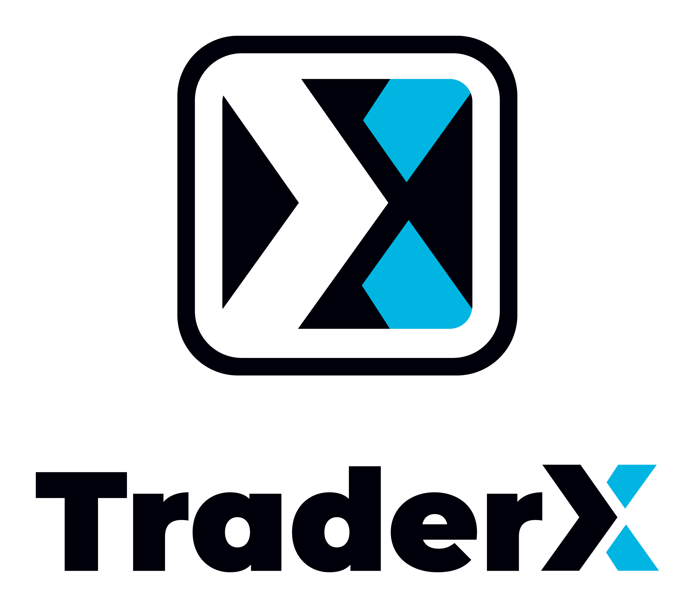

[](https://demo.traderx.finos.org/)
[](https://finosfoundation.atlassian.net/wiki/display/FINOS/Incubating)

# FINOS | TraderX Example of a Simple Trading App

 



TraderX is a Sample Trading Application, designed to be a distributed reference application 
in the financial services domain which can serve as a starting point for experimentation 
with various techniques and other open source projects.  It is designed to be simple
and accessible to developers of all backgrounds, with minimal pre-assumptions, and it 
can serve as a starting point for educational and experimentation purposes.

It is designed to be runnable from any developer workstation with minimal assumptions
other than Node, Java and Python runtimes. The libraries and toolkits it uses are meant
to be as vanilla as possible, to preserve its approachability by developers of all levels.

It contains Java, NodeJS, Python, .NET components that communicate over REST APIs and
messaging systems and are able to showcase a wide range of technical challenges to solve.

More detailed information about this project can be found in the website which is generated
from the code under the `docs` directory of this project.


## Project Demo and Overview Presentation

Learn more about the project - including a brief demo, in the Keynote Demo session 
that was presented at the [Open Source in Finance Forum 2023](https://events.linuxfoundation.org/open-source-finance-forum-new-york/)

[](https://youtu.be/tSKDJlRYkm0?list=PLmPXh6nBuhJueQS5q-5IU3-0vmZEIUbz0&t=400)


## Project Components

The project consists of multiple moving parts, and you can see how things hang together by reviewing the architecture and sequence diagrams located in the [docs](docs) directory.


| *Component* | *Tech Stack* |*Description* |
| :--- | :--- | :--- |
| [docs](docs) | markdown | Architecture and Flow Diagrams are here! |
| [database](database) | java/h2 | A simple self-contained SQL database |
| [reference-data](reference-data) | node/nestjs | REST service (off a flat file) for querying ticker symbols |
| [trade-feed](trade-feed) | node/socketio | Message bus used for trade flows, as well as streaming to the GUI |
| [people-service](people-service) | .Net core | Service for looking up users, for account mangement |
| [account-service](account-service) | java/spring | Service for querying and validating accounts |
| [position-service](position-service) | java/spring | Position service for looking up positions and trades by the blotter |
| [trade-service](trade-service) | java/spring | Service for submitting trade/order requests for further processing |
| [trade-processor](trade-processor) | java/spring | Trade Feed consumer which processes trade/orders |
| [web-front-end](web-front-end) | html/angular or react | Interactive UI for executing trades and viewing blotter. Note: the AngularJS GUI was an initial contribution and contains account management capabilities. The React GUI was contributed during a hack day and may not work for managing accounts, but it does work for executing trades and viewing the blotter |

## Installation  

This is installed locally through normal git clone operations.

## Usage example (Simple)

In order to get things working together, it is recommended to select a range of ports to provide all running processes with, so that the pieces can interconnect as needed.  A more advanced instance of this project is possible using the docker compose files which are present in each project directory. To run this all up 'by hand' here are default ports which are used, and you can easily export these variables to your favorite shell. 

```bash
export DATABASE_TCP_PORT=18082
export DATABASE_PG_PORT=18083
export DATABASE_WEB_PORT=18084
export REFERENCE_DATA_SERVICE_PORT=18085
export TRADE_FEED_PORT=18086
export ACCOUNT_SERVICE_PORT=18088
export PEOPLE_SERVICE_PORT=18089
export POSITION_SERVICE_PORT=18090
export TRADE_PROCESSOR_SERVICE_PORT=18091
export TRADING_SERVICE_PORT=18092
export WEB_SERVICE_ANGULAR_PORT=18093  #Angular
export WEB_SERVICE_REACT_PORT=18094  #React
```

The recommended starting sequence to let everything find what it needs is:

```bash
database
reference-data
trade-feed
people-service
account-service
position-service
trade-processor
trade-service
web-front-end
```

## Usage (Docker + Docker Compose)

The easiest way to run up the entire system is using Docker Compose. This should work on your local computer using Docker Desktop / Docker Compose (tested on Mac Silicon) and also in Github Codespaces.

From the root traderX directory run
```
docker compose up
```
On first run this will build all of the containers from the project specific Dockerfile's and then start them in the correct sequence.

The Docker containers are configured via Docker Compose to connect to a shred virtual network enabling them to communciate whether running on your local computer or via a Codespace.

The WebUIs will be added to this setup later, but in the interim you should be able to start either (or both) in the same environment to connect to the backend components.

## Local Building (Corporate Environments)

When building locally in your company, if you are using a corporate artifact repository, you might need to override certain settings such as mavenCentral() in gradle, for the Java projects.

In order to do this, we have designated a `.gitignore`'d folder where you can leave company-specific build scripts. This folder is not managed by git and can be modified locally.

### Local Gradle Use Case

Create a `.corp` directory and in there you can create a `settings.gradle` file which will allow you to build all gradle projects

```sh
# in the traderX main directory
mkdir .corp
touch settings.gradle
```

The `settings.gradle` file should contain any overrides on your `repositories` and `plugins` block but should also contain these contents:

```groovy
rootProject.name = 'finos-traderX'
includeFlat 'database'
includeFlat 'account-service'
includeFlat 'position-service'
includeFlat 'trade-service'
includeFlat 'trade-processor'
```

This will include projects in directories at the same level as the .corp directory.

You can also store a separate gradle wrapper here, if you need the `distributionUrl` in your `gradle.properties`  to differ from the public internet one.

To build and run these projects, you can do the following:

```sh
###### From traderX root #####
# Note: gradle or ./gradlew can be used, depending on your path

gradle --settings-file .corp/settings.gradle build

# Build specific project
gradle --settings-file .corp/settings.gradle database:build

# Run specific project
gradle --settings-file .corp/settings.gradle account-service:bootRun

##### From inside the .corp directory ####
cd .corp
./gradlew build
./gradlew account-service:bootRun
```

# Getting Involved

### Project Meetings

A great way to interact with the TraderX community is to attend the bi-weekly Friday TraderX meetings.
Email help@finos.org to be added to the meeting invite directly, or find the meeting in the [FINOS Community Calendar](https://calendar.finos.org/).

## Contributing

1. Fork it (<https://github.com/finos/traderx/fork>)
2. Create your feature branch (`git checkout -b feature/fooBar`)
3. Read our [contribution guidelines](https://github.com/finos/traderx/blob/main/CONTRIBUTING.md) and [Community Code of Conduct](https://www.finos.org/code-of-conduct)
4. Commit your changes (`git commit -am 'Add some fooBar'`)
5. Push to the branch (`git push origin feature/fooBar`)
6. Create a new Pull Request

*NOTE:* Commits and pull requests to FINOS repositories will only be accepted from those contributors with an active, executed Individual Contributor License Agreement (ICLA) with FINOS OR who are covered under an existing and active Corporate Contribution License Agreement (CCLA) executed with FINOS. Commits from individuals not covered under an ICLA or CCLA will be flagged and blocked by the FINOS Clabot tool. Please note that some CCLAs require individuals/employees to be explicitly named on the CCLA.

*Need an ICLA? Unsure if you are covered under an existing CCLA? Email [help@finos.org](mailto:help@finos.org)*

## License

Copyright 2023 UBS, FINOS, Morgan Stanley

Distributed under the [Apache License, Version 2.0](http://www.apache.org/licenses/LICENSE-2.0).

SPDX-License-Identifier: [Apache-2.0](https://spdx.org/licenses/Apache-2.0)
