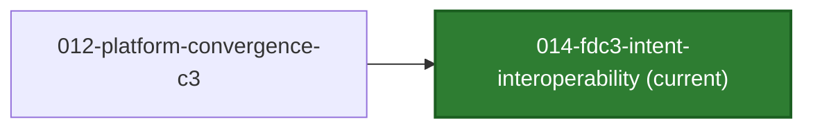

# TraderX Generated Code Snapshot

This branch is an auto-published generated-code snapshot for FINOS TraderX.

 

- State ID: `014-fdc3-intent-interoperability`
- State Title: `FDC3 Intent Interoperability on C3`
- Status: `implemented`
- Suggested Version Tag: `generated/014-fdc3-intent-interoperability/v1`
- Source Branch: `codex/address-actions-cves-20260528`
- Source Commit: `b311f3fe944207a4497a20cb5ed1a9529a004eab`
- Generated At (UTC): `2026-05-28T05:34:21Z`

## State Summary

- Builds on state `012` and preserves C3 runtime behavior.
- Adds TraderX app-side FDC3 flows plus a local Sail sidecar and two-tab demo profile.
- Keeps interoperability payloads canonical (`fdc3.instrument.id.ticker`) and tracks Sail-specific workaround logic as technical debt.

## State Lineage

```mermaid
flowchart LR
  S_CUR["014-fdc3-intent-interoperability (current)"]
  style S_CUR fill:#2e7d32,stroke:#1b5e20,color:#ffffff,stroke-width:2px
  S_PREV_012_platform_convergence_c3["012-platform-convergence-c3"] --> S_CUR
  click S_PREV_012_platform_convergence_c3 href "https://github.com/finos/traderX/tree/code%2Fgenerated-state-012-platform-convergence-c3" "Open branch"
  click S_CUR href "https://github.com/finos/traderX/tree/code%2Fgenerated-state-014-fdc3-intent-interoperability" "Open current branch"
```

| Direction | State | Branch | Compare |
| --- | --- | --- | --- |
| Previous | `012-platform-convergence-c3` | [code/generated-state-012-platform-convergence-c3](https://github.com/finos/traderX/tree/code%2Fgenerated-state-012-platform-convergence-c3) | 🔍 [compare](https://github.com/finos/traderX/compare/code%2Fgenerated-state-012-platform-convergence-c3...code%2Fgenerated-state-014-fdc3-intent-interoperability) |

State sets:
- Previous states: `012-platform-convergence-c3`
- Next states: `none`

## Convergence Status

- Convergence state: `false`
- Convergence level: `none`
- Lineage role: `canonical`
- Dotted-line parents: `none`
- Previous convergence milestone: [012-platform-convergence-c3](https://github.com/finos/traderX/tree/code%2Fgenerated-state-012-platform-convergence-c3) (🔍 [compare](https://github.com/finos/traderX/compare/code%2Fgenerated-state-012-platform-convergence-c3...code%2Fgenerated-state-014-fdc3-intent-interoperability))
- Next convergence milestone: `none`

### Convergence Neighborhood

```mermaid
flowchart LR
  C_CUR["014-fdc3-intent-interoperability (current)"]
  style C_CUR fill:#2e7d32,stroke:#1b5e20,color:#ffffff,stroke-width:2px
  C_PREV_012_platform_convergence_c3["012-platform-convergence-c3"] --> C_CUR
  click C_PREV_012_platform_convergence_c3 href "https://github.com/finos/traderX/tree/code%2Fgenerated-state-012-platform-convergence-c3" "Open branch"
  %% compare: https://github.com/finos/traderX/compare/code%2Fgenerated-state-012-platform-convergence-c3...code%2Fgenerated-state-014-fdc3-intent-interoperability
  click C_CUR href "https://github.com/finos/traderX/tree/code%2Fgenerated-state-014-fdc3-intent-interoperability" "Open current branch"
```

## Runtime Guidance

See `RUN_FROM_CLONE.md` for clone-first runtime instructions.

## API Explorer

- API explorer (ingress): `http://localhost:8080/api/docs`

## Interactive URLs

- Use `./scripts/status-*.sh` for this state to print active endpoint URLs.

Detailed clone-first instructions: [RUN_FROM_CLONE.md](./RUN_FROM_CLONE.md)
Functional validation guide: [FUNCTIONAL_TESTING.md](./FUNCTIONAL_TESTING.md)

## Learning Docs In This Snapshot

- [Docs Index](./docs/README.md)
- [Learning Index](./docs/learning/README.md)
- [Component List](./docs/learning/component-list.md)
- [System Design](./docs/learning/system-design.md)
- [Software Architecture](./docs/learning/software-architecture.md)
- [Component Diagram](./docs/learning/component-diagram.md)

## Canonical Specs And Docs

Canonical source-of-truth is maintained in the SpecKit authoring branch, not in this code snapshot branch.

- Feature pack: `specs/014-fdc3-intent-interoperability`
- Generation entrypoint: `bash pipeline/generate-state.sh 014-fdc3-intent-interoperability`
- Developer learning guide for this snapshot: [LEARNING.md](./LEARNING.md)
- Functional validation guide: [FUNCTIONAL_TESTING.md](./FUNCTIONAL_TESTING.md)
- Snapshot metadata: [STATE.md](./STATE.md), [state.json](./.traderx-state/state.json)
- Canonical Getting Started (main): https://github.com/finos/traderX/blob/main/docs/spec-kit/getting-started-with-traderx.md
- Source commit: https://github.com/finos/traderX/commit/b311f3fe944207a4497a20cb5ed1a9529a004eab
- Feature pack at source commit: https://github.com/finos/traderX/tree/b311f3fe944207a4497a20cb5ed1a9529a004eab/specs/014-fdc3-intent-interoperability
- SpecKit docs at source commit: https://github.com/finos/traderX/tree/b311f3fe944207a4497a20cb5ed1a9529a004eab/docs/spec-kit
