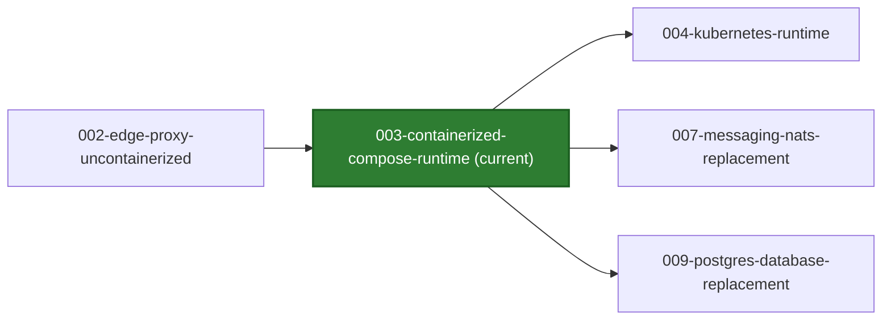

# TraderX Generated Code Snapshot

This branch is an auto-published generated-code snapshot for FINOS TraderX.

- State ID: `003-containerized-compose-runtime`
- State Title: `Containerized Compose Runtime (NGINX Ingress)`
- Status: `implemented`
- Suggested Version Tag: `generated/003-containerized-compose-runtime/v1`
- Source Branch: `feature/agentic-renovation`
- Source Commit: `68d19a554c7480a615b19c024eb0a88228c6b9ad`
- Generated At (UTC): `2026-03-31T13:06:14Z`

## State Summary

- Builds on state `002` by moving runtime to Docker Compose.
- Uses NGINX ingress (`ingress` service) as the browser/API/WebSocket entrypoint.
- Preserves baseline functional behavior while changing runtime/ops model.

## State Lineage


```mermaid
flowchart LR
  S_CUR["003-containerized-compose-runtime (current)"]
  style S_CUR fill:#2e7d32,stroke:#1b5e20,color:#ffffff,stroke-width:2px
  S_PREV_002_edge_proxy_uncontainerized["002-edge-proxy-uncontainerized"] --> S_CUR
  click S_PREV_002_edge_proxy_uncontainerized href "https://github.com/finos/traderX/tree/code%2Fgenerated-state-002-edge-proxy-uncontainerized" "Open branch"
  S_CUR --> S_NEXT_004_kubernetes_runtime["004-kubernetes-runtime"]
  click S_NEXT_004_kubernetes_runtime href "https://github.com/finos/traderX/tree/code%2Fgenerated-state-004-kubernetes-runtime" "Open branch"
  S_CUR --> S_NEXT_007_messaging_nats_replacement["007-messaging-nats-replacement"]
  click S_NEXT_007_messaging_nats_replacement href "https://github.com/finos/traderX/tree/code%2Fgenerated-state-007-messaging-nats-replacement" "Open branch"
  S_CUR --> S_NEXT_009_postgres_database_replacement["009-postgres-database-replacement"]
  click S_NEXT_009_postgres_database_replacement href "https://github.com/finos/traderX/tree/code%2Fgenerated-state-009-postgres-database-replacement" "Open branch"
  click S_CUR href "https://github.com/finos/traderX/tree/code%2Fgenerated-state-003-containerized-compose-runtime" "Open current branch"
```

| Direction | State | Branch | Compare |
| --- | --- | --- | --- |
| Previous | `002-edge-proxy-uncontainerized` | [code/generated-state-002-edge-proxy-uncontainerized](https://github.com/finos/traderX/tree/code%2Fgenerated-state-002-edge-proxy-uncontainerized) | 🔍 [compare](https://github.com/finos/traderX/compare/code%2Fgenerated-state-002-edge-proxy-uncontainerized...code%2Fgenerated-state-003-containerized-compose-runtime) |
| Next | `004-kubernetes-runtime` | [code/generated-state-004-kubernetes-runtime](https://github.com/finos/traderX/tree/code%2Fgenerated-state-004-kubernetes-runtime) | 🔍 [compare](https://github.com/finos/traderX/compare/code%2Fgenerated-state-003-containerized-compose-runtime...code%2Fgenerated-state-004-kubernetes-runtime) |
| Next | `007-messaging-nats-replacement` | [code/generated-state-007-messaging-nats-replacement](https://github.com/finos/traderX/tree/code%2Fgenerated-state-007-messaging-nats-replacement) | 🔍 [compare](https://github.com/finos/traderX/compare/code%2Fgenerated-state-003-containerized-compose-runtime...code%2Fgenerated-state-007-messaging-nats-replacement) |
| Next | `009-postgres-database-replacement` | [code/generated-state-009-postgres-database-replacement](https://github.com/finos/traderX/tree/code%2Fgenerated-state-009-postgres-database-replacement) | 🔍 [compare](https://github.com/finos/traderX/compare/code%2Fgenerated-state-003-containerized-compose-runtime...code%2Fgenerated-state-009-postgres-database-replacement) |

State sets:
- Previous states: `002-edge-proxy-uncontainerized`
- Next states: `004-kubernetes-runtime, 007-messaging-nats-replacement, 009-postgres-database-replacement`

## Runtime Guidance

Run directly from this generated snapshot branch:

```bash
./scripts/start-state-003-containerized-generated.sh
```

UI/ingress endpoint: `http://localhost:8080`

Stop:

```bash
./scripts/stop-state-003-containerized-generated.sh
```

Detailed clone-first instructions: [RUN_FROM_CLONE.md](./RUN_FROM_CLONE.md)

## Learning Docs In This Snapshot

- [Docs Index](./docs/README.md)
- [Learning Index](./docs/learning/README.md)
- [Component List](./docs/learning/component-list.md)
- [System Design](./docs/learning/system-design.md)
- [Software Architecture](./docs/learning/software-architecture.md)
- [Component Diagram](./docs/learning/component-diagram.md)

## Canonical Specs And Docs

Canonical source-of-truth is maintained in the SpecKit authoring branch, not in this code snapshot branch.

- Feature pack: `specs/003-containerized-compose-runtime`
- Generation entrypoint: `bash pipeline/generate-state.sh 003-containerized-compose-runtime`
- Developer learning guide for this snapshot: [LEARNING.md](./LEARNING.md)
- Snapshot metadata: [STATE.md](./STATE.md), [state.json](./.traderx-state/state.json)
- Source commit: https://github.com/finos/traderX/commit/68d19a554c7480a615b19c024eb0a88228c6b9ad
- Feature pack at source commit: https://github.com/finos/traderX/tree/68d19a554c7480a615b19c024eb0a88228c6b9ad/specs/003-containerized-compose-runtime
- SpecKit docs at source commit: https://github.com/finos/traderX/tree/68d19a554c7480a615b19c024eb0a88228c6b9ad/docs/spec-kit
