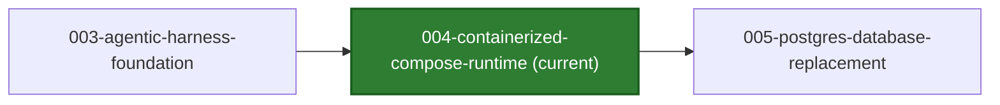
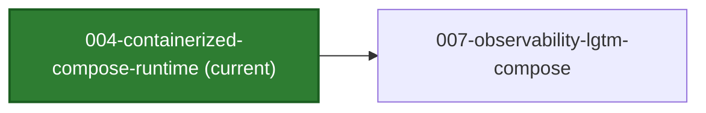

# TraderX Generated Code Snapshot

This branch is an auto-published generated-code snapshot for FINOS TraderX.

 

- State ID: `004-containerized-compose-runtime`
- State Title: `Containerized Compose Runtime (NGINX Ingress)`
- Status: `implemented`
- Suggested Version Tag: `generated/004-containerized-compose-runtime/v1`
- Source Branch: `codex/address-actions-cves-20260528`
- Source Commit: `0313dc7bf828e4933b788834802bda10b8200bf5`
- Generated At (UTC): `2026-05-28T05:18:53Z`

## State Summary

- Builds on state `003` by moving runtime to Docker Compose.
- Uses NGINX ingress (`ingress` service) as the browser/API/WebSocket entrypoint.
- Preserves baseline functional behavior while changing runtime/ops model.

## State Lineage


```mermaid
flowchart LR
  S_CUR["004-containerized-compose-runtime (current)"]
  style S_CUR fill:#2e7d32,stroke:#1b5e20,color:#ffffff,stroke-width:2px
  S_PREV_003_agentic_harness_foundation["003-agentic-harness-foundation"] --> S_CUR
  click S_PREV_003_agentic_harness_foundation href "https://github.com/finos/traderX/tree/code%2Fgenerated-state-003-agentic-harness-foundation" "Open branch"
  S_CUR --> S_NEXT_005_postgres_database_replacement["005-postgres-database-replacement"]
  click S_NEXT_005_postgres_database_replacement href "https://github.com/finos/traderX/tree/code%2Fgenerated-state-005-postgres-database-replacement" "Open branch"
  click S_CUR href "https://github.com/finos/traderX/tree/code%2Fgenerated-state-004-containerized-compose-runtime" "Open current branch"
```

| Direction | State | Branch | Compare |
| --- | --- | --- | --- |
| Previous | `003-agentic-harness-foundation` | [code/generated-state-003-agentic-harness-foundation](https://github.com/finos/traderX/tree/code%2Fgenerated-state-003-agentic-harness-foundation) | 🔍 [compare](https://github.com/finos/traderX/compare/code%2Fgenerated-state-003-agentic-harness-foundation...code%2Fgenerated-state-004-containerized-compose-runtime) |
| Next | `005-postgres-database-replacement` | [code/generated-state-005-postgres-database-replacement](https://github.com/finos/traderX/tree/code%2Fgenerated-state-005-postgres-database-replacement) | 🔍 [compare](https://github.com/finos/traderX/compare/code%2Fgenerated-state-004-containerized-compose-runtime...code%2Fgenerated-state-005-postgres-database-replacement) |

State sets:
- Previous states: `003-agentic-harness-foundation`
- Next states: `005-postgres-database-replacement`

## Convergence Status

- Convergence state: `true`
- Convergence level: `C0`
- Lineage role: `canonical`
- Dotted-line parents: `none`
- Previous convergence milestone: `none`
- Next convergence milestone: [007-observability-lgtm-compose](https://github.com/finos/traderX/tree/code%2Fgenerated-state-007-observability-lgtm-compose) (🔍 [compare](https://github.com/finos/traderX/compare/code%2Fgenerated-state-004-containerized-compose-runtime...code%2Fgenerated-state-007-observability-lgtm-compose))

### Convergence Neighborhood


```mermaid
flowchart LR
  C_CUR["004-containerized-compose-runtime (current)"]
  style C_CUR fill:#2e7d32,stroke:#1b5e20,color:#ffffff,stroke-width:2px
  C_CUR --> C_NEXT_007_observability_lgtm_compose["007-observability-lgtm-compose"]
  click C_NEXT_007_observability_lgtm_compose href "https://github.com/finos/traderX/tree/code%2Fgenerated-state-007-observability-lgtm-compose" "Open branch"
  %% compare: https://github.com/finos/traderX/compare/code%2Fgenerated-state-004-containerized-compose-runtime...code%2Fgenerated-state-007-observability-lgtm-compose
  click C_CUR href "https://github.com/finos/traderX/tree/code%2Fgenerated-state-004-containerized-compose-runtime" "Open current branch"
```

## Runtime Guidance

Run directly from this generated snapshot branch:

```bash
./scripts/start-state-004-containerized-generated.sh
```

UI/ingress endpoint: `http://localhost:8080`

Stop:

```bash
./scripts/stop-state-004-containerized-generated.sh
```

## API Explorer

- API explorer (ingress): `http://localhost:8080/api/docs`

## Interactive URLs

- UI (ingress): `http://localhost:8080`
- API explorer (ingress): `http://localhost:8080/api/docs`
- Trade service Swagger: `http://localhost:18092/v3/api-docs`
- Account service API sample: `http://localhost:18088/account/22214`
- Position service health: `http://localhost:18090/health/alive`

Detailed clone-first instructions: [RUN_FROM_CLONE.md](./RUN_FROM_CLONE.md)
Functional validation guide: [FUNCTIONAL_TESTING.md](./FUNCTIONAL_TESTING.md)

## Learning Docs In This Snapshot

- [Docs Index](./docs/README.md)
- [Learning Index](./docs/learning/README.md)
- [Component List](./docs/learning/component-list.md)
- [System Design](./docs/learning/system-design.md)
- [Software Architecture](./docs/learning/software-architecture.md)
- [Component Diagram](./docs/learning/component-diagram.md)

## Canonical Specs And Docs

Canonical source-of-truth is maintained in the SpecKit authoring branch, not in this code snapshot branch.

- Feature pack: `specs/004-containerized-compose-runtime`
- Generation entrypoint: `bash pipeline/generate-state.sh 004-containerized-compose-runtime`
- Developer learning guide for this snapshot: [LEARNING.md](./LEARNING.md)
- Functional validation guide: [FUNCTIONAL_TESTING.md](./FUNCTIONAL_TESTING.md)
- Snapshot metadata: [STATE.md](./STATE.md), [state.json](./.traderx-state/state.json)
- Canonical Getting Started (main): https://github.com/finos/traderX/blob/main/docs/spec-kit/getting-started-with-traderx.md
- Source commit: https://github.com/finos/traderX/commit/0313dc7bf828e4933b788834802bda10b8200bf5
- Feature pack at source commit: https://github.com/finos/traderX/tree/0313dc7bf828e4933b788834802bda10b8200bf5/specs/004-containerized-compose-runtime
- SpecKit docs at source commit: https://github.com/finos/traderX/tree/0313dc7bf828e4933b788834802bda10b8200bf5/docs/spec-kit
