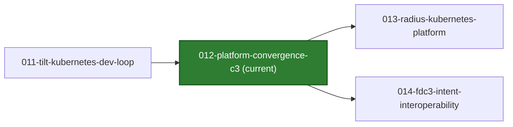

# TraderX Generated Code Snapshot

This branch is an auto-published generated-code snapshot for FINOS TraderX.

 

- State ID: `012-platform-convergence-c3`
- State Title: `Platform Convergence C3`
- Status: `implemented`
- Suggested Version Tag: `generated/012-platform-convergence-c3/v1`
- Source Branch: `main`
- Source Commit: `f0056d6753b9a76295ce40ede1f32c30bd2c5f27`
- Generated At (UTC): `2026-06-21T11:21:54Z`

## State Summary

- Generated code snapshot for TraderX state transition.

## State Lineage

```mermaid
flowchart LR
  S_CUR["012-platform-convergence-c3 (current)"]
  style S_CUR fill:#2e7d32,stroke:#1b5e20,color:#ffffff,stroke-width:2px
  S_PREV_011_tilt_kubernetes_dev_loop["011-tilt-kubernetes-dev-loop"] --> S_CUR
  click S_PREV_011_tilt_kubernetes_dev_loop href "https://github.com/finos/traderX/tree/code%2Fgenerated-state-011-tilt-kubernetes-dev-loop" "Open branch"
  S_CUR --> S_NEXT_013_radius_kubernetes_platform["013-radius-kubernetes-platform"]
  click S_NEXT_013_radius_kubernetes_platform href "https://github.com/finos/traderX/tree/code%2Fgenerated-state-013-radius-kubernetes-platform" "Open branch"
  S_CUR --> S_NEXT_014_fdc3_intent_interoperability["014-fdc3-intent-interoperability"]
  click S_NEXT_014_fdc3_intent_interoperability href "https://github.com/finos/traderX/tree/code%2Fgenerated-state-014-fdc3-intent-interoperability" "Open branch"
  click S_CUR href "https://github.com/finos/traderX/tree/code%2Fgenerated-state-012-platform-convergence-c3" "Open current branch"
```

| Direction | State | Branch | Compare |
| --- | --- | --- | --- |
| Previous | `011-tilt-kubernetes-dev-loop` | [code/generated-state-011-tilt-kubernetes-dev-loop](https://github.com/finos/traderX/tree/code%2Fgenerated-state-011-tilt-kubernetes-dev-loop) | 🔍 [compare](https://github.com/finos/traderX/compare/code%2Fgenerated-state-011-tilt-kubernetes-dev-loop...code%2Fgenerated-state-012-platform-convergence-c3) |
| Next | `013-radius-kubernetes-platform` | [code/generated-state-013-radius-kubernetes-platform](https://github.com/finos/traderX/tree/code%2Fgenerated-state-013-radius-kubernetes-platform) | 🔍 [compare](https://github.com/finos/traderX/compare/code%2Fgenerated-state-012-platform-convergence-c3...code%2Fgenerated-state-013-radius-kubernetes-platform) |
| Next | `014-fdc3-intent-interoperability` | [code/generated-state-014-fdc3-intent-interoperability](https://github.com/finos/traderX/tree/code%2Fgenerated-state-014-fdc3-intent-interoperability) | 🔍 [compare](https://github.com/finos/traderX/compare/code%2Fgenerated-state-012-platform-convergence-c3...code%2Fgenerated-state-014-fdc3-intent-interoperability) |

State sets:
- Previous states: `011-tilt-kubernetes-dev-loop`
- Next states: `013-radius-kubernetes-platform, 014-fdc3-intent-interoperability`

## Convergence Status

- Convergence state: `true`
- Convergence level: `C3`
- Lineage role: `canonical`
- Dotted-line parents: `009-order-management-matcher`
- Previous convergence milestone: [009-order-management-matcher](https://github.com/finos/traderX/tree/code%2Fgenerated-state-009-order-management-matcher) (🔍 [compare](https://github.com/finos/traderX/compare/code%2Fgenerated-state-009-order-management-matcher...code%2Fgenerated-state-012-platform-convergence-c3))
- Next convergence milestone: `none`

### Convergence Neighborhood

```mermaid
flowchart LR
  C_CUR["012-platform-convergence-c3 (current)"]
  style C_CUR fill:#2e7d32,stroke:#1b5e20,color:#ffffff,stroke-width:2px
  C_PREV_009_order_management_matcher["009-order-management-matcher"] --> C_CUR
  click C_PREV_009_order_management_matcher href "https://github.com/finos/traderX/tree/code%2Fgenerated-state-009-order-management-matcher" "Open branch"
  %% compare: https://github.com/finos/traderX/compare/code%2Fgenerated-state-009-order-management-matcher...code%2Fgenerated-state-012-platform-convergence-c3
  click C_CUR href "https://github.com/finos/traderX/tree/code%2Fgenerated-state-012-platform-convergence-c3" "Open current branch"
```

## Runtime Guidance

See `RUN_FROM_CLONE.md` for clone-first runtime instructions.

## API Explorer

- API explorer (ingress): `http://localhost:8080/api/docs`

## Interactive URLs

- UI (ingress): `http://localhost:8080`
- API explorer (ingress): `http://localhost:8080/api/docs`
- Trade page: `http://localhost:8080/trade`
- Account service route: `http://localhost:8080/account-service/account/22214`
- Position service route: `http://localhost:8080/position-service/positions/22214`
- Grafana (ingress): `http://localhost:8080/grafana`
- Prometheus (ingress): `http://localhost:8080/prometheus`

Detailed clone-first instructions: [RUN_FROM_CLONE.md](./RUN_FROM_CLONE.md)
Functional validation guide: [FUNCTIONAL_TESTING.md](./FUNCTIONAL_TESTING.md)

## Learning Docs In This Snapshot

- [Docs Index](./docs/README.md)
- [Learning Index](./docs/learning/README.md)
- [Component List](./docs/learning/component-list.md)
- [System Design](./docs/learning/system-design.md)
- [Software Architecture](./docs/learning/software-architecture.md)
- [Component Diagram](./docs/learning/component-diagram.md)

## Canonical Specs And Docs

Canonical source-of-truth is maintained in the SpecKit authoring branch, not in this code snapshot branch.

- Feature pack: `specs/012-platform-convergence-c3`
- Generation entrypoint: `bash pipeline/generate-state.sh 012-platform-convergence-c3`
- Developer learning guide for this snapshot: [LEARNING.md](./LEARNING.md)
- Functional validation guide: [FUNCTIONAL_TESTING.md](./FUNCTIONAL_TESTING.md)
- Snapshot metadata: [STATE.md](./STATE.md), [state.json](./.traderx-state/state.json)
- Canonical Getting Started (main): https://github.com/finos/traderX/blob/main/docs/spec-kit/getting-started-with-traderx.md
- Source commit: https://github.com/finos/traderX/commit/f0056d6753b9a76295ce40ede1f32c30bd2c5f27
- Feature pack at source commit: https://github.com/finos/traderX/tree/f0056d6753b9a76295ce40ede1f32c30bd2c5f27/specs/012-platform-convergence-c3
- SpecKit docs at source commit: https://github.com/finos/traderX/tree/f0056d6753b9a76295ce40ede1f32c30bd2c5f27/docs/spec-kit
