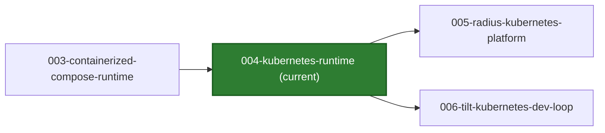

# TraderX Generated Code Snapshot

This branch is an auto-published generated-code snapshot for FINOS TraderX.

- State ID: `004-kubernetes-runtime`
- State Title: `Kubernetes Runtime Baseline`
- Status: `implemented`
- Suggested Version Tag: `generated/004-kubernetes-runtime/v1`
- Source Branch: `feature/agentic-renovation`
- Source Commit: `68d19a554c7480a615b19c024eb0a88228c6b9ad`
- Generated At (UTC): `2026-03-31T13:08:11Z`

## State Summary

- Builds on state `003` by moving runtime from Docker Compose to Kubernetes (Kind baseline).
- Uses in-cluster NGINX edge-proxy as browser/API/WebSocket entrypoint at `http://localhost:8080`.
- Preserves baseline functional behavior while changing runtime orchestration and deployment model.

## State Lineage


```mermaid
flowchart LR
  S_CUR["004-kubernetes-runtime (current)"]
  style S_CUR fill:#2e7d32,stroke:#1b5e20,color:#ffffff,stroke-width:2px
  S_PREV_003_containerized_compose_runtime["003-containerized-compose-runtime"] --> S_CUR
  click S_PREV_003_containerized_compose_runtime href "https://github.com/finos/traderX/tree/code%2Fgenerated-state-003-containerized-compose-runtime" "Open branch"
  S_CUR --> S_NEXT_005_radius_kubernetes_platform["005-radius-kubernetes-platform"]
  click S_NEXT_005_radius_kubernetes_platform href "https://github.com/finos/traderX/tree/code%2Fgenerated-state-005-radius-kubernetes-platform" "Open branch"
  S_CUR --> S_NEXT_006_tilt_kubernetes_dev_loop["006-tilt-kubernetes-dev-loop"]
  click S_NEXT_006_tilt_kubernetes_dev_loop href "https://github.com/finos/traderX/tree/code%2Fgenerated-state-006-tilt-kubernetes-dev-loop" "Open branch"
  click S_CUR href "https://github.com/finos/traderX/tree/code%2Fgenerated-state-004-kubernetes-runtime" "Open current branch"
```

| Direction | State | Branch | Compare |
| --- | --- | --- | --- |
| Previous | `003-containerized-compose-runtime` | [code/generated-state-003-containerized-compose-runtime](https://github.com/finos/traderX/tree/code%2Fgenerated-state-003-containerized-compose-runtime) | 🔍 [compare](https://github.com/finos/traderX/compare/code%2Fgenerated-state-003-containerized-compose-runtime...code%2Fgenerated-state-004-kubernetes-runtime) |
| Next | `005-radius-kubernetes-platform` | [code/generated-state-005-radius-kubernetes-platform](https://github.com/finos/traderX/tree/code%2Fgenerated-state-005-radius-kubernetes-platform) | 🔍 [compare](https://github.com/finos/traderX/compare/code%2Fgenerated-state-004-kubernetes-runtime...code%2Fgenerated-state-005-radius-kubernetes-platform) |
| Next | `006-tilt-kubernetes-dev-loop` | [code/generated-state-006-tilt-kubernetes-dev-loop](https://github.com/finos/traderX/tree/code%2Fgenerated-state-006-tilt-kubernetes-dev-loop) | 🔍 [compare](https://github.com/finos/traderX/compare/code%2Fgenerated-state-004-kubernetes-runtime...code%2Fgenerated-state-006-tilt-kubernetes-dev-loop) |

State sets:
- Previous states: `003-containerized-compose-runtime`
- Next states: `005-radius-kubernetes-platform, 006-tilt-kubernetes-dev-loop`

## Runtime Guidance

Run directly from this generated snapshot branch:

```bash
./scripts/start-state-004-kubernetes-generated.sh
```

UI/edge endpoint: `http://localhost:8080`

Status / stop:

```bash
./scripts/status-state-004-kubernetes-generated.sh
./scripts/stop-state-004-kubernetes-generated.sh
```

Detailed clone-first instructions: [RUN_FROM_CLONE.md](./RUN_FROM_CLONE.md)

## Learning Docs In This Snapshot

- [Docs Index](./docs/README.md)
- [Learning Index](./docs/learning/README.md)
- [Component List](./docs/learning/component-list.md)
- [System Design](./docs/learning/system-design.md)
- [Software Architecture](./docs/learning/software-architecture.md)
- [Component Diagram](./docs/learning/component-diagram.md)

## Canonical Specs And Docs

Canonical source-of-truth is maintained in the SpecKit authoring branch, not in this code snapshot branch.

- Feature pack: `specs/004-kubernetes-runtime`
- Generation entrypoint: `bash pipeline/generate-state.sh 004-kubernetes-runtime`
- Developer learning guide for this snapshot: [LEARNING.md](./LEARNING.md)
- Snapshot metadata: [STATE.md](./STATE.md), [state.json](./.traderx-state/state.json)
- Source commit: https://github.com/finos/traderX/commit/68d19a554c7480a615b19c024eb0a88228c6b9ad
- Feature pack at source commit: https://github.com/finos/traderX/tree/68d19a554c7480a615b19c024eb0a88228c6b9ad/specs/004-kubernetes-runtime
- SpecKit docs at source commit: https://github.com/finos/traderX/tree/68d19a554c7480a615b19c024eb0a88228c6b9ad/docs/spec-kit
