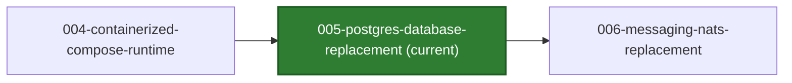

# TraderX Generated Code Snapshot

This branch is an auto-published generated-code snapshot for FINOS TraderX.

 

- State ID: `005-postgres-database-replacement`
- State Title: `PostgreSQL Database Replacement`
- Status: `implemented`
- Suggested Version Tag: `generated/005-postgres-database-replacement/v1`
- Source Branch: `main`
- Source Commit: `5038ee0a983a5c84584bcefd69d0478a47b95de7`
- Generated At (UTC): `2026-07-22T15:20:59Z`

## State Summary

- Builds on state `004` and preserves containerized ingress runtime behavior.
- Replaces H2 runtime database with PostgreSQL container + deterministic init SQL.
- Preserves baseline REST/event contracts and user-visible behavior.

## State Lineage


```mermaid
flowchart LR
  S_CUR["005-postgres-database-replacement (current)"]
  style S_CUR fill:#2e7d32,stroke:#1b5e20,color:#ffffff,stroke-width:2px
  S_PREV_004_containerized_compose_runtime["004-containerized-compose-runtime"] --> S_CUR
  click S_PREV_004_containerized_compose_runtime href "https://github.com/finos/traderX/tree/code%2Fgenerated-state-004-containerized-compose-runtime" "Open branch"
  S_CUR --> S_NEXT_006_messaging_nats_replacement["006-messaging-nats-replacement"]
  click S_NEXT_006_messaging_nats_replacement href "https://github.com/finos/traderX/tree/code%2Fgenerated-state-006-messaging-nats-replacement" "Open branch"
  click S_CUR href "https://github.com/finos/traderX/tree/code%2Fgenerated-state-005-postgres-database-replacement" "Open current branch"
```

| Direction | State | Branch | Compare |
| --- | --- | --- | --- |
| Previous | `004-containerized-compose-runtime` | [code/generated-state-004-containerized-compose-runtime](https://github.com/finos/traderX/tree/code%2Fgenerated-state-004-containerized-compose-runtime) | 🔍 [compare](https://github.com/finos/traderX/compare/code%2Fgenerated-state-004-containerized-compose-runtime...code%2Fgenerated-state-005-postgres-database-replacement) |
| Next | `006-messaging-nats-replacement` | [code/generated-state-006-messaging-nats-replacement](https://github.com/finos/traderX/tree/code%2Fgenerated-state-006-messaging-nats-replacement) | 🔍 [compare](https://github.com/finos/traderX/compare/code%2Fgenerated-state-005-postgres-database-replacement...code%2Fgenerated-state-006-messaging-nats-replacement) |

State sets:
- Previous states: `004-containerized-compose-runtime`
- Next states: `006-messaging-nats-replacement`

## Convergence Status

- Convergence state: `false`
- Convergence level: `none`
- Lineage role: `canonical`
- Dotted-line parents: `none`
- Previous convergence milestone: [004-containerized-compose-runtime](https://github.com/finos/traderX/tree/code%2Fgenerated-state-004-containerized-compose-runtime) (🔍 [compare](https://github.com/finos/traderX/compare/code%2Fgenerated-state-004-containerized-compose-runtime...code%2Fgenerated-state-005-postgres-database-replacement))
- Next convergence milestone: [007-observability-lgtm-compose](https://github.com/finos/traderX/tree/code%2Fgenerated-state-007-observability-lgtm-compose) (🔍 [compare](https://github.com/finos/traderX/compare/code%2Fgenerated-state-005-postgres-database-replacement...code%2Fgenerated-state-007-observability-lgtm-compose))

### Convergence Neighborhood


```mermaid
flowchart LR
  C_CUR["005-postgres-database-replacement (current)"]
  style C_CUR fill:#2e7d32,stroke:#1b5e20,color:#ffffff,stroke-width:2px
  C_PREV_004_containerized_compose_runtime["004-containerized-compose-runtime"] --> C_CUR
  click C_PREV_004_containerized_compose_runtime href "https://github.com/finos/traderX/tree/code%2Fgenerated-state-004-containerized-compose-runtime" "Open branch"
  %% compare: https://github.com/finos/traderX/compare/code%2Fgenerated-state-004-containerized-compose-runtime...code%2Fgenerated-state-005-postgres-database-replacement
  C_CUR --> C_NEXT_007_observability_lgtm_compose["007-observability-lgtm-compose"]
  click C_NEXT_007_observability_lgtm_compose href "https://github.com/finos/traderX/tree/code%2Fgenerated-state-007-observability-lgtm-compose" "Open branch"
  %% compare: https://github.com/finos/traderX/compare/code%2Fgenerated-state-005-postgres-database-replacement...code%2Fgenerated-state-007-observability-lgtm-compose
  click C_CUR href "https://github.com/finos/traderX/tree/code%2Fgenerated-state-005-postgres-database-replacement" "Open current branch"
```

## Runtime Guidance

Run directly from this generated snapshot branch:

```bash
./scripts/start-state-005-postgres-database-replacement-generated.sh
```

UI/ingress endpoint: `http://localhost:8080`
PostgreSQL endpoint: `localhost:18083`

Status / stop:

```bash
./scripts/status-state-005-postgres-database-replacement-generated.sh
./scripts/stop-state-005-postgres-database-replacement-generated.sh
```

## API Explorer

- API explorer (ingress): `http://localhost:8080/api/docs`

## Interactive URLs

- UI (ingress): `http://localhost:8080`
- API explorer (ingress): `http://localhost:8080/api/docs`
- Trade service Swagger: `http://localhost:18092/v3/api-docs`
- Account service API sample: `http://localhost:18088/account/22214`
- Position service health: `http://localhost:18090/health/alive`


Detailed clone-first instructions: [RUN_FROM_CLONE.md](./RUN_FROM_CLONE.md)
Functional validation guide: [FUNCTIONAL_TESTING.md](./FUNCTIONAL_TESTING.md)

## Learning Docs In This Snapshot

- [Docs Index](./docs/README.md)
- [Learning Index](./docs/learning/README.md)
- [Component List](./docs/learning/component-list.md)
- [System Design](./docs/learning/system-design.md)
- [Software Architecture](./docs/learning/software-architecture.md)
- [Component Diagram](./docs/learning/component-diagram.md)

## Canonical Specs And Docs

Canonical source-of-truth is maintained in the SpecKit authoring branch, not in this code snapshot branch.

- Feature pack: `specs/005-postgres-database-replacement`
- Generation entrypoint: `bash pipeline/generate-state.sh 005-postgres-database-replacement`
- Developer learning guide for this snapshot: [LEARNING.md](./LEARNING.md)
- Functional validation guide: [FUNCTIONAL_TESTING.md](./FUNCTIONAL_TESTING.md)
- Snapshot metadata: [STATE.md](./STATE.md), [state.json](./.traderx-state/state.json)
- Canonical Getting Started (main): https://github.com/finos/traderX/blob/main/docs/spec-kit/getting-started-with-traderx.md
- Source commit: https://github.com/finos/traderX/commit/5038ee0a983a5c84584bcefd69d0478a47b95de7
- Feature pack at source commit: https://github.com/finos/traderX/tree/5038ee0a983a5c84584bcefd69d0478a47b95de7/specs/005-postgres-database-replacement
- SpecKit docs at source commit: https://github.com/finos/traderX/tree/5038ee0a983a5c84584bcefd69d0478a47b95de7/docs/spec-kit
