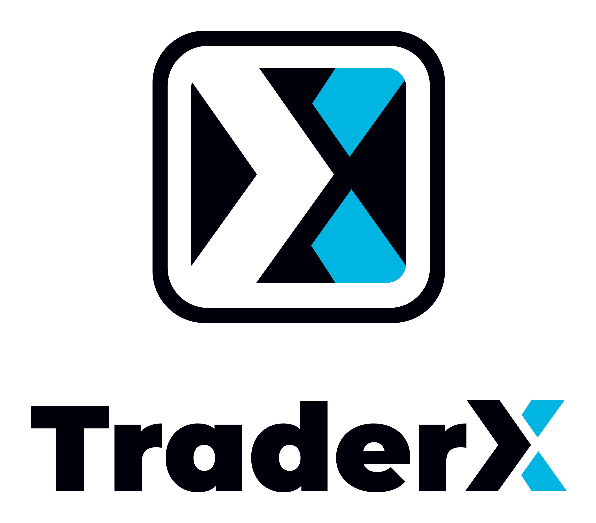
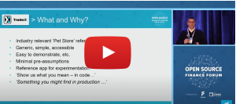

[](https://demo.traderx.finos.org/)
[](https://finosfoundation.atlassian.net/wiki/display/FINOS/Incubating)

# FINOS | TraderX Example of a Simple Trading App

 



TraderX is a Sample Trading Application, designed to be a distributed reference application 
in the financial services domain which can serve as a starting point for experimentation 
with various techniques and other open source projects.  It is designed to be simple
and accessible to developers of all backgrounds, with minimal pre-assumptions, and it 
can serve as a starting point for educational and experimentation purposes.

It is designed to be runnable from any developer workstation with minimal assumptions
other than Node, Java and Python runtimes. The libraries and toolkits it uses are meant
to be as vanilla as possible, to preserve its approachability by developers of all levels.

It contains Java, NodeJS, Python, .NET components that communicate over REST APIs and
messaging systems and are able to showcase a wide range of technical challenges to solve.

More detailed information about this project can be found in the website which is generated
from the code under the `docs` directory of this project.


## Project Demo and Overview Presentation

Learn more about the project - including a brief demo, in the Keynote Demo session 
that was presented at the [Open Source in Finance Forum 2023](https://events.linuxfoundation.org/open-source-finance-forum-new-york/)

[](https://youtu.be/tSKDJlRYkm0?list=PLmPXh6nBuhJueQS5q-5IU3-0vmZEIUbz0&t=400)


## Project Components

The project consists of multiple moving parts, and you can see how things hang together by reviewing the architecture and sequence diagrams located in the [docs](docs) directory.


| *Component* | *Tech Stack* |*Description* |
| :--- | :--- | :--- |
| [docs](docs) | markdown | Architecture and Flow Diagrams are here! |
| [database](database) | java/h2 | A simple self-contained SQL database |
| [reference-data](reference-data) | node/nestjs | REST service (off a flat file) for querying ticker symbols |
| [trade-feed](trade-feed) | node/socketio | Message bus used for trade flows, as well as streaming to the GUI |
| [people-service](people-service) | .Net core | Service for looking up users, for account mangement |
| [account-service](account-service) | java/spring | Service for querying and validating accounts |
| [position-service](position-service) | java/spring | Position service for looking up positions and trades by the blotter |
| [trade-service](trade-service) | java/spring | Service for submitting trade/order requests for further processing |
| [trade-processor](trade-processor) | java/spring | Trade Feed consumer which processes trade/orders |
| [web-front-end](web-front-end) | html/angular or react | Interactive UI for executing trades and viewing blotter. Note: the AngularJS GUI was an initial contribution and contains account management capabilities. The React GUI was contributed during a hack day and may not work for managing accounts, but it does work for executing trades and viewing the blotter |

## Check out Code

```bash
git clone https://github.com/finos/traderX.git
```

## Run TraderX

**Quick start with Docker Compose:**

```bash
cd traderX
docker compose up
```

WebUI available at http://localhost:8080

**Other run options:**
- Docker Compose (easiest)
- Kubernetes with Tilt
- Manual run (each service individually)
- Corporate environments (custom artifact repos)

📖 **[Full Build & Run Guide](docs/running.md)** - detailed instructions for all methods.

# Getting Involved

### Project Meetings

A great way to interact with the TraderX community is to attend the bi-weekly Friday TraderX meetings.
Email help@finos.org to be added to the meeting invite directly, or find the meeting in the [FINOS Community Calendar](https://calendar.finos.org/).

## Contributing

1. Fork it (<https://github.com/finos/traderx/fork>)
2. Create your feature branch (`git checkout -b feature/fooBar`)
3. Read our [contribution guidelines](https://github.com/finos/traderx/blob/main/CONTRIBUTING.md) and [Community Code of Conduct](https://www.finos.org/code-of-conduct)
4. Commit your changes (`git commit -am 'Add some fooBar'`)
5. Push to the branch (`git push origin feature/fooBar`)
6. Create a new Pull Request

*NOTE:* Commits and pull requests to FINOS repositories will only be accepted from those contributors with an active, executed Individual Contributor License Agreement (ICLA) with FINOS OR who are covered under an existing and active Corporate Contribution License Agreement (CCLA) executed with FINOS. Commits from individuals not covered under an ICLA or CCLA will be flagged and blocked by the FINOS Clabot tool. Please note that some CCLAs require individuals/employees to be explicitly named on the CCLA.

*Need an ICLA? Unsure if you are covered under an existing CCLA? Email [help@finos.org](mailto:help@finos.org)*

## License

Copyright 2023 UBS, FINOS, Morgan Stanley

Distributed under the [Apache License, Version 2.0](http://www.apache.org/licenses/LICENSE-2.0).

SPDX-License-Identifier: [Apache-2.0](https://spdx.org/licenses/Apache-2.0)
