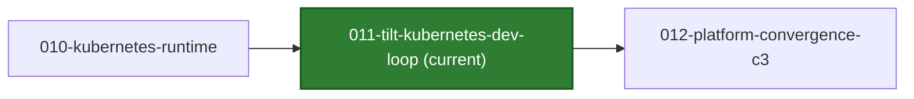

# TraderX Generated Code Snapshot

This branch is an auto-published generated-code snapshot for FINOS TraderX.

 

- State ID: `011-tilt-kubernetes-dev-loop`
- State Title: `Tilt Local Dev on Kubernetes`
- Status: `implemented`
- Suggested Version Tag: `generated/011-tilt-kubernetes-dev-loop/v1`
- Source Branch: `codex/address-actions-cves-20260528`
- Source Commit: `0313dc7bf828e4933b788834802bda10b8200bf5`
- Generated At (UTC): `2026-05-28T05:25:00Z`

## State Summary

- Builds on state `010` and preserves Kubernetes runtime behavior.
- Adds Tilt local developer-loop artifacts (`Tiltfile`, Tilt settings, workflow docs).
- Preserves baseline functional behavior and API contracts.

## State Lineage


```mermaid
flowchart LR
  S_CUR["011-tilt-kubernetes-dev-loop (current)"]
  style S_CUR fill:#2e7d32,stroke:#1b5e20,color:#ffffff,stroke-width:2px
  S_PREV_010_kubernetes_runtime["010-kubernetes-runtime"] --> S_CUR
  click S_PREV_010_kubernetes_runtime href "https://github.com/finos/traderX/tree/code%2Fgenerated-state-010-kubernetes-runtime" "Open branch"
  S_CUR --> S_NEXT_012_platform_convergence_c3["012-platform-convergence-c3"]
  click S_NEXT_012_platform_convergence_c3 href "https://github.com/finos/traderX/tree/code%2Fgenerated-state-012-platform-convergence-c3" "Open branch"
  click S_CUR href "https://github.com/finos/traderX/tree/code%2Fgenerated-state-011-tilt-kubernetes-dev-loop" "Open current branch"
```

| Direction | State | Branch | Compare |
| --- | --- | --- | --- |
| Previous | `010-kubernetes-runtime` | [code/generated-state-010-kubernetes-runtime](https://github.com/finos/traderX/tree/code%2Fgenerated-state-010-kubernetes-runtime) | 🔍 [compare](https://github.com/finos/traderX/compare/code%2Fgenerated-state-010-kubernetes-runtime...code%2Fgenerated-state-011-tilt-kubernetes-dev-loop) |
| Next | `012-platform-convergence-c3` | [code/generated-state-012-platform-convergence-c3](https://github.com/finos/traderX/tree/code%2Fgenerated-state-012-platform-convergence-c3) | 🔍 [compare](https://github.com/finos/traderX/compare/code%2Fgenerated-state-011-tilt-kubernetes-dev-loop...code%2Fgenerated-state-012-platform-convergence-c3) |

State sets:
- Previous states: `010-kubernetes-runtime`
- Next states: `012-platform-convergence-c3`

## Convergence Status

- Convergence state: `false`
- Convergence level: `none`
- Lineage role: `canonical`
- Dotted-line parents: `none`
- Previous convergence milestone: [009-order-management-matcher](https://github.com/finos/traderX/tree/code%2Fgenerated-state-009-order-management-matcher) (🔍 [compare](https://github.com/finos/traderX/compare/code%2Fgenerated-state-009-order-management-matcher...code%2Fgenerated-state-011-tilt-kubernetes-dev-loop))
- Next convergence milestone: [012-platform-convergence-c3](https://github.com/finos/traderX/tree/code%2Fgenerated-state-012-platform-convergence-c3) (🔍 [compare](https://github.com/finos/traderX/compare/code%2Fgenerated-state-011-tilt-kubernetes-dev-loop...code%2Fgenerated-state-012-platform-convergence-c3))

### Convergence Neighborhood


```mermaid
flowchart LR
  C_CUR["011-tilt-kubernetes-dev-loop (current)"]
  style C_CUR fill:#2e7d32,stroke:#1b5e20,color:#ffffff,stroke-width:2px
  C_PREV_009_order_management_matcher["009-order-management-matcher"] --> C_CUR
  click C_PREV_009_order_management_matcher href "https://github.com/finos/traderX/tree/code%2Fgenerated-state-009-order-management-matcher" "Open branch"
  %% compare: https://github.com/finos/traderX/compare/code%2Fgenerated-state-009-order-management-matcher...code%2Fgenerated-state-011-tilt-kubernetes-dev-loop
  C_CUR --> C_NEXT_012_platform_convergence_c3["012-platform-convergence-c3"]
  click C_NEXT_012_platform_convergence_c3 href "https://github.com/finos/traderX/tree/code%2Fgenerated-state-012-platform-convergence-c3" "Open branch"
  %% compare: https://github.com/finos/traderX/compare/code%2Fgenerated-state-011-tilt-kubernetes-dev-loop...code%2Fgenerated-state-012-platform-convergence-c3
  click C_CUR href "https://github.com/finos/traderX/tree/code%2Fgenerated-state-011-tilt-kubernetes-dev-loop" "Open current branch"
```

## Runtime Guidance

Run directly from this generated snapshot branch:

```bash
./scripts/start-state-010-kubernetes-runtime-generated.sh --provider kind
```

UI/edge endpoint: `http://localhost:8080`
Tilt UI: `http://localhost:10350`

Tilt artifact pack:

- `tilt-kubernetes-dev-loop/tilt/Tiltfile`
- `tilt-kubernetes-dev-loop/tilt/tilt-settings.json`

Status / stop:

```bash
./scripts/status-state-010-kubernetes-runtime-generated.sh --provider kind
./scripts/stop-state-010-kubernetes-runtime-generated.sh --provider kind
```

## API Explorer

- API explorer (ingress): `http://localhost:8080/api/docs`

## Interactive URLs

- UI (ingress): `http://localhost:8080`
- API explorer (ingress): `http://localhost:8080/api/docs`
- Trade page: `http://localhost:8080/trade`
- Account service route: `http://localhost:8080/account-service/account/22214`
- Position service route: `http://localhost:8080/position-service/positions/22214`
- Grafana (ingress): `http://localhost:8080/grafana` (admin/admin)
- Prometheus (ingress): `http://localhost:8080/prometheus`

Detailed clone-first instructions: [RUN_FROM_CLONE.md](./RUN_FROM_CLONE.md)
Functional validation guide: [FUNCTIONAL_TESTING.md](./FUNCTIONAL_TESTING.md)

## Learning Docs In This Snapshot

- [Docs Index](./docs/README.md)
- [Learning Index](./docs/learning/README.md)
- [Component List](./docs/learning/component-list.md)
- [System Design](./docs/learning/system-design.md)
- [Software Architecture](./docs/learning/software-architecture.md)
- [Component Diagram](./docs/learning/component-diagram.md)

## Canonical Specs And Docs

Canonical source-of-truth is maintained in the SpecKit authoring branch, not in this code snapshot branch.

- Feature pack: `specs/011-tilt-kubernetes-dev-loop`
- Generation entrypoint: `bash pipeline/generate-state.sh 011-tilt-kubernetes-dev-loop`
- Developer learning guide for this snapshot: [LEARNING.md](./LEARNING.md)
- Functional validation guide: [FUNCTIONAL_TESTING.md](./FUNCTIONAL_TESTING.md)
- Snapshot metadata: [STATE.md](./STATE.md), [state.json](./.traderx-state/state.json)
- Canonical Getting Started (main): https://github.com/finos/traderX/blob/main/docs/spec-kit/getting-started-with-traderx.md
- Source commit: https://github.com/finos/traderX/commit/0313dc7bf828e4933b788834802bda10b8200bf5
- Feature pack at source commit: https://github.com/finos/traderX/tree/0313dc7bf828e4933b788834802bda10b8200bf5/specs/011-tilt-kubernetes-dev-loop
- SpecKit docs at source commit: https://github.com/finos/traderX/tree/0313dc7bf828e4933b788834802bda10b8200bf5/docs/spec-kit
