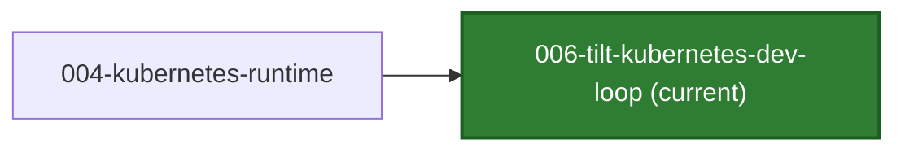

# TraderX Generated Code Snapshot

This branch is an auto-published generated-code snapshot for FINOS TraderX.

- State ID: `006-tilt-kubernetes-dev-loop`
- State Title: `Tilt Local Dev on Kubernetes`
- Status: `implemented`
- Suggested Version Tag: `generated/006-tilt-kubernetes-dev-loop/v1`
- Source Branch: `feature/agentic-renovation`
- Source Commit: `68d19a554c7480a615b19c024eb0a88228c6b9ad`
- Generated At (UTC): `2026-03-31T13:10:25Z`

## State Summary

- Builds on state `004` and preserves Kubernetes runtime behavior.
- Adds Tilt local developer-loop artifacts (`Tiltfile`, Tilt settings, workflow docs).
- Preserves baseline functional behavior and API contracts.

## State Lineage


```mermaid
flowchart LR
  S_CUR["006-tilt-kubernetes-dev-loop (current)"]
  style S_CUR fill:#2e7d32,stroke:#1b5e20,color:#ffffff,stroke-width:2px
  S_PREV_004_kubernetes_runtime["004-kubernetes-runtime"] --> S_CUR
  click S_PREV_004_kubernetes_runtime href "https://github.com/finos/traderX/tree/code%2Fgenerated-state-004-kubernetes-runtime" "Open branch"
  click S_CUR href "https://github.com/finos/traderX/tree/code%2Fgenerated-state-006-tilt-kubernetes-dev-loop" "Open current branch"
```

| Direction | State | Branch | Compare |
| --- | --- | --- | --- |
| Previous | `004-kubernetes-runtime` | [code/generated-state-004-kubernetes-runtime](https://github.com/finos/traderX/tree/code%2Fgenerated-state-004-kubernetes-runtime) | 🔍 [compare](https://github.com/finos/traderX/compare/code%2Fgenerated-state-004-kubernetes-runtime...code%2Fgenerated-state-006-tilt-kubernetes-dev-loop) |

State sets:
- Previous states: `004-kubernetes-runtime`
- Next states: `none`

## Runtime Guidance

Run directly from this generated snapshot branch:

```bash
./scripts/start-state-004-kubernetes-generated.sh --provider kind
```

UI/edge endpoint: `http://localhost:8080`
Tilt UI: `http://localhost:10350`

Tilt artifact pack:

- `tilt-kubernetes-dev-loop/tilt/Tiltfile`
- `tilt-kubernetes-dev-loop/tilt/tilt-settings.json`

Status / stop:

```bash
./scripts/status-state-004-kubernetes-generated.sh --provider kind
./scripts/stop-state-004-kubernetes-generated.sh --provider kind
```

Detailed clone-first instructions: [RUN_FROM_CLONE.md](./RUN_FROM_CLONE.md)

## Learning Docs In This Snapshot

- [Docs Index](./docs/README.md)
- [Learning Index](./docs/learning/README.md)
- [Component List](./docs/learning/component-list.md)
- [System Design](./docs/learning/system-design.md)
- [Software Architecture](./docs/learning/software-architecture.md)
- [Component Diagram](./docs/learning/component-diagram.md)

## Canonical Specs And Docs

Canonical source-of-truth is maintained in the SpecKit authoring branch, not in this code snapshot branch.

- Feature pack: `specs/006-tilt-kubernetes-dev-loop`
- Generation entrypoint: `bash pipeline/generate-state.sh 006-tilt-kubernetes-dev-loop`
- Developer learning guide for this snapshot: [LEARNING.md](./LEARNING.md)
- Snapshot metadata: [STATE.md](./STATE.md), [state.json](./.traderx-state/state.json)
- Source commit: https://github.com/finos/traderX/commit/68d19a554c7480a615b19c024eb0a88228c6b9ad
- Feature pack at source commit: https://github.com/finos/traderX/tree/68d19a554c7480a615b19c024eb0a88228c6b9ad/specs/006-tilt-kubernetes-dev-loop
- SpecKit docs at source commit: https://github.com/finos/traderX/tree/68d19a554c7480a615b19c024eb0a88228c6b9ad/docs/spec-kit
