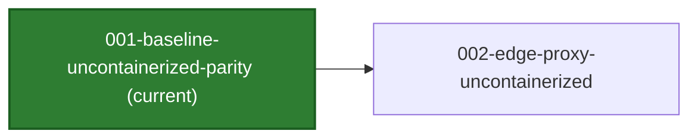

# TraderX Generated Code Snapshot

This branch is an auto-published generated-code snapshot for FINOS TraderX.

- State ID: `001-baseline-uncontainerized-parity`
- State Title: `Simple App - Base Uncontainerized App`
- Status: `released`
- Suggested Version Tag: `generated/001-baseline-uncontainerized-parity/v1`
- Source Branch: `feature/agentic-renovation`
- Source Commit: `68d19a554c7480a615b19c024eb0a88228c6b9ad`
- Generated At (UTC): `2026-03-31T13:03:44Z`

## State Summary

- Base case for TraderX generated code.
- Runtime model: uncontainerized local processes in deterministic startup order.
- Browser directly calls multiple service ports (cross-origin CORS behavior is part of this state).

## State Lineage


```mermaid
flowchart LR
  S_CUR["001-baseline-uncontainerized-parity (current)"]
  style S_CUR fill:#2e7d32,stroke:#1b5e20,color:#ffffff,stroke-width:2px
  S_CUR --> S_NEXT_002_edge_proxy_uncontainerized["002-edge-proxy-uncontainerized"]
  click S_NEXT_002_edge_proxy_uncontainerized href "https://github.com/finos/traderX/tree/code%2Fgenerated-state-002-edge-proxy-uncontainerized" "Open branch"
  click S_CUR href "https://github.com/finos/traderX/tree/code%2Fgenerated-state-001-baseline-uncontainerized-parity" "Open current branch"
```

| Direction | State | Branch | Compare |
| --- | --- | --- | --- |
| Next | `002-edge-proxy-uncontainerized` | [code/generated-state-002-edge-proxy-uncontainerized](https://github.com/finos/traderX/tree/code%2Fgenerated-state-002-edge-proxy-uncontainerized) | 🔍 [compare](https://github.com/finos/traderX/compare/code%2Fgenerated-state-001-baseline-uncontainerized-parity...code%2Fgenerated-state-002-edge-proxy-uncontainerized) |

State sets:
- Previous states: `none`
- Next states: `002-edge-proxy-uncontainerized`

## Runtime Guidance

Run directly from this generated snapshot branch:

```bash
./scripts/start-base-uncontainerized-generated.sh
```

UI endpoint: `http://localhost:18093`

Status / stop:

```bash
./scripts/status-base-uncontainerized-generated.sh
./scripts/stop-base-uncontainerized-generated.sh
```

Detailed clone-first instructions: [RUN_FROM_CLONE.md](./RUN_FROM_CLONE.md)

## Learning Docs In This Snapshot

- [Docs Index](./docs/README.md)
- [Learning Index](./docs/learning/README.md)
- [Component List](./docs/learning/component-list.md)
- [System Design](./docs/learning/system-design.md)
- [Software Architecture](./docs/learning/software-architecture.md)
- [Component Diagram](./docs/learning/component-diagram.md)

## Canonical Specs And Docs

Canonical source-of-truth is maintained in the SpecKit authoring branch, not in this code snapshot branch.

- Feature pack: `specs/001-baseline-uncontainerized-parity`
- Generation entrypoint: `bash pipeline/generate-from-spec.sh`
- Developer learning guide for this snapshot: [LEARNING.md](./LEARNING.md)
- Snapshot metadata: [STATE.md](./STATE.md), [state.json](./.traderx-state/state.json)
- Source commit: https://github.com/finos/traderX/commit/68d19a554c7480a615b19c024eb0a88228c6b9ad
- Feature pack at source commit: https://github.com/finos/traderX/tree/68d19a554c7480a615b19c024eb0a88228c6b9ad/specs/001-baseline-uncontainerized-parity
- SpecKit docs at source commit: https://github.com/finos/traderX/tree/68d19a554c7480a615b19c024eb0a88228c6b9ad/docs/spec-kit
