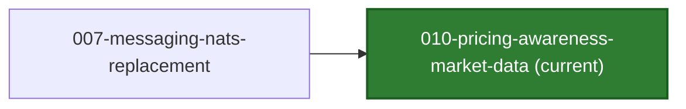

# TraderX Generated Code Snapshot

This branch is an auto-published generated-code snapshot for FINOS TraderX.

- State ID: `010-pricing-awareness-market-data`
- State Title: `Pricing Awareness and Market Data Streaming`
- Status: `implemented`
- Suggested Version Tag: `generated/010-pricing-awareness-market-data/v1`
- Source Branch: `feature/agentic-renovation`
- Source Commit: `68d19a554c7480a615b19c024eb0a88228c6b9ad`
- Generated At (UTC): `2026-03-31T13:16:32Z`

## State Summary

- Builds on state `007` and preserves NATS-based messaging + compose ingress runtime behavior.
- Adds market pricing stream, trade execution price stamping, and position average cost basis aggregation.
- Extends UI blotters with pricing/value/P&L visualization while preserving baseline trade/account workflows.

## State Lineage


```mermaid
flowchart LR
  S_CUR["010-pricing-awareness-market-data (current)"]
  style S_CUR fill:#2e7d32,stroke:#1b5e20,color:#ffffff,stroke-width:2px
  S_PREV_007_messaging_nats_replacement["007-messaging-nats-replacement"] --> S_CUR
  click S_PREV_007_messaging_nats_replacement href "https://github.com/finos/traderX/tree/code%2Fgenerated-state-007-messaging-nats-replacement" "Open branch"
  click S_CUR href "https://github.com/finos/traderX/tree/code%2Fgenerated-state-010-pricing-awareness-market-data" "Open current branch"
```

| Direction | State | Branch | Compare |
| --- | --- | --- | --- |
| Previous | `007-messaging-nats-replacement` | [code/generated-state-007-messaging-nats-replacement](https://github.com/finos/traderX/tree/code%2Fgenerated-state-007-messaging-nats-replacement) | 🔍 [compare](https://github.com/finos/traderX/compare/code%2Fgenerated-state-007-messaging-nats-replacement...code%2Fgenerated-state-010-pricing-awareness-market-data) |

State sets:
- Previous states: `007-messaging-nats-replacement`
- Next states: `none`

## Runtime Guidance

Run directly from this generated snapshot branch:

```bash
./scripts/start-state-010-pricing-awareness-market-data-generated.sh
```

UI/ingress endpoint: `http://localhost:8080`
NATS monitor endpoint: `http://localhost:8222/varz`
Price publisher endpoint: `http://localhost:18100/prices`

Status / stop:

```bash
./scripts/status-state-010-pricing-awareness-market-data-generated.sh
./scripts/stop-state-010-pricing-awareness-market-data-generated.sh
```

Detailed clone-first instructions: [RUN_FROM_CLONE.md](./RUN_FROM_CLONE.md)

## Learning Docs In This Snapshot

- [Docs Index](./docs/README.md)
- [Learning Index](./docs/learning/README.md)
- [Component List](./docs/learning/component-list.md)
- [System Design](./docs/learning/system-design.md)
- [Software Architecture](./docs/learning/software-architecture.md)
- [Component Diagram](./docs/learning/component-diagram.md)

## Canonical Specs And Docs

Canonical source-of-truth is maintained in the SpecKit authoring branch, not in this code snapshot branch.

- Feature pack: `specs/010-pricing-awareness-market-data`
- Generation entrypoint: `bash pipeline/generate-state.sh 010-pricing-awareness-market-data`
- Developer learning guide for this snapshot: [LEARNING.md](./LEARNING.md)
- Snapshot metadata: [STATE.md](./STATE.md), [state.json](./.traderx-state/state.json)
- Source commit: https://github.com/finos/traderX/commit/68d19a554c7480a615b19c024eb0a88228c6b9ad
- Feature pack at source commit: https://github.com/finos/traderX/tree/68d19a554c7480a615b19c024eb0a88228c6b9ad/specs/010-pricing-awareness-market-data
- SpecKit docs at source commit: https://github.com/finos/traderX/tree/68d19a554c7480a615b19c024eb0a88228c6b9ad/docs/spec-kit
