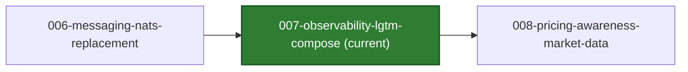

# TraderX Generated Code Snapshot

This branch is an auto-published generated-code snapshot for FINOS TraderX.

 

- State ID: `007-observability-lgtm-compose`
- State Title: `Observability with LGTM on Compose`
- Status: `implemented`
- Suggested Version Tag: `generated/007-observability-lgtm-compose/v1`
- Source Branch: `main`
- Source Commit: `f0056d6753b9a76295ce40ede1f32c30bd2c5f27`
- Generated At (UTC): `2026-06-21T11:17:35Z`

## State Summary

- Generated code snapshot for TraderX state transition.

## State Lineage

```mermaid
flowchart LR
  S_CUR["007-observability-lgtm-compose (current)"]
  style S_CUR fill:#2e7d32,stroke:#1b5e20,color:#ffffff,stroke-width:2px
  S_PREV_006_messaging_nats_replacement["006-messaging-nats-replacement"] --> S_CUR
  click S_PREV_006_messaging_nats_replacement href "https://github.com/finos/traderX/tree/code%2Fgenerated-state-006-messaging-nats-replacement" "Open branch"
  S_CUR --> S_NEXT_008_pricing_awareness_market_data["008-pricing-awareness-market-data"]
  click S_NEXT_008_pricing_awareness_market_data href "https://github.com/finos/traderX/tree/code%2Fgenerated-state-008-pricing-awareness-market-data" "Open branch"
  click S_CUR href "https://github.com/finos/traderX/tree/code%2Fgenerated-state-007-observability-lgtm-compose" "Open current branch"
```

| Direction | State | Branch | Compare |
| --- | --- | --- | --- |
| Previous | `006-messaging-nats-replacement` | [code/generated-state-006-messaging-nats-replacement](https://github.com/finos/traderX/tree/code%2Fgenerated-state-006-messaging-nats-replacement) | 🔍 [compare](https://github.com/finos/traderX/compare/code%2Fgenerated-state-006-messaging-nats-replacement...code%2Fgenerated-state-007-observability-lgtm-compose) |
| Next | `008-pricing-awareness-market-data` | [code/generated-state-008-pricing-awareness-market-data](https://github.com/finos/traderX/tree/code%2Fgenerated-state-008-pricing-awareness-market-data) | 🔍 [compare](https://github.com/finos/traderX/compare/code%2Fgenerated-state-007-observability-lgtm-compose...code%2Fgenerated-state-008-pricing-awareness-market-data) |

State sets:
- Previous states: `006-messaging-nats-replacement`
- Next states: `008-pricing-awareness-market-data`

## Convergence Status

- Convergence state: `true`
- Convergence level: `C1`
- Lineage role: `canonical`
- Dotted-line parents: `none`
- Previous convergence milestone: [004-containerized-compose-runtime](https://github.com/finos/traderX/tree/code%2Fgenerated-state-004-containerized-compose-runtime) (🔍 [compare](https://github.com/finos/traderX/compare/code%2Fgenerated-state-004-containerized-compose-runtime...code%2Fgenerated-state-007-observability-lgtm-compose))
- Next convergence milestone: [009-order-management-matcher](https://github.com/finos/traderX/tree/code%2Fgenerated-state-009-order-management-matcher) (🔍 [compare](https://github.com/finos/traderX/compare/code%2Fgenerated-state-007-observability-lgtm-compose...code%2Fgenerated-state-009-order-management-matcher))

### Convergence Neighborhood

```mermaid
flowchart LR
  C_CUR["007-observability-lgtm-compose (current)"]
  style C_CUR fill:#2e7d32,stroke:#1b5e20,color:#ffffff,stroke-width:2px
  C_PREV_004_containerized_compose_runtime["004-containerized-compose-runtime"] --> C_CUR
  click C_PREV_004_containerized_compose_runtime href "https://github.com/finos/traderX/tree/code%2Fgenerated-state-004-containerized-compose-runtime" "Open branch"
  %% compare: https://github.com/finos/traderX/compare/code%2Fgenerated-state-004-containerized-compose-runtime...code%2Fgenerated-state-007-observability-lgtm-compose
  C_CUR --> C_NEXT_009_order_management_matcher["009-order-management-matcher"]
  click C_NEXT_009_order_management_matcher href "https://github.com/finos/traderX/tree/code%2Fgenerated-state-009-order-management-matcher" "Open branch"
  %% compare: https://github.com/finos/traderX/compare/code%2Fgenerated-state-007-observability-lgtm-compose...code%2Fgenerated-state-009-order-management-matcher
  click C_CUR href "https://github.com/finos/traderX/tree/code%2Fgenerated-state-007-observability-lgtm-compose" "Open current branch"
```

## Runtime Guidance

See `RUN_FROM_CLONE.md` for clone-first runtime instructions.

## API Explorer

- API explorer (ingress): `http://localhost:8080/api/docs`

## Interactive URLs

- UI (ingress): `http://localhost:8080`
- API explorer (ingress): `http://localhost:8080/api/docs`
- Grafana dashboards (ingress): `http://localhost:8080/grafana/`
- Grafana local admin: `http://localhost:3001`
- Prometheus: `http://localhost:9090`
- Loki: `http://localhost:3100`
- Tempo: `http://localhost:3200`

## Grafana Access

- Public dashboards: `http://localhost:8080/grafana/`
- Local admin URL: `http://localhost:3001`
- The start script prints the active local admin credential.
- Default convention: user from `TRADERX_GRAFANA_ADMIN_USER` or `traderx-admin`; password from `TRADERX_GRAFANA_ADMIN_PASSWORD` or `traderx-state-007`.

Detailed clone-first instructions: [RUN_FROM_CLONE.md](./RUN_FROM_CLONE.md)
Functional validation guide: [FUNCTIONAL_TESTING.md](./FUNCTIONAL_TESTING.md)

## Learning Docs In This Snapshot

- [Docs Index](./docs/README.md)
- [Learning Index](./docs/learning/README.md)
- [Component List](./docs/learning/component-list.md)
- [System Design](./docs/learning/system-design.md)
- [Software Architecture](./docs/learning/software-architecture.md)
- [Component Diagram](./docs/learning/component-diagram.md)

## Canonical Specs And Docs

Canonical source-of-truth is maintained in the SpecKit authoring branch, not in this code snapshot branch.

- Feature pack: `specs/007-observability-lgtm-compose`
- Generation entrypoint: `bash pipeline/generate-state.sh 007-observability-lgtm-compose`
- Developer learning guide for this snapshot: [LEARNING.md](./LEARNING.md)
- Functional validation guide: [FUNCTIONAL_TESTING.md](./FUNCTIONAL_TESTING.md)
- Snapshot metadata: [STATE.md](./STATE.md), [state.json](./.traderx-state/state.json)
- Canonical Getting Started (main): https://github.com/finos/traderX/blob/main/docs/spec-kit/getting-started-with-traderx.md
- Source commit: https://github.com/finos/traderX/commit/f0056d6753b9a76295ce40ede1f32c30bd2c5f27
- Feature pack at source commit: https://github.com/finos/traderX/tree/f0056d6753b9a76295ce40ede1f32c30bd2c5f27/specs/007-observability-lgtm-compose
- SpecKit docs at source commit: https://github.com/finos/traderX/tree/f0056d6753b9a76295ce40ede1f32c30bd2c5f27/docs/spec-kit
