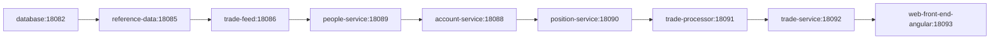
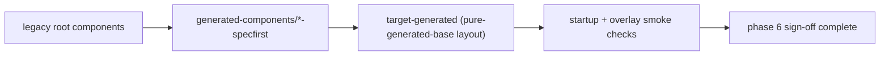
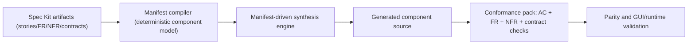

# TraderSpec Migration Blog

This blog tracks major migration phases, findings, and decisions as we execute `TraderSpec/migration-todo.md`.

## Phase Timeline

| Date | Phase | Status | Summary |
|---|---|---|---|
| 2026-03-27 | Phase 1 - Scaffold + Bridge | Done | Spec scaffolding, catalogs, prompts, docs wiring, parity/spec-first bridge scripts. |
| 2026-03-27 | Phase 2 - Base Uncontainerized Runtime | Done | Startup sequence validated through all services to Angular UI readiness. |
| 2026-03-27 | Phase 4 - First Pure-Generated Component | Done | `reference-data` generated from specs and booted in mixed mode. |
| 2026-03-27 | Phase 5 - Iterative Component Cutover | Done | All base-case components (including Angular UI) validated green in mixed generated mode. |
| 2026-03-27 | Phase 6 - Source Deletion by Approval | Done | Legacy root component sources removed; pure-generated base startup and web smoke checks validated. |
| 2026-03-27 | Phase 7 - GitHub Spec Kit Adoption | Done | Manifest-driven synthesis, conformance packs, semantic compare harness, 7.11 pilot proof, and 7.12 cleanup are complete. |

## Live TODO Activity Summary

This mirrors `TraderSpec/migration-todo.md` and highlights active execution signals.

| TODO Ref | Activity | Status | Findings |
|---|---|---|---|
| 1.1-1.2 | Confirmed scaffold/bridge state and semantics | Done | Hydration exists; pure synthesis parity is not complete yet. |
| 2.1-2.2 | Captured base runtime order/ports + start-stop-health | Done | Order and commands are now explicit and machine-readable. |
| 2.3 | Run and validate hydrated base state end-to-end | Done | Reached ready state through `web-front-end-angular` on `:18093`. |
| 3.1-3.3 | Startup orchestration from machine-readable spec | Done | Generated startup-order script executed full baseline sequence. |
| 4.1-4.2 | Select first component and expand specs | Done | `reference-data` selected with FR/NFR/technical/verification docs. |
| 4.3-4.4 | Generate first pure component and run mixed mode | Done | Generated `reference-data` started successfully in overlay mode. |
| 5.1 | Compatibility/regression checks for first cutover | Done | `reference-data`, `database`, `people-service`, `account-service`, `position-service`, `trade-feed`, `trade-processor`, `trade-service`, and `web-front-end-angular` checks now pass in generated overlay mode. |
| 5.2 | Track generated-vs-hydrated component matrix | Done | Added `catalog/component-cutover-matrix.csv` with active cutover status. |
| 5.3 | Prepare second component generated overlay | Done | Generated `database-specfirst` artifact validated with smoke checks and promoted to ready-for-signoff. |
| 5.4 | Prepare third component generated overlay | Done | Generated `people-service` overlay passed mixed-mode smoke tests including CORS and account-service interoperability checks. |
| 5.5 | Prepare fourth component spec pack | Done | Added account-service FR/NFR/technical/verification specs and generation prompt. |
| 5.6 | Prepare fourth component generated overlay | Done | Generated `account-service` overlay passed GUI and smoke validation in mixed mode. |
| 5.7 | Resolve generated account-service startup blocker | Done | Added `mavenCentral()` to generated Gradle build and introduced startup Gradle network preflight checks with explicit diagnostics. |
| 5.8 | Prepare fifth component spec pack | Done | Added position-service FR/NFR/technical/verification specs and generation prompt. |
| 5.9 | Prepare fifth component generated overlay | Done | Generated `position-service` overlay passed GUI and smoke validation in mixed mode. |
| 5.10 | Prepare sixth component spec pack | Done | Added trade-feed FR/NFR/technical/verification specs and generation prompt. |
| 5.11 | Prepare sixth component generated overlay | Done | Generated `trade-feed` overlay passed publish/subscribe smoke checks and was promoted to ready-for-signoff. |
| 5.12 | Prepare seventh component generated overlay | Done | Generated `trade-processor` overlay passed smoke checks and GUI validation and was promoted to ready-for-signoff. |
| 5.13 | Prepare eighth component spec pack | Done | Added trade-service FR/NFR/technical/verification specs and generation prompt. |
| 5.14 | Prepare eighth component generated overlay | Done | Generated `trade-service` overlay passed smoke checks and GUI validation and was promoted to ready-for-signoff. |
| 5.15 | Prepare ninth component spec pack | Done | Added Angular web frontend FR/NFR/technical/verification specs and generation prompt. |
| 5.16 | Prepare ninth component generated overlay | Done | Generated Angular frontend overlay passed smoke checks and GUI branding/flow validation and was promoted to ready-for-signoff. |
| 6.1 | Prepare source-retirement sign-off checklist | Done | Approved components are now retired from root source; generated-only base startup validated. |
| 7.1-7.4 | Adopt GitHub Spec Kit requirements-first generation flow | Done | Spec artifacts, traceability, readiness gates, and compliance checks are in place. |
| 7.5 | Prove parity from Spec Kit generation | Done | Full parity validation passed for current generation pipeline behavior. |
| 7.6 | Define normalized manifest schema from Spec Kit | Done | Added manifest spec and JSON schema as the synthesis contract. |
| 7.7 | Implement manifest compiler stage (`speckit -> manifest`) | Done | Deterministic manifests now compile for all catalog components. |
| 7.8 | Implement manifest-driven synthesis generators | Done | All baseline component generators now synthesize from manifest + template. |
| 7.9 | Add conformance packs (story/FR/NFR/contracts) | Done | Added per-component packs and validated all 9 baseline components through conformance gates. |
| 7.10 | Add semantic generation compare harness | Done | Added per-component and all-component compare runners with semantic diff categorization. |
| 7.11 | Pilot trade-service synthesis + parity proof | Done | `trade-service` compare harness returned no output diff and full parity runner passed including trade-service + Angular smoke checks. |
| 7.12 | Roll synthesis across all baseline components | Done | All-component conformance+compare validation passed and residual hydrate/direct-write bridge usage was retired. |

## Phase 1 Findings

- We have robust scaffolding for spec-driven delivery.
- We do not yet have full pure code synthesis parity.
- Hydration is currently used as an operational bridge.

## Phase 2: Base Uncontainerized Runtime (Completed)

### Objective

Define and run the official base case as local processes in deterministic order.

### Decisions

- Active UI scope is Angular only.
- Base runtime order follows existing TraderX manual sequence.
- Runtime process definitions are now captured in machine-readable catalog data.

### Process Order Diagram

### Phase 2 Findings (So Far)

- Service startup and dependencies are explicit enough to automate.
- Ports are normalized and discoverable in one place.
- The base case is now reproducible from TraderSpec scripts, with hydration still used for component internals.

### Phase 2.3 Validation Attempt #1 (2026-03-27)

- Dry-run completed successfully and confirmed startup order + commands.
- Full run with dependency download progressed through:
  - `database` (ready on `:18082`)
  - `reference-data` (ready on `:18085`)
  - `trade-feed` (ready on `:18086`)
- Execution blocked on `people-service` with:
  - `bad CPU type in executable: dotnet`
- Corrective action added:
  - startup script now uses TraderSpec-local tool caches (`GRADLE_USER_HOME`, npm cache, dotnet home, NuGet packages)
  - startup script now performs a dotnet preflight runtime check and fails early with a targeted hint

### Phase 2.3 Validation Attempt #2 (2026-03-27)

- After installing arm64 dotnet runtime support, startup again progressed through:
  - `database` (ready on `:18082`)
  - `reference-data` (ready on `:18085`)
  - `trade-feed` (ready on `:18086`)
- `people-service` still fails before port bind due missing framework:
  - `Microsoft.AspNetCore.App`, version `9.0.0` (arm64)
- Additional corrective action:
  - startup preflight now validates both `Microsoft.NETCore.App 9.x` and `Microsoft.AspNetCore.App 9.x` before launch

### Phase 2.3 Validation Attempt #3 (2026-03-27)

- After installing required dotnet runtimes, startup progressed to full sequence completion:
  - `people-service` ready on `:18089`
  - `account-service` ready on `:18088`
  - `position-service` ready on `:18090`
  - `trade-processor` ready on `:18091`
  - `trade-service` ready on `:18092`
  - `web-front-end-angular` ready on `:18093`
- Result: phase 2.3 and 3.3 execution gates are satisfied.

## Phase 4: First Pure-Generated Component (Completed)

### Component Choice

- First target: `reference-data` service.

### New Component Spec Pack

- `foundation/00-traditional-to-cloud-native/specs/components/reference-data/01-functional-requirements.md`
- `foundation/00-traditional-to-cloud-native/specs/components/reference-data/02-non-functional-requirements.md`
- `foundation/00-traditional-to-cloud-native/specs/components/reference-data/03-technical-specification.md`
- `foundation/00-traditional-to-cloud-native/specs/components/reference-data/04-verification-checklist.md`
- `prompts/generation/02-generate-reference-data-component.md`

### Generated Component Artifact

- `codebase/generated-components/reference-data-specfirst`
- startup overlay flag added: `--overlay-reference-generated`
- generator script: `pipeline/generate-reference-data-specfirst.sh` (resets and regenerates generated-only folder)

### Mixed-Mode Execution Result

- Mixed startup run completed with all services reporting ready through Angular UI.
- `reference-data` log confirms generated package booted:
  - `@traderspec/reference-data-specfirst`
  - ready signal on port `18085`

### Cross-Origin Finding And Action

- Finding: browser calls from UI port to reference-data port are blocked without explicit service CORS in pre-ingress mode.
- Decision: treat CORS as a baseline NFR for this state (applies to generated services until ingress/proxy state).
- Implemented:
  - generated `reference-data` bootstrap now enables CORS by default
  - specs/prompts updated so future generated components in this state include CORS configuration

### Dataset Coverage Finding And Action

- Finding: generated `reference-data` initially used a reduced seed list and did not match baseline symbol coverage.
- Implemented:
  - generated component now loads `data/s-and-p-500-companies.csv`
  - generation pipeline now regenerates with CSV-backed loader by default

### Phase 5 Tracking Artifacts

- `catalog/component-cutover-matrix.csv`
- `codebase/scripts/test-reference-data-overlay.sh`
- `codebase/scripts/test-database-overlay.sh`
- `pipeline/generate-database-specfirst.sh`
- `codebase/scripts/test-people-service-overlay.sh`
- `pipeline/generate-people-service-specfirst.sh`
- `codebase/scripts/test-account-service-overlay.sh`
- `pipeline/generate-account-service-specfirst.sh`
- `codebase/scripts/test-position-service-overlay.sh`
- `pipeline/generate-position-service-specfirst.sh`
- `codebase/scripts/test-trade-feed-overlay.sh`
- `pipeline/generate-trade-feed-specfirst.sh`
- `codebase/scripts/test-trade-processor-overlay.sh`
- `pipeline/generate-trade-processor-specfirst.sh`
- `codebase/scripts/test-trade-service-overlay.sh`
- `pipeline/generate-trade-service-specfirst.sh`
- `codebase/scripts/test-web-angular-overlay.sh`
- `pipeline/generate-web-front-end-angular-specfirst.sh`

### Planned Component Cutover Order (Phase 4+)

This is the working order for replacing hydrated components with pure-generated implementations.

```mermaid
flowchart LR
  H0["Hydrated Base Runtime (anchor)"] --> C1["1. reference-data service"]
  C1 --> C2["2. database support artifacts"]
  C2 --> C3["3. people service"]
  C3 --> C4["4. account service"]
  C4 --> C5["5. position service"]
  C5 --> C6["6. trade-feed service"]
  C6 --> C7["7. trade-processor service"]
  C7 --> C8["8. trade-service API"]
  C8 --> C9["9. angular web frontend"]

  classDef done fill:#d9f2d9,stroke:#2d6a2d,color:#123b12;
  classDef inprogress fill:#fff3cd,stroke:#a17700,color:#4d3b00;
  classDef planned fill:#e8edf2,stroke:#52606d,color:#1f2933;

  class H0,C1,C2,C3,C4,C5,C6,C7,C8,C9 done;
```

### Artifacts Added

- `foundation/.../10-base-uncontainerized-state.md`
- `catalog/base-uncontainerized-processes.csv`
- `codebase/scripts/start-base-uncontainerized-hydrated.sh`
- `codebase/scripts/stop-base-uncontainerized-hydrated.sh`
- `codebase/scripts/status-base-uncontainerized-hydrated.sh`

### What This Enables

- Repeatable base runtime in hydrated TraderSpec location.
- A concrete substrate for phase 3 startup-script generation from specs.

## Phase 6: Source Retirement (Completed)

### Actions Completed

- Added reusable template snapshots in `TraderSpec/templates` so generators no longer depend on deleted legacy folders.
- Deleted legacy root component sources for all 9 base-case components after smoke and GUI sign-off.
- Added pure-generated startup layout mode (`--pure-generated-base`) and validated full startup with generated overlays only.
- Fixed pure-generated startup cleanup to preserve `.run` state and avoid intermittent deletion failures on busy cache folders.

### Retirement Visualization

## Phase 7: GitHub Spec Kit Adoption (In Progress)

### Goal

Replace template-driven direct source writes with a Spec Kit workflow where generation is driven by requirements and user stories.

### Required Outcomes

- Define Spec Kit artifacts for each component and state:
  - epics and feature narratives
  - user stories with acceptance criteria
  - functional and non-functional requirements
  - technical constraints/contracts (ports, APIs, schemas, runtime expectations)
- Add traceability from each requirement to:
  - user story / acceptance criteria
  - generated implementation units
  - verification tests
- Update TraderSpec generation pipelines to consume these artifacts as first-class inputs.
- Add compliance verification checks proving generated outputs satisfy the mapped requirements.
- Demonstrate parity on at least one representative component regenerated from Spec Kit inputs.

### Phase 7 Progress Update

- Implemented `TraderSpec/speckit/` with:
  - system context and flow model sourced from `docs/overview.md`, `docs/flows.md`, and READMEs
  - baseline system requirements, user stories, acceptance criteria
  - requirements traceability matrix across baseline components
  - component-level Spec Kit requirement files
- Added Spec Kit-owned contract snapshots under `TraderSpec/speckit/contracts/**/openapi.yaml`.
- Added `pipeline/speckit/validate-speckit-readiness.sh` and shared guard logic in `pipeline/speckit/lib.sh`.
- Updated all baseline component generators to require Spec Kit global and component readiness before generation.
- Updated regeneration readiness/coverage checks to validate Spec Kit artifacts and no longer require deleted legacy source trees.
- Added a normalized manifest specification and schema (`component-generation-manifest.md`, `component-generation-manifest.schema.json`) as the required interface between Spec Kit artifacts and synthesis generators.
- Added manifest compiler scripts (`compile-component-manifest.sh`, `compile-all-component-manifests.sh`) and wired `generate-from-spec.sh` to attach compiled manifests to generated component scaffolds.
- Re-ran `validate-speckit-readiness.sh` and `verify-spec-expressiveness.sh` after manifest additions; both remained green.
- Converted `generate-trade-service-specfirst.sh` to manifest-driven synthesis by copying a static template and injecting runtime/env/contract values from `trade-service.manifest.json`.
- Added `TraderSpec/templates/trade-service-specfirst` as the static source template for manifest-driven trade-service generation.
- Ran generator diff harness against `HEAD`; only expected deltas were README wording and new `SPEC.manifest.json` artifact.
- Verified generated `trade-service-specfirst` compiles successfully with `./gradlew build`.
- Converted `generate-account-service-specfirst.sh`, `generate-position-service-specfirst.sh`, and `generate-trade-processor-specfirst.sh` to the same manifest-driven synthesis pattern.
- Added template roots for converted Spring services: `templates/account-service-specfirst`, `templates/position-service-specfirst`, `templates/trade-processor-specfirst`.
- Completed one integrated startup + smoke pass with converted overlays: account-service, position-service, and trade-processor smoke tests all passed in a single run.
- Converted remaining generators (`database`, `reference-data`, `trade-feed`, `people-service`, `web-front-end-angular`) to the same manifest-driven synthesis pattern.
- Added non-Spring template roots used by converted generators: `templates/database-specfirst`, `templates/reference-data-specfirst`, `templates/trade-feed-specfirst`, `templates/people-service-specfirst` (Angular generator continues to use `templates/web-front-end/angular`).
- Ran full parity validation after the full conversion set; startup and every overlay smoke test passed.
- Added conformance pack automation (`sync-conformance-packs.sh`, `run-component-conformance-pack.sh`, `run-all-conformance-packs.sh`) and generated docs under `speckit/conformance/**`.
- Ran all conformance packs successfully across all 9 baseline components.
- Added semantic comparison harness (`compare-component-generation.sh`, `compare-all-component-generation.sh`) with category-level diff reporting.
- Fixed compare harness portability on macOS bash 3.x (removed associative-array dependency), and validated compare-all execution.
- Compare reports currently show `docs-spec` deltas only when comparing against older refs because `SPEC.manifest.json` timestamp format changed; source/runtime/contract files remain aligned.
- Completed focused 7.11 `trade-service` proof with:
  - `bash TraderSpec/pipeline/speckit/compare-component-generation.sh trade-service HEAD --allow-differences`
  - result: no output differences for `trade-service`
  - `bash TraderSpec/pipeline/speckit/run-full-parity-validation.sh`
  - result: full pass including `trade-service` smoke checks and Angular UI/branding smoke checks
- Completed 7.12 all-component proof with:
  - `bash TraderSpec/pipeline/speckit/run-all-conformance-packs.sh`
  - result: passed for all 9 generated baseline components
  - `bash TraderSpec/pipeline/speckit/compare-all-component-generation.sh HEAD --allow-differences`
  - result: no output differences across all 9 generated baseline components
- Retired residual hydration bridge usage in specfirst regeneration path:
  - `pipeline/generate-from-spec.sh` now assembles from synthesized `generated-components/*-specfirst` only
  - `codebase/scripts/run-specfirst-generated-codebase.sh` and docs no longer use `--hydrate-from-source`
  - base startup script now auto-falls back to pure-generated mode when legacy root baseline folders are absent

### Phase 7 Gap Confirmed

- Phase 7 is complete.

### Phase 7 Synthesis Cutover Plan

## Next Up

- Continue Phase 8 documentation and visual evidence maintenance.
- Keep migration evidence and Mermaid visuals updated as synthesis milestones land.
