# TraderSpec Migration TODO

This is the long-running execution plan for moving TraderX from source-first to pure spec-first generation.

## Latest Update

- Current phase: **Phase 9 complete** (TraderSpec docs consolidation after root Spec Kit canonicalization).
- Current focus: prepare phase-10 learning-path evolution from the now-clean canonical docs and root Spec Kit baseline.
- Current blocker: none.
- Planned cutover order for pure generation is now documented in the migration blog (Phase 2 section).
- Migration blog: `TraderSpec/migration-blog.md`
- Last updated: 2026-03-29

## Phase Snapshot

| Phase | Status | Immediate Next Checkpoint |
|---|---|---|
| 1 - Scaffold + Bridge | Done | Keep as reference baseline only. |
| 2 - Base Uncontainerized Runtime | Done | Startup sequence validated through Angular UI readiness. |
| 3 - Generate Startup Orchestration | Done | Environment run via generated startup-order script. |
| 4 - First Pure-Generated Component | Done | Generated `reference-data` and booted mixed mode sequence. |
| 5 - Iterative Component Cutover | Done | All baseline components generated and validated in overlay mode. |
| 6 - Source Deletion by Approval | Done | Legacy root components removed after sign-off. |
| 7 - GitHub Spec Kit Adoption | Done | Manifest-driven synthesis + conformance + compare harness + pilot proof + cleanup complete. |
| 8 - Migration Documentation + Visual Evidence | Done | Journey docs and Mermaid proof artifacts updated through Phase 7 closeout. |
| 9 - TraderSpec Docs Consolidation | Done | Runbook and navigation are consolidated; Docusaurus build is green after plugin overlap fix. |
| 10 - Learning Path Evolution | Pending | Apply NFR/FR overlays for post-baseline states. |
| 11 - Root-Level Spec Kit Canonical Migration | Done | Root specs now drive readiness/expressiveness/conformance/parity with CI gates and legacy pointer-only decommissioning. |

## Current Reality Check (Confirmed)

- We have built **spec-driven scaffolding**, catalogs, prompts, and generation pipelines.
- We have **not** yet synthesized a full production-equivalent codebase purely from requirements.
- Current runnable modes are:
  - parity snapshot mode (copied reference implementation)
  - spec-first scaffold generation
  - spec-mapped hydration mode (materialized from mapped source paths)
- Hydration is a bridge, not the end-state.

## Mission

Make TraderSpec the source of truth so original root source can be retired safely, and contributors can generate and run any state directly from spec history.

## Program TODO

- [x] 1) Document what we have done so far.
- [x] 1.1 Confirm status: scaffolding + hydration bridge exists, pure synthesis not complete.
- [x] 1.2 Define baseline/parity/spec-first semantics.

- [x] 2) Establish official base case: uncontainerized process-first startup in known order with fixed ports.
- [x] 2.1 Capture exact startup order and dependency graph for all base services.
- [x] 2.2 Define per-process start/stop commands and health checks.
- [x] 2.3 Bring up base state in hydrated TraderSpec location and validate.

- [x] 3) Describe base case deeply enough to generate startup orchestration from spec.
- [x] 3.1 Add machine-readable startup-order spec.
- [x] 3.2 Generate startup script from spec.
- [x] 3.3 Run environment using generated startup script.

- [x] 4) Choose first component for true replacement generation (no hydration).
- [x] 4.1 Start with simplest viable component (DB or reference-data).
- [x] 4.2 Expand FR/NFR/technical/contract spec for that component.
- [x] 4.3 Generate component implementation from spec.
- [x] 4.4 Run environment with generated component + hydrated others.

- [x] 5) Repeat component-by-component cutover to pure generation.
- [x] 5.1 Maintain compatibility and regression checks each cut.
- [x] 5.2 Track generated-vs-hydrated component matrix.

- [x] 6) After approval per component, delete original source component.
- [x] 6.1 Define sign-off checklist for deletion.
- [x] 6.2 Remove source only after generated replacement is stable.

- [x] 7) Adopt GitHub Spec Kit workflow for requirements-first generation.
- [x] 7.1 Define Spec Kit artifact model (epics, features, user stories, acceptance criteria, FR, NFR, technical constraints).
- [x] 7.2 Add requirement traceability mapping (requirements -> stories -> acceptance tests -> generated code units).
- [x] 7.3 Update generation pipelines to consume Spec Kit artifacts as primary input (instead of direct file-writing templates only).
- [x] 7.4 Add compliance checks to verify generated code satisfies mapped requirements and contracts.
- [x] 7.5 Prove parity by regenerating baseline components from Spec Kit requirements and passing smoke tests.
- [x] 7.6 Define a normalized component-generation manifest schema emitted from Spec Kit artifacts (interfaces, endpoints, domain model, infra, runtime, NFR toggles).
- [x] 7.7 Implement manifest compiler stage (`speckit -> manifest`) per baseline component with deterministic output.
- [x] 7.8 Replace heredoc-style source-dump generators with manifest-driven synthesis generators (template/AST-based).
- [x] 7.8.1 Convert `trade-service` to manifest-driven synthesis (template copy + manifest-derived runtime/env/contract wiring).
- [x] 7.8.2 Convert `account-service`, `position-service`, and `trade-processor` to manifest-driven synthesis.
- [x] 7.8.3 Apply the same manifest-driven synthesis pattern to remaining baseline components (`database`, `reference-data`, `trade-feed`, `people-service`, `web-front-end-angular`).
- [x] 7.9 Add per-component conformance packs: user-story acceptance tests, FR checks, NFR checks, and contract validation gates.
- [x] 7.10 Add generation comparison harness for each component (`legacy-dump` vs `speckit-synthesis`) with semantic diff categories.
- [x] 7.11 Pilot full synthesis on `trade-service` and prove parity with existing smoke tests and GUI flow.
- [x] 7.12 Roll synthesis approach across remaining baseline components and retire old direct-write generator scripts.

- [x] 8) Document the migration journey with visual progress and evidence.
- [x] 8.1 Keep Mermaid journey/status graph updated.
- [x] 8.2 Keep execution log with decisions, blockers, and outcomes.

- [x] 9) Consolidate documentation around TraderSpec after base-case completion.
- [x] 9.1 Remove/merge redundant docs.
- [x] 9.2 Keep learning paths and state progression docs intact.

- [ ] 10) Continue to learning-path state generation and showcase flows.
- [ ] 10.1 Adjust specs per learning-path goals.
- [ ] 10.2 Adjust generators and show examples per path.

- [ ] 11) Complete root-level GitHub Spec Kit canonical migration.
- [x] 11.1 Bootstrap official root `.specify/` scaffold and `.agents/skills/speckit-*` skills via `specify init` artifacts.
- [x] 11.2 Create first canonical root feature pack `specs/001-baseline-uncontainerized-parity` with spec/plan/tasks/research/data-model/quickstart/contracts.
- [x] 11.3 Migrate remaining `TraderSpec/speckit/system/**` and component requirements into numbered root feature packs.
- [x] 11.4 Rewire generation and conformance pipelines to consume root `specs/**` artifacts as primary inputs.
- [x] 11.5 Add CI quality gates for root Spec Kit artifacts (`.specify`, `specs/NNN-*`) and branch/feature resolution behavior.
- [x] 11.6 Decommission duplicate legacy spec docs once parity and traceability prove root artifacts are complete.
- [x] 11.7 Enforce generation-fidelity policy (plain-English FR + technical NFR + semantic diff gates) for base-case outputs.

## Progress Graph

```mermaid
flowchart LR
  P1["Phase 1: Scaffold + Bridge (Done)"] --> P2["Phase 2: Uncontainerized Base State (Done)"]
  P2 --> P3["Phase 3: Generate Startup Orchestration (Done)"]
  P3 --> P4["Phase 4: First Pure-Generated Component (Done)"]
  P4 --> P5["Phase 5: Iterative Component Cutover (Done)"]
  P5 --> P6["Phase 6: Source Deletion by Approval (Done)"]
  P6 --> P7["Phase 7: GitHub Spec Kit Adoption + Synthesis Cutover (Done)"]
  P7 --> P8["Phase 8: Journey Documentation + Visual Progress (Done)"]
  P8 --> P11["Phase 11: Root-Level Spec Kit Canonical Migration (Done)"]
  P11 --> P9["Phase 9: TraderSpec Doc Consolidation (Done)"]
  P9 --> P10["Phase 10: Learning-Path State Evolution (Current Next)"]
```

## Execution Log

- 2026-03-29: Clarified TraderSpec documentation for Spec Kit-first operations: added an explicit generation user guide, rewrote portal/workflow overview pages, and cleaned TraderSpec sidebars to prioritize active Spec Kit routes.
- 2026-03-29: Clarified `.specify` publishing approach: constitution is rendered directly in Docusaurus and official template files are linked from the `.specify` sidebar (kept as links because upstream placeholders are not MDX-safe).
- 2026-03-29: Added Docusaurus OpenAPI Explorer (`/traderspec-specs/api`) using `docusaurus-plugin-openapi-docs` + `docusaurus-theme-openapi-docs`, generated from root canonical contract files under `specs/001-baseline-uncontainerized-parity/contracts/**/openapi.yaml`.
- 2026-03-29: Added Spec Kit portal surfacing in Docusaurus: root `specs/**` catalog plugin plus `.specify/memory/**` with template source links, and hardened navbar/top-level routes to absolute paths.
- 2026-03-29: Fixed Docusaurus MDX double-loader failure by splitting TraderSpec docs into two non-overlapping plugins: `traderspec` (`TraderSpec/`) and `traderspec-root-specs` (`specs/`), then validated `npm --prefix website run build` successfully.
- 2026-03-29: Consolidated nine `docs/traderspec/run-mixed-*.md` pages into `docs/traderspec/run-generated-overlays.md` and switched docs sidebars to curated TraderSpec navigation.
- 2026-03-29: Removed stale Spec Kit doc links (`/traderspec-specs/speckit`) in main docs sidebar and migration journey page; canonical docs entrypoint is now `/traderspec-specs/specs/baseline-uncontainerized-parity/README`.
- 2026-03-29: Added CI root-gate script (`pipeline/speckit/validate-root-spec-kit-gates.sh`) and workflow (`.github/workflows/spec-kit-root-gates.yml`) for `.specify` integrity, root feature-pack completeness, and branch/feature resolution behavior.
- 2026-03-29: Completed legacy duplicate decommission pass for `TraderSpec/speckit/**`; removed redundant system/component/conformance/contract artifacts and kept pointer-only README stubs.
- 2026-03-29: Rewired TraderSpec docs plugin/sidebar to surface canonical root feature-pack specs and keep legacy `TraderSpec/speckit/**` as explicit pointer pages only.
- 2026-03-28: Initialized canonical root GitHub Spec Kit scaffold (`.specify/`) and Codex Spec Kit skills (`.agents/skills/speckit-*`) from official `specify init` output.
- 2026-03-28: Replaced placeholder constitution with TraderX-specific governance in `.specify/memory/constitution.md`.
- 2026-03-28: Added first root feature pack `specs/001-baseline-uncontainerized-parity` including `spec.md`, `plan.md`, `tasks.md`, `research.md`, `data-model.md`, `quickstart.md`, and contract snapshots.
- 2026-03-28: Re-baselined migration TODO with Phase 11 for full root-level Spec Kit canonical migration.
- 2026-03-28: Added baseline fidelity profile and technical NFR/code-closeness constraints to root feature pack so generation targets "very close" baseline implementation shape.
- 2026-03-28: Migrated legacy `TraderSpec/speckit/system/**` and component requirement docs into `specs/001-baseline-uncontainerized-parity/system/**` and `components/**`.
- 2026-03-28: Rewired Spec Kit pipeline scripts to prefer root feature-pack artifacts (system/components/contracts/conformance) with compatibility fallback to legacy TraderSpec location.
- 2026-03-28: Repointed contract references to root spec contracts in component catalog and regenerated manifests; readiness/expressiveness/conformance/coverage checks all passed.
- 2026-03-28: Ran semantic compare-all harness after root rewiring; only `docs-spec` differences (manifest contract path relocation) were detected, with no `source-code`, `runtime-config`, or `api-contract` differences.
- 2026-03-28: Ran full parity validation (`pipeline/speckit/run-full-parity-validation.sh`) after root rewiring; startup and all overlay smoke tests passed.
- 2026-03-27: Created TraderSpec scaffolding, tracks, prompts, catalogs, and docs integration.
- 2026-03-27: Added Mermaid visual graphs and live spec browser route.
- 2026-03-27: Added parity and spec-first generation scripts, including readiness checks.
- 2026-03-27: Scoped active frontend target to Angular for base migration.
- 2026-03-27: Added Phase-2 base uncontainerized startup specs and hydrated start/stop/status scripts.
- 2026-03-27: Added migration blog with phase summaries and visual process-order diagram.
- 2026-03-27: Added component cutover order planning diagram and live TODO activity summary to migration blog.
- 2026-03-27: Ran Phase-2 startup validation; reached `people-service` and found dotnet architecture blocker on arm64 host.
- 2026-03-27: Re-ran Phase-2 validation after dotnet update; `people-service` now blocked by missing `Microsoft.AspNetCore.App 9.x` runtime.
- 2026-03-27: Validated full startup chain to `web-front-end-angular` readiness after installing required dotnet runtimes.
- 2026-03-27: Created reference-data component cutover spec pack (FR/NFR/technical/verification) and generation prompt.
- 2026-03-27: Generated spec-first `reference-data` component and executed mixed-mode startup using `--overlay-reference-generated`.
- 2026-03-27: Captured baseline pre-ingress CORS as explicit NFR and enabled CORS in generated reference-data bootstrap.
- 2026-03-27: Added `generate-reference-data-specfirst.sh` and re-generated reference-data folder to a generated-only file set.
- 2026-03-27: Upgraded generated reference-data to CSV-backed dataset loading for baseline symbol coverage parity.
- 2026-03-27: Added `component-cutover-matrix.csv`, reference-data smoke test script, and database component spec pack for next cutover.
- 2026-03-27: Generated `database-specfirst`, added `--overlay-database-generated`, and added database overlay smoke test/docs.
- 2026-03-27: Confirmed smoke-test evidence for generated `reference-data` and generated `database` overlays (ports, API, and data checks passing).
- 2026-03-27: Added people-service spec pack, generation prompt, `generate-people-service-specfirst.sh`, people overlay smoke test, and `--overlay-people-generated` startup path.
- 2026-03-27: Confirmed smoke-test evidence for generated `people-service` overlay (CORS header, lookup/matching/validate behavior, and account-service interoperability checks passing).
- 2026-03-27: Started next cutover pack for `account-service` (FR/NFR/technical/verification + generation prompt).
- 2026-03-27: Added `generate-account-service-specfirst.sh`, `--overlay-account-generated`, and account-service overlay smoke test/doc flow.
- 2026-03-27: Fixed generated account-service Gradle repository configuration (`mavenCentral`) and added Gradle network preflight checks in base startup script.
- 2026-03-27: Confirmed green account-service overlay validation from GUI + smoke tests; promoted account-service to ready-for-signoff and advanced focus to position-service.
- 2026-03-27: Added position-service spec pack and generation prompt as the next cutover target.
- 2026-03-27: Added `generate-position-service-specfirst.sh`, `--overlay-position-generated`, position-service smoke test script, and mixed-mode run docs.
- 2026-03-27: Verified generated `position-service-specfirst` Gradle build succeeds with network-enabled dependency resolution.
- 2026-03-27: Confirmed green position-service overlay validation from GUI + smoke tests; promoted position-service to ready-for-signoff and advanced focus to trade-feed.
- 2026-03-27: Added trade-feed spec pack and generation prompt as the next cutover target.
- 2026-03-27: Added `generate-trade-feed-specfirst.sh`, `--overlay-trade-feed-generated`, trade-feed socket smoke test script, and mixed-mode run docs.
- 2026-03-27: Confirmed green trade-feed overlay validation from socket smoke checks; promoted trade-feed to ready-for-signoff and advanced focus to trade-processor.
- 2026-03-27: Added trade-processor spec pack, generation prompt, `generate-trade-processor-specfirst.sh`, startup overlay flag, and smoke test harness.
- 2026-03-27: Confirmed green trade-processor overlay validation from smoke tests and GUI flow; promoted trade-processor to ready-for-signoff and advanced focus to trade-service.
- 2026-03-27: Added trade-service spec pack, generation prompt, `generate-trade-service-specfirst.sh`, startup overlay flag, smoke test script, and mixed-mode run docs.
- 2026-03-27: Confirmed green trade-service overlay validation from smoke tests and GUI flow; promoted trade-service to ready-for-signoff and advanced focus to web-front-end-angular.
- 2026-03-27: Added web-front-end-angular spec pack and generation prompt as the final base-case component cutover target.
- 2026-03-27: Added `generate-web-front-end-angular-specfirst.sh`, `--overlay-web-angular-generated`, web frontend smoke test script, and mixed-mode run docs with explicit FINOS/TraderX branding asset checks.
- 2026-03-27: Confirmed green web-front-end-angular overlay validation from smoke tests and GUI flow; completed phase-5 base-case component cutover set.
- 2026-03-27: Snapshotted reusable templates into `TraderSpec/templates` (Gradle wrapper, reference-data CSV, trade-feed inspector HTML, Angular workspace) so generation no longer depends on legacy root components.
- 2026-03-27: Deleted legacy root component sources for account-service, database, people-service, position-service, reference-data, trade-feed, trade-processor, trade-service, and web-front-end.
- 2026-03-27: Added `--pure-generated-base` startup mode and verified end-to-end startup + web smoke checks against generated overlays only.
- 2026-03-27: Fixed pure-generated startup cleanup to preserve `.run` cache/state and refresh component directories only, eliminating intermittent `rm -rf` failures on busy runtime folders.
- 2026-03-27: Re-sequenced plan so next phase is GitHub Spec Kit adoption (requirements + user stories + acceptance criteria + compliance generation), with previous phases 7/8/9 shifted to 8/9/10.
- 2026-03-27: Added full `TraderSpec/speckit/` system layer (context, flows, requirements, user stories, acceptance criteria, traceability matrix, component specs, and contracts).
- 2026-03-27: Added Spec Kit pipeline enforcement (`pipeline/speckit/validate-speckit-readiness.sh`) and wired generator scripts to assert per-component traceability before generation.
- 2026-03-27: Updated regeneration readiness and coverage checks to require Spec Kit artifacts and removed legacy-root-source existence assumptions.
- 2026-03-27: Added spec-expressiveness parity checks and full parity runner (`pipeline/speckit/run-full-parity-validation.sh`) and validated full baseline stack + all overlay smoke tests successfully.
- 2026-03-27: Re-baselined Phase 7 as in-progress after identifying remaining gap: component generators still rely on direct source emission and must be converted to manifest-driven Spec Kit synthesis.
- 2026-03-27: Added normalized generation-manifest specification (`component-generation-manifest.md` + JSON schema) and advanced Phase 7.6 to complete.
- 2026-03-27: Re-ran Spec Kit readiness + expressiveness checks after manifest additions; both checks passed.
- 2026-03-27: Added manifest compiler scripts (`compile-component-manifest.sh`, `compile-all-component-manifests.sh`) and wired `generate-from-spec.sh` to compile/copy manifests into generated component scaffolds.
- 2026-03-27: Completed Phase 7.7 manifest compiler milestone; generated deterministic manifests for all catalog components.
- 2026-03-27: Converted `generate-trade-service-specfirst.sh` to manifest-driven synthesis using `templates/trade-service-specfirst` plus compiled manifest inputs (runtime envs, default port, contract path).
- 2026-03-27: Verified `trade-service` pilot generation via diff harness (`HEAD` vs current): behavioral files remain aligned; expected deltas are generated manifest artifact and README wording updates.
- 2026-03-27: Verified generated `trade-service-specfirst` Gradle build passes after manifest-driven conversion.
- 2026-03-27: Converted `generate-account-service-specfirst.sh`, `generate-position-service-specfirst.sh`, and `generate-trade-processor-specfirst.sh` to manifest-driven synthesis with template roots and manifest-derived runtime/env/contract wiring.
- 2026-03-27: Added new template roots for converted Spring services: `templates/account-service-specfirst`, `templates/position-service-specfirst`, `templates/trade-processor-specfirst`.
- 2026-03-27: Completed one integrated runtime pass for converted services in a single startup cycle: account-service, position-service, and trade-processor overlay smoke tests all passed.
- 2026-03-27: Converted remaining generator scripts (`database`, `reference-data`, `trade-feed`, `people-service`, `web-front-end-angular`) to manifest-driven synthesis with template roots and manifest artifacts.
- 2026-03-27: Added additional template roots for non-Spring components: `templates/database-specfirst`, `templates/reference-data-specfirst`, `templates/trade-feed-specfirst`, and `templates/people-service-specfirst` (web Angular template reused from existing `templates/web-front-end/angular`).
- 2026-03-27: Executed full parity validation (`pipeline/speckit/run-full-parity-validation.sh`) after all generator conversions; startup plus all overlay smoke tests passed.
- 2026-03-27: Added per-component conformance-pack pipeline (`sync-conformance-packs.sh`, `run-component-conformance-pack.sh`, `run-all-conformance-packs.sh`) and generated docs under `speckit/conformance/**`.
- 2026-03-27: Executed `run-all-conformance-packs.sh` and validated all 9 baseline components against story/FR/NFR/acceptance/contract/verification gates.
- 2026-03-27: Added semantic generation compare harness (`compare-all-component-generation.sh`) and categorized diffs by impact domain (source-code/runtime-config/contracts/build/deployment/seed/branding/docs/other).
- 2026-03-27: Fixed compare harness portability on macOS bash 3 by removing associative-array usage; compare-all now completes successfully with semantic reporting.
- 2026-03-27: Completed 7.11 `trade-service` pilot synthesis proof: `compare-component-generation.sh trade-service HEAD --allow-differences` reported no output differences.
- 2026-03-27: Completed 7.11 runtime parity proof using `pipeline/speckit/run-full-parity-validation.sh`; startup, `trade-service` overlay smoke checks, and Angular UI/branding smoke checks passed.
- 2026-03-27: Ran full all-component validation for 7.12: `run-all-conformance-packs.sh` passed and `compare-all-component-generation.sh HEAD --allow-differences` reported no output differences across all 9 generated baseline components.
- 2026-03-27: Retired residual specfirst hydration bridge usage by updating `generate-from-spec.sh` to assemble target output from synthesized generated-components only (no `--hydrate-from-source` mode).
- 2026-03-27: Updated specfirst run/docs to remove hydrate references and added automatic fallback in base startup script to pure-generated mode when legacy root baseline folders are absent.
- 2026-03-27: Completed Phase 8 documentation closure: updated migration timeline/status, maintained Mermaid progress visuals, and captured final Phase 7 evidence commands/results in the migration blog.
