# TraderSpec Migration TODO

This is the long-running execution plan for moving TraderX from source-first to pure spec-first generation.

## Latest Update

- Current phase: **Phase 6 complete** (base-case component sign-off + legacy source retirement).
- Current focus: Phase 7 GitHub Spec Kit adoption for requirements-first compliant generation.
- Current blocker: none.
- Planned cutover order for pure generation is now documented in the migration blog (Phase 2 section).
- Migration blog: `TraderSpec/migration-blog.md`
- Last updated: 2026-03-27

## Phase Snapshot

| Phase | Status | Immediate Next Checkpoint |
|---|---|---|
| 1 - Scaffold + Bridge | Done | Keep as reference baseline only. |
| 2 - Base Uncontainerized Runtime | Done | Startup sequence validated through Angular UI readiness. |
| 3 - Generate Startup Orchestration | Done | Environment run via generated startup-order script. |
| 4 - First Pure-Generated Component | Done | Generated `reference-data` and booted mixed mode sequence. |
| 5-10 - Full Cutover + Docs Consolidation | In Progress | Phase 6 complete; begin Spec Kit adoption and requirements-first generation flow. |

## Current Reality Check (Confirmed)

- We have built **spec-driven scaffolding**, catalogs, prompts, and generation pipelines.
- We have **not** yet synthesized a full production-equivalent codebase purely from requirements.
- Current runnable modes are:
  - parity snapshot mode (copied reference implementation)
  - spec-first scaffold generation
  - spec-mapped hydration mode (materialized from mapped source paths)
- Hydration is a bridge, not the end-state.

## Mission

Make TraderSpec the source of truth so original root source can be retired safely, and contributors can generate and run any state directly from spec history.

## Program TODO

- [x] 1) Document what we have done so far.
- [x] 1.1 Confirm status: scaffolding + hydration bridge exists, pure synthesis not complete.
- [x] 1.2 Define baseline/parity/spec-first semantics.

- [x] 2) Establish official base case: uncontainerized process-first startup in known order with fixed ports.
- [x] 2.1 Capture exact startup order and dependency graph for all base services.
- [x] 2.2 Define per-process start/stop commands and health checks.
- [x] 2.3 Bring up base state in hydrated TraderSpec location and validate.

- [x] 3) Describe base case deeply enough to generate startup orchestration from spec.
- [x] 3.1 Add machine-readable startup-order spec.
- [x] 3.2 Generate startup script from spec.
- [x] 3.3 Run environment using generated startup script.

- [x] 4) Choose first component for true replacement generation (no hydration).
- [x] 4.1 Start with simplest viable component (DB or reference-data).
- [x] 4.2 Expand FR/NFR/technical/contract spec for that component.
- [x] 4.3 Generate component implementation from spec.
- [x] 4.4 Run environment with generated component + hydrated others.

- [x] 5) Repeat component-by-component cutover to pure generation.
- [x] 5.1 Maintain compatibility and regression checks each cut.
- [x] 5.2 Track generated-vs-hydrated component matrix.

- [x] 6) After approval per component, delete original source component.
- [x] 6.1 Define sign-off checklist for deletion.
- [x] 6.2 Remove source only after generated replacement is stable.

- [ ] 7) Adopt GitHub Spec Kit workflow for requirements-first generation.
- [ ] 7.1 Define Spec Kit artifact model (epics, features, user stories, acceptance criteria, FR, NFR, technical constraints).
- [ ] 7.2 Add requirement traceability mapping (requirements -> stories -> acceptance tests -> generated code units).
- [ ] 7.3 Update generation pipelines to consume Spec Kit artifacts as primary input (instead of direct file-writing templates only).
- [ ] 7.4 Add compliance checks to verify generated code satisfies mapped requirements and contracts.
- [ ] 7.5 Prove parity by regenerating at least one existing component from Spec Kit requirements and passing smoke tests.

- [ ] 8) Document the migration journey with visual progress and evidence.
- [ ] 8.1 Keep Mermaid journey/status graph updated.
- [ ] 8.2 Keep execution log with decisions, blockers, and outcomes.

- [ ] 9) Consolidate documentation around TraderSpec after base-case completion.
- [ ] 9.1 Remove/merge redundant docs.
- [ ] 9.2 Keep learning paths and state progression docs intact.

- [ ] 10) Continue to learning-path state generation and showcase flows.
- [ ] 10.1 Adjust specs per learning-path goals.
- [ ] 10.2 Adjust generators and show examples per path.

## Progress Graph

```mermaid
flowchart LR
  P1["Phase 1: Scaffold + Bridge (Done)"] --> P2["Phase 2: Uncontainerized Base State (Done)"]
  P2 --> P3["Phase 3: Generate Startup Orchestration (Done)"]
  P3 --> P4["Phase 4: First Pure-Generated Component (Done)"]
  P4 --> P5["Phase 5: Iterative Component Cutover (Done)"]
  P5 --> P6["Phase 6: Source Deletion by Approval (Done)"]
  P6 --> P7["Phase 7: GitHub Spec Kit Adoption (Current)"]
  P7 --> P8["Phase 8: Journey Documentation + Visual Progress (Planned)"]
  P8 --> P9["Phase 9: TraderSpec Doc Consolidation (Planned)"]
  P9 --> P10["Phase 10: Learning-Path State Evolution (Planned)"]
```

## Execution Log

- 2026-03-27: Created TraderSpec scaffolding, tracks, prompts, catalogs, and docs integration.
- 2026-03-27: Added Mermaid visual graphs and live spec browser route.
- 2026-03-27: Added parity and spec-first generation scripts, including readiness checks.
- 2026-03-27: Scoped active frontend target to Angular for base migration.
- 2026-03-27: Added Phase-2 base uncontainerized startup specs and hydrated start/stop/status scripts.
- 2026-03-27: Added migration blog with phase summaries and visual process-order diagram.
- 2026-03-27: Added component cutover order planning diagram and live TODO activity summary to migration blog.
- 2026-03-27: Ran Phase-2 startup validation; reached `people-service` and found dotnet architecture blocker on arm64 host.
- 2026-03-27: Re-ran Phase-2 validation after dotnet update; `people-service` now blocked by missing `Microsoft.AspNetCore.App 9.x` runtime.
- 2026-03-27: Validated full startup chain to `web-front-end-angular` readiness after installing required dotnet runtimes.
- 2026-03-27: Created reference-data component cutover spec pack (FR/NFR/technical/verification) and generation prompt.
- 2026-03-27: Generated spec-first `reference-data` component and executed mixed-mode startup using `--overlay-reference-generated`.
- 2026-03-27: Captured baseline pre-ingress CORS as explicit NFR and enabled CORS in generated reference-data bootstrap.
- 2026-03-27: Added `generate-reference-data-specfirst.sh` and re-generated reference-data folder to a generated-only file set.
- 2026-03-27: Upgraded generated reference-data to CSV-backed dataset loading for baseline symbol coverage parity.
- 2026-03-27: Added `component-cutover-matrix.csv`, reference-data smoke test script, and database component spec pack for next cutover.
- 2026-03-27: Generated `database-specfirst`, added `--overlay-database-generated`, and added database overlay smoke test/docs.
- 2026-03-27: Confirmed smoke-test evidence for generated `reference-data` and generated `database` overlays (ports, API, and data checks passing).
- 2026-03-27: Added people-service spec pack, generation prompt, `generate-people-service-specfirst.sh`, people overlay smoke test, and `--overlay-people-generated` startup path.
- 2026-03-27: Confirmed smoke-test evidence for generated `people-service` overlay (CORS header, lookup/matching/validate behavior, and account-service interoperability checks passing).
- 2026-03-27: Started next cutover pack for `account-service` (FR/NFR/technical/verification + generation prompt).
- 2026-03-27: Added `generate-account-service-specfirst.sh`, `--overlay-account-generated`, and account-service overlay smoke test/doc flow.
- 2026-03-27: Fixed generated account-service Gradle repository configuration (`mavenCentral`) and added Gradle network preflight checks in base startup script.
- 2026-03-27: Confirmed green account-service overlay validation from GUI + smoke tests; promoted account-service to ready-for-signoff and advanced focus to position-service.
- 2026-03-27: Added position-service spec pack and generation prompt as the next cutover target.
- 2026-03-27: Added `generate-position-service-specfirst.sh`, `--overlay-position-generated`, position-service smoke test script, and mixed-mode run docs.
- 2026-03-27: Verified generated `position-service-specfirst` Gradle build succeeds with network-enabled dependency resolution.
- 2026-03-27: Confirmed green position-service overlay validation from GUI + smoke tests; promoted position-service to ready-for-signoff and advanced focus to trade-feed.
- 2026-03-27: Added trade-feed spec pack and generation prompt as the next cutover target.
- 2026-03-27: Added `generate-trade-feed-specfirst.sh`, `--overlay-trade-feed-generated`, trade-feed socket smoke test script, and mixed-mode run docs.
- 2026-03-27: Confirmed green trade-feed overlay validation from socket smoke checks; promoted trade-feed to ready-for-signoff and advanced focus to trade-processor.
- 2026-03-27: Added trade-processor spec pack, generation prompt, `generate-trade-processor-specfirst.sh`, startup overlay flag, and smoke test harness.
- 2026-03-27: Confirmed green trade-processor overlay validation from smoke tests and GUI flow; promoted trade-processor to ready-for-signoff and advanced focus to trade-service.
- 2026-03-27: Added trade-service spec pack, generation prompt, `generate-trade-service-specfirst.sh`, startup overlay flag, smoke test script, and mixed-mode run docs.
- 2026-03-27: Confirmed green trade-service overlay validation from smoke tests and GUI flow; promoted trade-service to ready-for-signoff and advanced focus to web-front-end-angular.
- 2026-03-27: Added web-front-end-angular spec pack and generation prompt as the final base-case component cutover target.
- 2026-03-27: Added `generate-web-front-end-angular-specfirst.sh`, `--overlay-web-angular-generated`, web frontend smoke test script, and mixed-mode run docs with explicit FINOS/TraderX branding asset checks.
- 2026-03-27: Confirmed green web-front-end-angular overlay validation from smoke tests and GUI flow; completed phase-5 base-case component cutover set.
- 2026-03-27: Snapshotted reusable templates into `TraderSpec/templates` (Gradle wrapper, reference-data CSV, trade-feed inspector HTML, Angular workspace) so generation no longer depends on legacy root components.
- 2026-03-27: Deleted legacy root component sources for account-service, database, people-service, position-service, reference-data, trade-feed, trade-processor, trade-service, and web-front-end.
- 2026-03-27: Added `--pure-generated-base` startup mode and verified end-to-end startup + web smoke checks against generated overlays only.
- 2026-03-27: Fixed pure-generated startup cleanup to preserve `.run` cache/state and refresh component directories only, eliminating intermittent `rm -rf` failures on busy runtime folders.
- 2026-03-27: Re-sequenced plan so next phase is GitHub Spec Kit adoption (requirements + user stories + acceptance criteria + compliance generation), with previous phases 7/8/9 shifted to 8/9/10.
