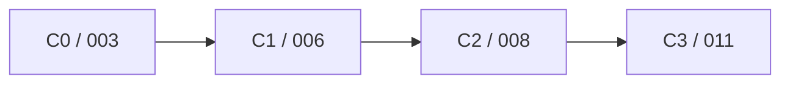

# Convergence Milestone Releases (C0-C3)

We introduced explicit convergence milestones so developers have clear, recommended jump-off points for new state work.

Convergence states are not just another node in the graph. They are curated checkpoints where multiple concerns have been intentionally composed and validated.

## Why We Added Convergence States

- Keep transitional states focused and easy to reason about.
- Provide stable branch points for new enhancements.
- Avoid repeatedly re-solving baseline architecture choices in each new state.

## Current Convergence Levels

- `C0`: `003-containerized-compose-runtime`
- `C1`: `006-observability-lgtm-compose`
- `C2`: `008-order-management-matcher`
- `C3`: `011-platform-convergence-c3`

## Dotted-Line Inheritance

Convergence states can declare dotted-line lineage for documentation and learning context, while keeping a single publish parent for branch ancestry.

That lets us carry forward improvements into the best “next base” without creating ambiguous multi-parent publish history.

## Convergence View

## Contribution Guidance

- For most new features, start from the nearest convergence state that already contains needed prerequisites.
- If a convergence state is changed, document explicit rationale.
- Use dotted-line lineage only when it clarifies learning inheritance, not branch ancestry.

## Decision + Navigation Links

- ADR: [ADR-008 Convergence State Model](/docs/adr/008-convergence-state-model)
- Visual learning graphs: [/docs/learning-paths](/docs/learning-paths)
- State catalog: [/docs/spec-kit/state-docs](/docs/spec-kit/state-docs)
