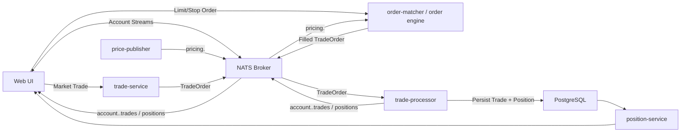

# State 009: Rudimentary Order Manager and Matcher

State `009-order-management-matcher` introduces a deliberately simple order-management model to demonstrate architecture and flow shape, not market microstructure correctness.

This state adds pending orders, cancel/force-fill workflows, and a basic matching loop on top of pricing + messaging foundations.

## What This State Adds

- User order ticket and account-scoped order blotter.
- Admin screen for global order inspection, cancel, and force-fill actions.
- Basic matching engine behavior:
  - evaluate open orders against streaming prices,
  - auto-fill rules for in-the-money orders,
  - emit fills as trade events into the existing trade/position pipeline.
- Order-focused observability metrics and dashboard coverage.

## Messaging Architecture (State 009)

## Why “Rudimentary” Is Intentional

- The matching logic is intentionally simple for learning and extension.
- The state demonstrates where richer matching policies, risk checks, and lifecycle controls would plug in.
- Teams can branch from this state to build more realistic order workflows without redesigning the system spine.

## Spec + Code Links

- State spec pack: [/specs/order-management-matcher](/specs/order-management-matcher)
- Learning guide: [/docs/learning/state-009-order-management-matcher](/docs/learning/state-009-order-management-matcher)
- Generated code branch: [code/generated-state-009-order-management-matcher](https://github.com/finos/traderX/tree/code/generated-state-009-order-management-matcher)
- Compare vs parent (`008`): [code/generated-state-008-pricing-awareness-market-data...code/generated-state-009-order-management-matcher](https://github.com/finos/traderX/compare/code%2Fgenerated-state-008-pricing-awareness-market-data...code%2Fgenerated-state-009-order-management-matcher)
