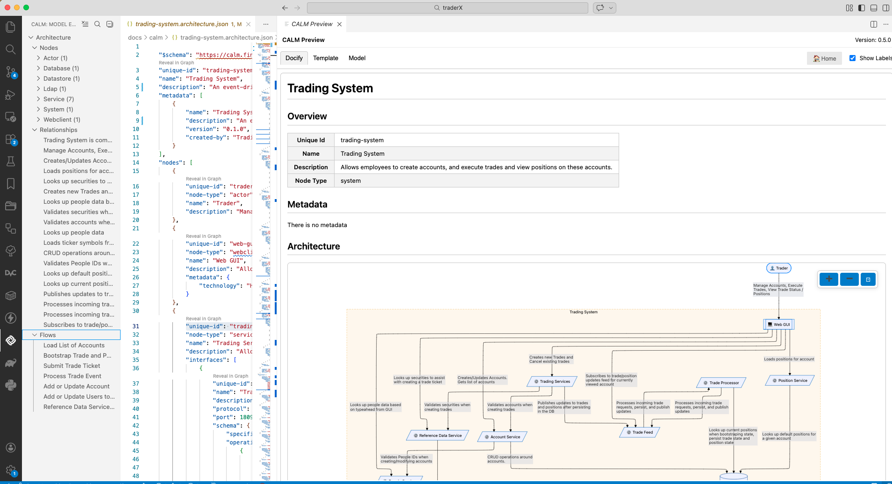

# TraderX CALM Architecture

This folder contains the CALM (Common Architecture Language Model) architecture definition for the TraderX trading system.

## Contents

- **[`trading-system.architecture.json`](trading-system.architecture.json)** - The complete CALM architecture model for TraderX
- **`docs/`** - Generated architecture documentation in Markdown format
  - [`trading-system-overview.md`](docs/trading-system-overview.md) - System-wide architecture overview
  - [`flow-overview.md`](docs/flow-overview.md) - Business flow diagrams and descriptions
- **`templates/`** - Handlebars templates for generating documentation from the CALM model
  - `architecture-overview.md.hbs` - Template for system overview
  - `flows-overview.md.hbs` - Template for flow documentation

## What is CALM?

CALM (Common Architecture Language Model) is a sibling project of TraderX within the FINOS family of open source projects. It provides a JSON-based declarative language for describing system architectures.

CALM enables:

- Machine-readable architecture definitions
- Automated architecture analysis and validation
- Compliance tracking through controls and metadata
- Integration with governance tools

Since all facets of an architecture are contained in a single source file that can be validated, it is possible to generate different views of the architecture that are consistent.

**Learn more:** [CALM Documentation](https://calm.finos.org)

## Viewing the Architecture

**Option 1: Read the JSON directly**  
Open [`trading-system.architecture.json`](trading-system.architecture.json) in your editor to explore nodes, interfaces, relationships, and flows.  

**Option 2: VSCode CALM Tool Extension**
CALM project provides a VSCode extension to view a CALM architecture and its components in the VSCode IDE.  This is useful for real-time feedback when modifying the architecture.  See this [web page for installation and usage](https://calm.finos.org/tutorials/beginner/04-vscode-extension) of the extension.



**Option 3: Read generated documentation**  
The `docs/` folder contains human-readable Markdown documentation generated from the CALM model.  See next section for generating the markdown files.


## Generating CALM Architecture Documents

The documentation in the `docs/` subfolder is generated from the CALM architecture model using Handlebars templates and the CALM CLI.

### Prerequisites

Install the CALM CLI globally:

```shell
npm install -g @finos/calm-cli
```

### Generate Architecture Overview

Generate the system architecture overview with diagrams and node tables:

```shell
calm docify \
  -a trading-system.architecture.json \
  --template templates/architecture-overview.md.hbs \
  -o docs/trading-system-overview.md
```

### Generate Flow Documentation

Generate business flow sequence diagrams and descriptions:

```shell
calm docify \
  -a trading-system.architecture.json \
  --template templates/flows-overview.md.hbs \
  -o docs/flow-overview.md
```

**Note:** The templates use Handlebars syntax with CALM-specific helpers like `{{block-architecture}}`, `{{table}}`, and `{{flow-sequence}}` to generate Mermaid diagrams and HTML tables from the architecture model.

