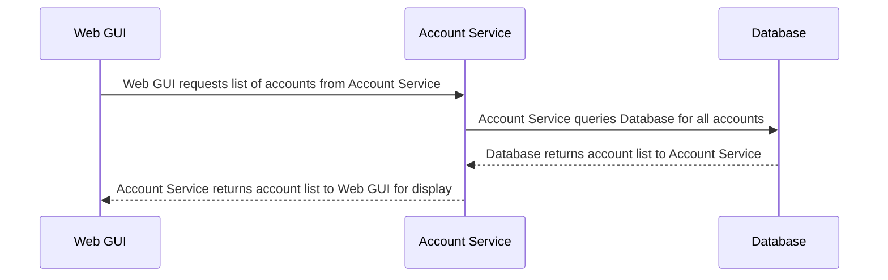
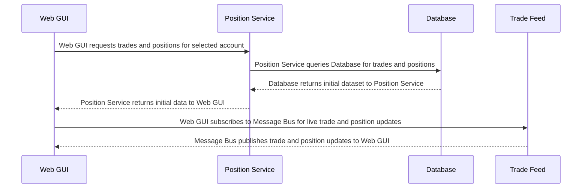
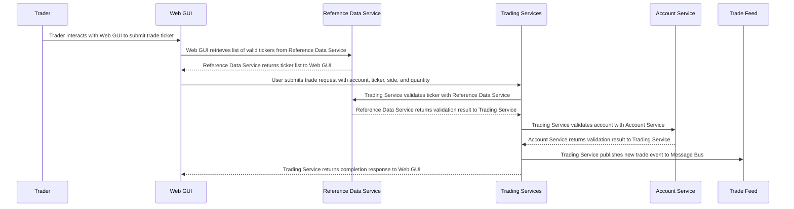
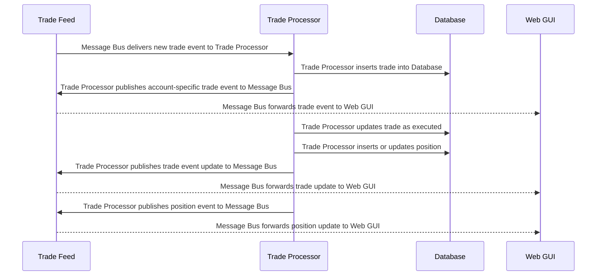
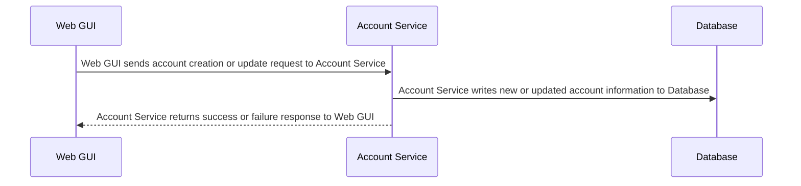
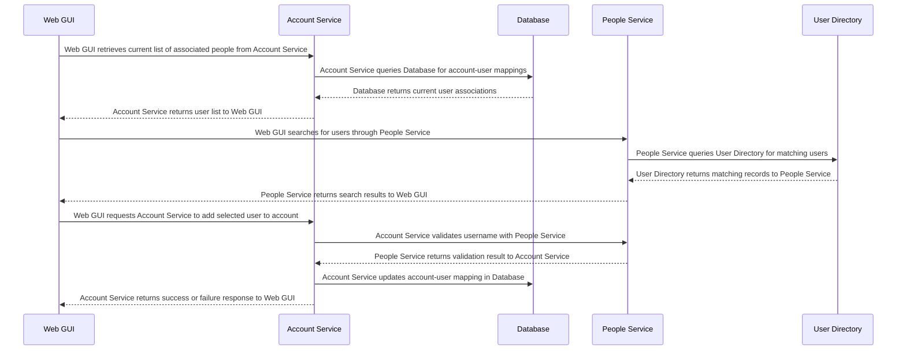
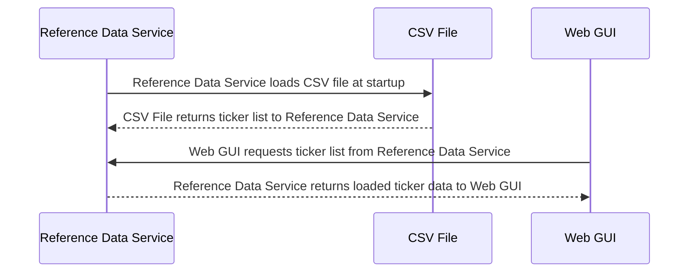

# Trading System Flows Overview

## Load List of Accounts

    Description: Web GUI retrieves and displays the list of all trading accounts

---

## Bootstrap Trade and Position Blotter

    Description: Initialize the blotter with current trades and positions, then subscribe to live updates

---

## Submit Trade Ticket
    Description: User submits a trade order with validation against reference data service and account service

---

## Process Trade Event

    Description: Trade Processor handles new trade events, updates database, and publishes position updates

---

## Manage Account

    Description: Create a new trading account or update existing account information

---

## Add User to Account

    Description: Associate users with trading accounts by searching the user directory and updating mappings

---

## Reference Data Service Bootstrap
    Description: Load ticker list from CSV file at startup and provide it to the Web GUI

---

