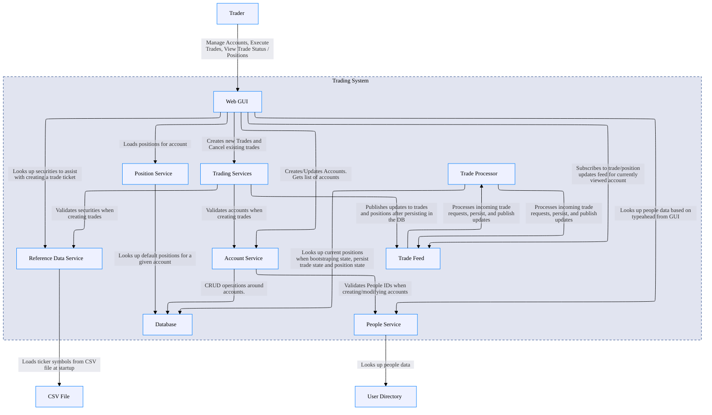
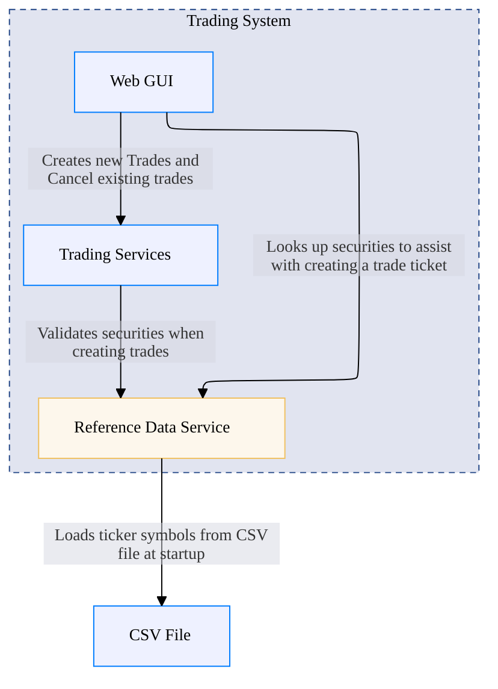
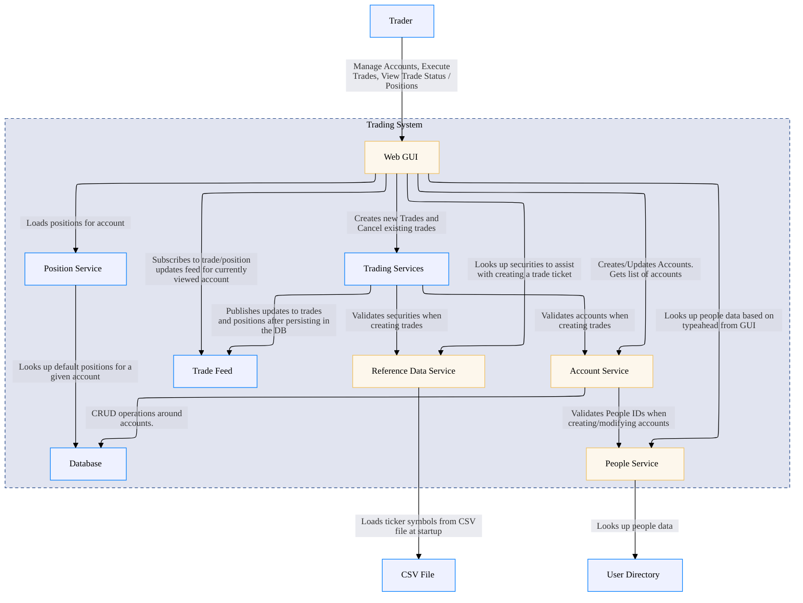
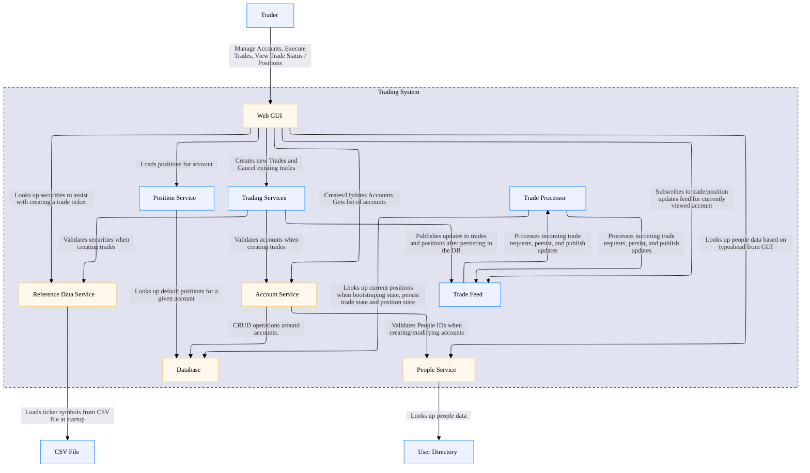
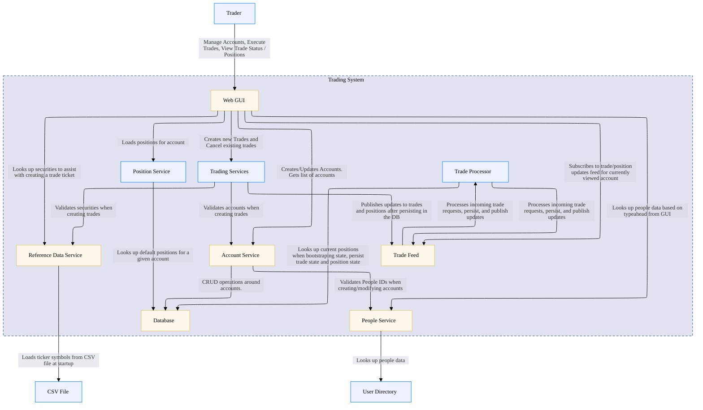

## Architecture Overview

## Single Service

    <table>
        <tbody>
        <tr>
            <th>Unique Id</th>
            <td>reference-data-service</td>
        </tr>
        <tr>
            <th>Name</th>
            <td>Reference Data Service</td>
        </tr>
        <tr>
            <th>Description</th>
            <td>Provides REST API to securities reference data</td>
        </tr>
        <tr>
            <th>Node Type</th>
            <td>service</td>
        </tr>
        <tr>
            <th>Metadata</th>
            <td>
                <table class="nested-table">
                        <tbody>
                        <tr>
                            <td><b>Technology</b></td>
                            <td>
                                NodeJS
                                    </td>
                        </tr>
                        </tbody>
                    </table>        </td>
        </tr>
        </tbody>
    </table>

## Multiple Services No Database

    <table>
        <tbody>
        <tr>
            <th>Unique Id</th>
            <td>reference-data-service</td>
        </tr>
        <tr>
            <th>Name</th>
            <td>Reference Data Service</td>
        </tr>
        <tr>
            <th>Description</th>
            <td>Provides REST API to securities reference data</td>
        </tr>
        <tr>
            <th>Node Type</th>
            <td>service</td>
        </tr>
        <tr>
            <th>Metadata</th>
            <td>
                <table class="nested-table">
                        <tbody>
                        <tr>
                            <td><b>Technology</b></td>
                            <td>
                                NodeJS
                                    </td>
                        </tr>
                        </tbody>
                    </table>        </td>
        </tr>
        </tbody>
    </table>

    <table>
        <tbody>
        <tr>
            <th>Unique Id</th>
            <td>web-gui</td>
        </tr>
        <tr>
            <th>Name</th>
            <td>Web GUI</td>
        </tr>
        <tr>
            <th>Description</th>
            <td>Allows employees to manage accounts and book trades.</td>
        </tr>
        <tr>
            <th>Node Type</th>
            <td>webclient</td>
        </tr>
        <tr>
            <th>Metadata</th>
            <td>
                <table class="nested-table">
                        <tbody>
                        <tr>
                            <td><b>Technology</b></td>
                            <td>
                                HTML and JavaScript and NodeJS
                                    </td>
                        </tr>
                        </tbody>
                    </table>        </td>
        </tr>
        </tbody>
    </table>

    <table>
        <tbody>
        <tr>
            <th>Unique Id</th>
            <td>account-service</td>
        </tr>
        <tr>
            <th>Name</th>
            <td>Account Service</td>
        </tr>
        <tr>
            <th>Description</th>
            <td>Allows employees to manage accounts</td>
        </tr>
        <tr>
            <th>Node Type</th>
            <td>service</td>
        </tr>
        <tr>
            <th>Metadata</th>
            <td>
                <table class="nested-table">
                        <tbody>
                        <tr>
                            <td><b>Technology</b></td>
                            <td>
                                Java and Spring Boot
                                    </td>
                        </tr>
                        </tbody>
                    </table>        </td>
        </tr>
        </tbody>
    </table>

    <table>
        <tbody>
        <tr>
            <th>Unique Id</th>
            <td>people-service</td>
        </tr>
        <tr>
            <th>Name</th>
            <td>People Service</td>
        </tr>
        <tr>
            <th>Description</th>
            <td>Provides user details</td>
        </tr>
        <tr>
            <th>Node Type</th>
            <td>service</td>
        </tr>
        <tr>
            <th>Metadata</th>
            <td>
                <table class="nested-table">
                        <tbody>
                        <tr>
                            <td><b>Technology</b></td>
                            <td>
                                .NET Core
                                    </td>
                        </tr>
                        </tbody>
                    </table>        </td>
        </tr>
        </tbody>
    </table>

## Multiple Services With Database

    <table>
        <tbody>
        <tr>
            <th>Unique Id</th>
            <td>reference-data-service</td>
        </tr>
        <tr>
            <th>Name</th>
            <td>Reference Data Service</td>
        </tr>
        <tr>
            <th>Description</th>
            <td>Provides REST API to securities reference data</td>
        </tr>
        <tr>
            <th>Node Type</th>
            <td>service</td>
        </tr>
        <tr>
            <th>Metadata</th>
            <td>
                <table class="nested-table">
                        <tbody>
                        <tr>
                            <td><b>Technology</b></td>
                            <td>
                                NodeJS
                                    </td>
                        </tr>
                        </tbody>
                    </table>        </td>
        </tr>
        </tbody>
    </table>

    <table>
        <tbody>
        <tr>
            <th>Unique Id</th>
            <td>web-gui</td>
        </tr>
        <tr>
            <th>Name</th>
            <td>Web GUI</td>
        </tr>
        <tr>
            <th>Description</th>
            <td>Allows employees to manage accounts and book trades.</td>
        </tr>
        <tr>
            <th>Node Type</th>
            <td>webclient</td>
        </tr>
        <tr>
            <th>Metadata</th>
            <td>
                <table class="nested-table">
                        <tbody>
                        <tr>
                            <td><b>Technology</b></td>
                            <td>
                                HTML and JavaScript and NodeJS
                                    </td>
                        </tr>
                        </tbody>
                    </table>        </td>
        </tr>
        </tbody>
    </table>

    <table>
        <tbody>
        <tr>
            <th>Unique Id</th>
            <td>account-service</td>
        </tr>
        <tr>
            <th>Name</th>
            <td>Account Service</td>
        </tr>
        <tr>
            <th>Description</th>
            <td>Allows employees to manage accounts</td>
        </tr>
        <tr>
            <th>Node Type</th>
            <td>service</td>
        </tr>
        <tr>
            <th>Metadata</th>
            <td>
                <table class="nested-table">
                        <tbody>
                        <tr>
                            <td><b>Technology</b></td>
                            <td>
                                Java and Spring Boot
                                    </td>
                        </tr>
                        </tbody>
                    </table>        </td>
        </tr>
        </tbody>
    </table>

    <table>
        <tbody>
        <tr>
            <th>Unique Id</th>
            <td>people-service</td>
        </tr>
        <tr>
            <th>Name</th>
            <td>People Service</td>
        </tr>
        <tr>
            <th>Description</th>
            <td>Provides user details</td>
        </tr>
        <tr>
            <th>Node Type</th>
            <td>service</td>
        </tr>
        <tr>
            <th>Metadata</th>
            <td>
                <table class="nested-table">
                        <tbody>
                        <tr>
                            <td><b>Technology</b></td>
                            <td>
                                .NET Core
                                    </td>
                        </tr>
                        </tbody>
                    </table>        </td>
        </tr>
        </tbody>
    </table>

    <table>
        <tbody>
        <tr>
            <th>Unique Id</th>
            <td>database</td>
        </tr>
        <tr>
            <th>Name</th>
            <td>Database</td>
        </tr>
        <tr>
            <th>Description</th>
            <td>Stores account, trade, and position state.</td>
        </tr>
        <tr>
            <th>Node Type</th>
            <td>database</td>
        </tr>
        <tr>
            <th>Metadata</th>
            <td>
                <table class="nested-table">
                        <tbody>
                        <tr>
                            <td><b>Technology</b></td>
                            <td>
                                H2 Standalone
                                    </td>
                        </tr>
                        </tbody>
                    </table>        </td>
        </tr>
        </tbody>
    </table>

## Multiple Services With Trade Feed

    <table>
        <tbody>
        <tr>
            <th>Unique Id</th>
            <td>reference-data-service</td>
        </tr>
        <tr>
            <th>Name</th>
            <td>Reference Data Service</td>
        </tr>
        <tr>
            <th>Description</th>
            <td>Provides REST API to securities reference data</td>
        </tr>
        <tr>
            <th>Node Type</th>
            <td>service</td>
        </tr>
        <tr>
            <th>Metadata</th>
            <td>
                <table class="nested-table">
                        <tbody>
                        <tr>
                            <td><b>Technology</b></td>
                            <td>
                                NodeJS
                                    </td>
                        </tr>
                        </tbody>
                    </table>        </td>
        </tr>
        </tbody>
    </table>

    <table>
        <tbody>
        <tr>
            <th>Unique Id</th>
            <td>web-gui</td>
        </tr>
        <tr>
            <th>Name</th>
            <td>Web GUI</td>
        </tr>
        <tr>
            <th>Description</th>
            <td>Allows employees to manage accounts and book trades.</td>
        </tr>
        <tr>
            <th>Node Type</th>
            <td>webclient</td>
        </tr>
        <tr>
            <th>Metadata</th>
            <td>
                <table class="nested-table">
                        <tbody>
                        <tr>
                            <td><b>Technology</b></td>
                            <td>
                                HTML and JavaScript and NodeJS
                                    </td>
                        </tr>
                        </tbody>
                    </table>        </td>
        </tr>
        </tbody>
    </table>

    <table>
        <tbody>
        <tr>
            <th>Unique Id</th>
            <td>account-service</td>
        </tr>
        <tr>
            <th>Name</th>
            <td>Account Service</td>
        </tr>
        <tr>
            <th>Description</th>
            <td>Allows employees to manage accounts</td>
        </tr>
        <tr>
            <th>Node Type</th>
            <td>service</td>
        </tr>
        <tr>
            <th>Metadata</th>
            <td>
                <table class="nested-table">
                        <tbody>
                        <tr>
                            <td><b>Technology</b></td>
                            <td>
                                Java and Spring Boot
                                    </td>
                        </tr>
                        </tbody>
                    </table>        </td>
        </tr>
        </tbody>
    </table>

    <table>
        <tbody>
        <tr>
            <th>Unique Id</th>
            <td>people-service</td>
        </tr>
        <tr>
            <th>Name</th>
            <td>People Service</td>
        </tr>
        <tr>
            <th>Description</th>
            <td>Provides user details</td>
        </tr>
        <tr>
            <th>Node Type</th>
            <td>service</td>
        </tr>
        <tr>
            <th>Metadata</th>
            <td>
                <table class="nested-table">
                        <tbody>
                        <tr>
                            <td><b>Technology</b></td>
                            <td>
                                .NET Core
                                    </td>
                        </tr>
                        </tbody>
                    </table>        </td>
        </tr>
        </tbody>
    </table>

    <table>
        <tbody>
        <tr>
            <th>Unique Id</th>
            <td>database</td>
        </tr>
        <tr>
            <th>Name</th>
            <td>Database</td>
        </tr>
        <tr>
            <th>Description</th>
            <td>Stores account, trade, and position state.</td>
        </tr>
        <tr>
            <th>Node Type</th>
            <td>database</td>
        </tr>
        <tr>
            <th>Metadata</th>
            <td>
                <table class="nested-table">
                        <tbody>
                        <tr>
                            <td><b>Technology</b></td>
                            <td>
                                H2 Standalone
                                    </td>
                        </tr>
                        </tbody>
                    </table>        </td>
        </tr>
        </tbody>
    </table>

    <table>
        <tbody>
        <tr>
            <th>Unique Id</th>
            <td>messagebus</td>
        </tr>
        <tr>
            <th>Name</th>
            <td>Trade Feed</td>
        </tr>
        <tr>
            <th>Description</th>
            <td>Message bus for streaming updates to trades and positions</td>
        </tr>
        <tr>
            <th>Node Type</th>
            <td>service</td>
        </tr>
        <tr>
            <th>Metadata</th>
            <td>
                <table class="nested-table">
                        <tbody>
                        <tr>
                            <td><b>Technology</b></td>
                            <td>
                                SocketIO
                                    </td>
                        </tr>
                        </tbody>
                    </table>        </td>
        </tr>
        </tbody>
    </table>

