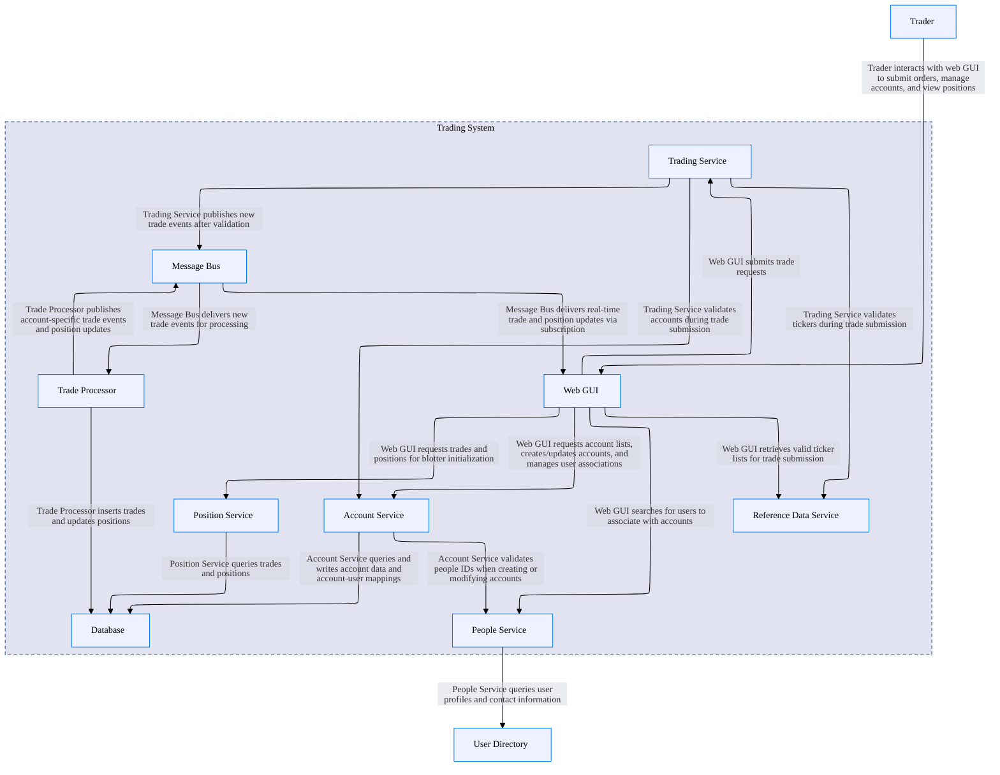

## Architecture Overview

```mermaid
---
config:
  theme: base
  themeVariables:
    fontFamily: -apple-system, BlinkMacSystemFont, 'Segoe WPC', 'Segoe UI', system-ui, 'Ubuntu', sans-serif
    darkMode: false
    fontSize: 14px
    edgeLabelBackground: '#d5d7e1'
    lineColor: '#000000'
---
%%{init: {"layout": "elk", "flowchart": {"htmlLabels": false}}}%%
flowchart TB
classDef boundary fill:#e1e4f0,stroke:#204485,stroke-dasharray: 5 4,stroke-width:1px,color:#000000;
classDef node fill:#eef1ff,stroke:#007dff,stroke-width:1px,color:#000000;
classDef iface fill:#f0f0f0,stroke:#b6b6b6,stroke-width:1px,font-size:10px,color:#000000;
classDef highlight fill:#fdf7ec,stroke:#f0c060,stroke-width:1px,color:#000000;

        subgraph trading-system["Trading System"]
        direction TB
            account-service["Account Service"]:::node
            database["Database"]:::node
            messagebus["Message Bus"]:::node
            people-service["People Service"]:::node
            position-service["Position Service"]:::node
            reference-data-service["Reference Data Service"]:::node
            trade-processor["Trade Processor"]:::node
            trading-service["Trading Service"]:::node
            web-gui["Web GUI"]:::node
        end
        class trading-system boundary

    trader["Trader"]:::node
    user-directory["User Directory"]:::node

    trader -->|Trader interacts with web GUI to submit orders, manage accounts, and view positions| web-gui
    web-gui -->|Web GUI requests account lists, creates/updates accounts, and manages user associations| account-service
    web-gui -->|Web GUI requests trades and positions for blotter initialization| position-service
    web-gui -->|Web GUI retrieves valid ticker lists for trade submission| reference-data-service
    web-gui -->|Web GUI submits trade requests| trading-service
    web-gui -->|Web GUI searches for users to associate with accounts| people-service
    trading-service -->|Trading Service validates tickers during trade submission| reference-data-service
    trading-service -->|Trading Service validates accounts during trade submission| account-service
    people-service -->|People Service queries user profiles and contact information| user-directory
    account-service -->|Account Service queries and writes account data and account-user mappings| database
    account-service -->|Account Service validates people IDs when creating or modifying accounts| people-service
    position-service -->|Position Service queries trades and positions| database
    trade-processor -->|Trade Processor inserts trades and updates positions| database
    trading-service -->|Trading Service publishes new trade events after validation| messagebus
    messagebus -->|Message Bus delivers new trade events for processing| trade-processor
    trade-processor -->|Trade Processor publishes account-specific trade events and position updates| messagebus
    messagebus -->|Message Bus delivers real-time trade and position updates via subscription| web-gui


```
