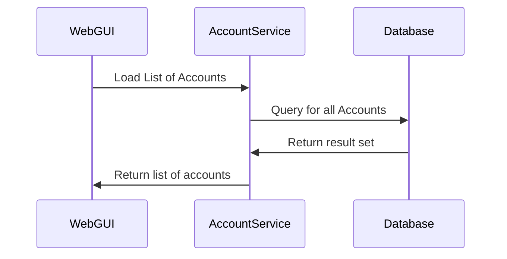
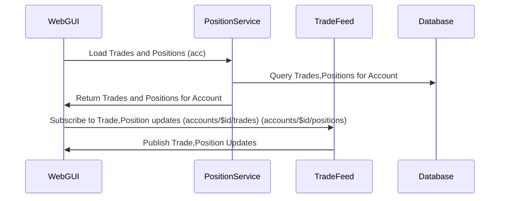
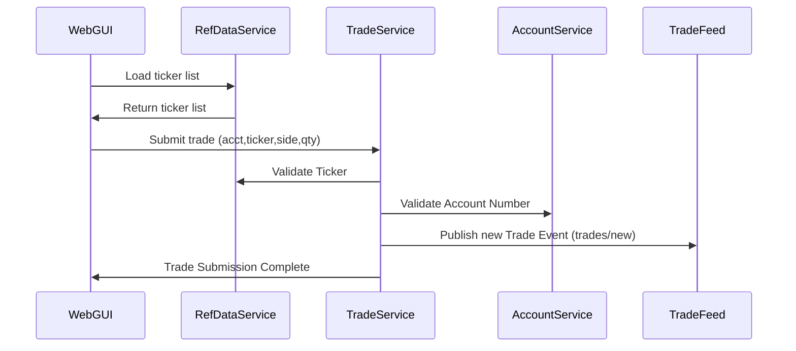
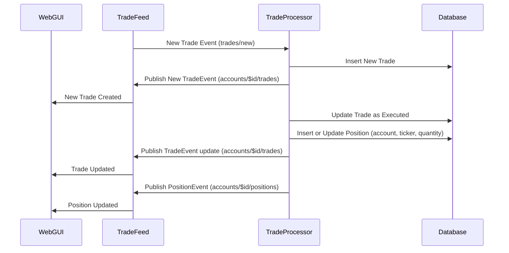
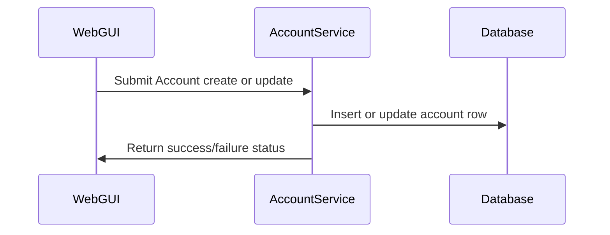
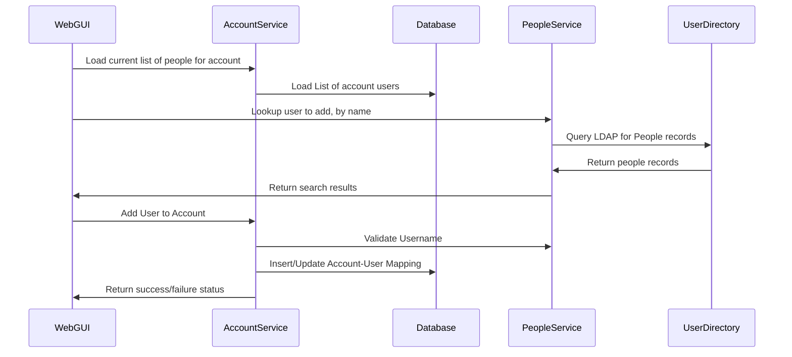

## Sequence Diagrams

The following is a list of sequence diagrams which will help illustrate the flows which take place in this system.  For an overview of the system, be sure to look at the [Overview](./overview.md)

## 1: Load List of Accounts 

This takes place when the GUI initially loads. A list of accounts is populated into a drop down for the user to select which account to trade on.

## 2: Bootstrapping the Trade and Position Blotter

Once a user selects an account to trade on, the initial trade history and current positions are populated into a trade and position blotter respectively, after which future updates are streamed from the trade feed directly to the GUI. 

## 3: Submitting a Trade Ticket

## 4: Trade Processing

Trade processing here is meant to simulate any ‘black box’ downstream handling of new trade events. This is the current flow in the sample application. One could easily add random behavior, delays, rejections, etc, to the processor to make this example more interesting.

## 5: Add/Update Account

Accounts are the entities that contain trades/positions. The web GUI supports creating and updating accounts.

## 6: Add/Update Users to Account

Users can be associated with accounts, for future entitlements implementation purposes. Multiple users can be associated with multiple accounts (many-to-many relationship)

