# Learning Paths

This page is generated from `catalog/state-catalog.json`.
Green nodes represent convergence checkpoints (C-level milestones such as `[C0]`, `[C1]`, `[C2]`, `[C3]`).

## Convergence-Level Graph

This high-level view shows only the canonical convergence progression from `C0` to `C3`.

```mermaid
flowchart LR
  S004_containerized_compose_runtime["004: Containerized Compose Runtime (NGINX Ingress) [C0]"]
  S007_observability_lgtm_compose["007: Observability with LGTM on Compose [C1]"]
  S009_order_management_matcher["009: Order Management and Matcher [C2]"]
  S012_platform_convergence_c3["012: Platform Convergence C3 [C3]"]
  S004_containerized_compose_runtime --> S007_observability_lgtm_compose
  S007_observability_lgtm_compose --> S009_order_management_matcher
  S009_order_management_matcher --> S012_platform_convergence_c3
  click S004_containerized_compose_runtime href "/specs/containerized-compose-runtime" "Open 004-containerized-compose-runtime"
  click S007_observability_lgtm_compose href "/specs/observability-lgtm-compose" "Open 007-observability-lgtm-compose"
  click S009_order_management_matcher href "/specs/order-management-matcher" "Open 009-order-management-matcher"
  click S012_platform_convergence_c3 href "/specs/platform-convergence-c3" "Open 012-platform-convergence-c3"
  classDef convergence fill:#d7f5dd,stroke:#2e7d32,stroke-width:2px
  class S004_containerized_compose_runtime convergence
  class S007_observability_lgtm_compose convergence
  class S009_order_management_matcher convergence
  class S012_platform_convergence_c3 convergence
```

## Official Current Graph

```mermaid
flowchart TB
  S001_baseline_uncontainerized_parity["001: Simple App - Base Uncontainerized App"]
  S002_edge_proxy_uncontainerized["002: Edge Proxy Uncontainerized"]
  S003_agentic_harness_foundation["003: Agentic Harness Foundation"]
  S004_containerized_compose_runtime["004: Containerized Compose Runtime (NGINX Ingress) [C0]"]
  S005_postgres_database_replacement["005: PostgreSQL Database Replacement"]
  S006_messaging_nats_replacement["006: Messaging Layer Replacement with NATS"]
  S007_observability_lgtm_compose["007: Observability with LGTM on Compose [C1]"]
  S008_pricing_awareness_market_data["008: Pricing Awareness and Market Data Streaming"]
  S009_order_management_matcher["009: Order Management and Matcher [C2]"]
  S010_kubernetes_runtime["010: Kubernetes Runtime on C2"]
  S011_tilt_kubernetes_dev_loop["011: Tilt Local Dev on Kubernetes"]
  S012_platform_convergence_c3["012: Platform Convergence C3 [C3]"]
  S013_radius_kubernetes_platform["013: Radius Platform on Kubernetes (Optional)"]
  S001_baseline_uncontainerized_parity --> S002_edge_proxy_uncontainerized
  S002_edge_proxy_uncontainerized --> S003_agentic_harness_foundation
  S003_agentic_harness_foundation --> S004_containerized_compose_runtime
  S004_containerized_compose_runtime --> S005_postgres_database_replacement
  S005_postgres_database_replacement --> S006_messaging_nats_replacement
  S006_messaging_nats_replacement --> S007_observability_lgtm_compose
  S007_observability_lgtm_compose --> S008_pricing_awareness_market_data
  S008_pricing_awareness_market_data --> S009_order_management_matcher
  S009_order_management_matcher --> S010_kubernetes_runtime
  S010_kubernetes_runtime --> S011_tilt_kubernetes_dev_loop
  S011_tilt_kubernetes_dev_loop --> S012_platform_convergence_c3
  S012_platform_convergence_c3 --> S013_radius_kubernetes_platform
  S009_order_management_matcher -.-> S012_platform_convergence_c3
  click S001_baseline_uncontainerized_parity href "/specs/baseline-uncontainerized-parity" "Open State 001 Spec Pack"
  click S002_edge_proxy_uncontainerized href "/specs/edge-proxy-uncontainerized" "Open State 002 Spec Pack"
  click S003_agentic_harness_foundation href "/specs/agentic-harness-foundation" "Open State 003 Spec Pack"
  click S004_containerized_compose_runtime href "/specs/containerized-compose-runtime" "Open State 004 Spec Pack"
  click S005_postgres_database_replacement href "/specs/postgres-database-replacement" "Open State 005 Spec Pack"
  click S006_messaging_nats_replacement href "/specs/messaging-nats-replacement" "Open State 006 Spec Pack"
  click S007_observability_lgtm_compose href "/specs/observability-lgtm-compose" "Open State 007 Spec Pack"
  click S008_pricing_awareness_market_data href "/specs/pricing-awareness-market-data" "Open State 008 Spec Pack"
  click S009_order_management_matcher href "/specs/order-management-matcher" "Open State 009 Spec Pack"
  click S010_kubernetes_runtime href "/specs/kubernetes-runtime" "Open State 010 Spec Pack"
  click S011_tilt_kubernetes_dev_loop href "/specs/tilt-kubernetes-dev-loop" "Open State 011 Spec Pack"
  click S012_platform_convergence_c3 href "/specs/platform-convergence-c3" "Open State 012 Spec Pack"
  click S013_radius_kubernetes_platform href "/specs/radius-kubernetes-platform" "Open State 013 Spec Pack"
  classDef convergence fill:#d7f5dd,stroke:#2e7d32,stroke-width:2px
  class S004_containerized_compose_runtime convergence
  class S007_observability_lgtm_compose convergence
  class S009_order_management_matcher convergence
  class S012_platform_convergence_c3 convergence
```

## State To Artifact Mapping

| State | Spec Pack | Architecture | Flows / Runtime Topology | Learning Guide | Generated Code Branch |
| --- | --- | --- | --- | --- | --- |
| [`001-baseline-uncontainerized-parity`](pathname:///specs/baseline-uncontainerized-parity) | [link](pathname:///specs/baseline-uncontainerized-parity) | [link](pathname:///specs/baseline-uncontainerized-parity/system/architecture) | [link](pathname:///specs/baseline-uncontainerized-parity/system/end-to-end-flows) | [link](pathname:///docs/learning/state-001-baseline-uncontainerized-parity) | [code/generated-state-001-baseline-uncontainerized-parity](https://github.com/finos/traderX/tree/code/generated-state-001-baseline-uncontainerized-parity) |
| [`002-edge-proxy-uncontainerized`](pathname:///specs/edge-proxy-uncontainerized) | [link](pathname:///specs/edge-proxy-uncontainerized) | [link](pathname:///specs/edge-proxy-uncontainerized/system/architecture) | [link](pathname:///specs/edge-proxy-uncontainerized/system/runtime-topology) | [link](pathname:///docs/learning/state-002-edge-proxy-uncontainerized) | [code/generated-state-002-edge-proxy-uncontainerized](https://github.com/finos/traderX/tree/code/generated-state-002-edge-proxy-uncontainerized) |
| [`003-agentic-harness-foundation`](pathname:///specs/agentic-harness-foundation) | [link](pathname:///specs/agentic-harness-foundation) | [link](pathname:///specs/agentic-harness-foundation/system/architecture) | [link](pathname:///specs/agentic-harness-foundation/system/runtime-topology) | [link](pathname:///docs/learning/state-003-agentic-harness-foundation) | [code/generated-state-003-agentic-harness-foundation](https://github.com/finos/traderX/tree/code/generated-state-003-agentic-harness-foundation) |
| **[`004-containerized-compose-runtime`](pathname:///specs/containerized-compose-runtime)** [(C0)](pathname:///docs/spec-kit/convergence-states#c0) | [link](pathname:///specs/containerized-compose-runtime) | [link](pathname:///specs/containerized-compose-runtime/system/architecture) | [link](pathname:///specs/containerized-compose-runtime/system/runtime-topology) | [link](pathname:///docs/learning/state-004-containerized-compose-runtime) | [code/generated-state-004-containerized-compose-runtime](https://github.com/finos/traderX/tree/code/generated-state-004-containerized-compose-runtime) |
| [`005-postgres-database-replacement`](pathname:///specs/postgres-database-replacement) | [link](pathname:///specs/postgres-database-replacement) | [link](pathname:///specs/postgres-database-replacement/system/architecture) | [link](pathname:///specs/postgres-database-replacement/system/runtime-topology) | [link](pathname:///docs/learning/state-005-postgres-database-replacement) | [code/generated-state-005-postgres-database-replacement](https://github.com/finos/traderX/tree/code/generated-state-005-postgres-database-replacement) |
| [`006-messaging-nats-replacement`](pathname:///specs/messaging-nats-replacement) | [link](pathname:///specs/messaging-nats-replacement) | [link](pathname:///specs/messaging-nats-replacement/system/architecture) | [link](pathname:///specs/messaging-nats-replacement/system/runtime-topology) | [link](pathname:///docs/learning/state-006-messaging-nats-replacement) | [code/generated-state-006-messaging-nats-replacement](https://github.com/finos/traderX/tree/code/generated-state-006-messaging-nats-replacement) |
| **[`007-observability-lgtm-compose`](pathname:///specs/observability-lgtm-compose)** [(C1)](pathname:///docs/spec-kit/convergence-states#c1) | [link](pathname:///specs/observability-lgtm-compose) | [link](pathname:///specs/observability-lgtm-compose/system/architecture) | [link](pathname:///specs/observability-lgtm-compose/system/runtime-topology) | [link](pathname:///docs/learning/state-007-observability-lgtm-compose) | [code/generated-state-007-observability-lgtm-compose](https://github.com/finos/traderX/tree/code/generated-state-007-observability-lgtm-compose) |
| [`008-pricing-awareness-market-data`](pathname:///specs/pricing-awareness-market-data) | [link](pathname:///specs/pricing-awareness-market-data) | [link](pathname:///specs/pricing-awareness-market-data/system/architecture) | [link](pathname:///specs/pricing-awareness-market-data/system/runtime-topology) | [link](pathname:///docs/learning/state-008-pricing-awareness-market-data) | [code/generated-state-008-pricing-awareness-market-data](https://github.com/finos/traderX/tree/code/generated-state-008-pricing-awareness-market-data) |
| **[`009-order-management-matcher`](pathname:///specs/order-management-matcher)** [(C2)](pathname:///docs/spec-kit/convergence-states#c2) | [link](pathname:///specs/order-management-matcher) | [link](pathname:///specs/order-management-matcher/system/architecture) | [link](pathname:///specs/order-management-matcher/system/runtime-topology) | [link](pathname:///docs/learning/state-009-order-management-matcher) | [code/generated-state-009-order-management-matcher](https://github.com/finos/traderX/tree/code/generated-state-009-order-management-matcher) |
| [`010-kubernetes-runtime`](pathname:///specs/kubernetes-runtime) | [link](pathname:///specs/kubernetes-runtime) | [link](pathname:///specs/kubernetes-runtime/system/architecture) | [link](pathname:///specs/kubernetes-runtime/system/runtime-topology) | [link](pathname:///docs/learning/state-010-kubernetes-runtime) | [code/generated-state-010-kubernetes-runtime](https://github.com/finos/traderX/tree/code/generated-state-010-kubernetes-runtime) |
| [`011-tilt-kubernetes-dev-loop`](pathname:///specs/tilt-kubernetes-dev-loop) | [link](pathname:///specs/tilt-kubernetes-dev-loop) | [link](pathname:///specs/tilt-kubernetes-dev-loop/system/architecture) | [link](pathname:///specs/tilt-kubernetes-dev-loop/system/runtime-topology) | [link](pathname:///docs/learning/state-011-tilt-kubernetes-dev-loop) | [code/generated-state-011-tilt-kubernetes-dev-loop](https://github.com/finos/traderX/tree/code/generated-state-011-tilt-kubernetes-dev-loop) |
| **[`012-platform-convergence-c3`](pathname:///specs/platform-convergence-c3)** [(C3)](pathname:///docs/spec-kit/convergence-states#c3) | [link](pathname:///specs/platform-convergence-c3) | [link](pathname:///specs/platform-convergence-c3/system/architecture) | [link](pathname:///specs/platform-convergence-c3/system/runtime-topology) | [link](pathname:///docs/learning/state-012-platform-convergence-c3) | [code/generated-state-012-platform-convergence-c3](https://github.com/finos/traderX/tree/code/generated-state-012-platform-convergence-c3) |
| [`013-radius-kubernetes-platform`](pathname:///specs/radius-kubernetes-platform) | [link](pathname:///specs/radius-kubernetes-platform) | [link](pathname:///specs/radius-kubernetes-platform/system/architecture) | [link](pathname:///specs/radius-kubernetes-platform/system/runtime-topology) | [link](pathname:///docs/learning/state-013-radius-kubernetes-platform) | [code/generated-state-013-radius-kubernetes-platform](https://github.com/finos/traderX/tree/code/generated-state-013-radius-kubernetes-platform) |

## Swimlane View

```mermaid
flowchart TB
  subgraph PRELUDE["Prelude Track"]
    S001_baseline_uncontainerized_parity["001: Simple App - Base Uncontainerized App"]
    S002_edge_proxy_uncontainerized["002: Edge Proxy Uncontainerized"]
    S003_agentic_harness_foundation["003: Agentic Harness Foundation"]
  end
  subgraph BASELINE["Baseline Track"]
    S004_containerized_compose_runtime["004: Containerized Compose Runtime (NGINX Ingress) [C0]"]
  end
  subgraph ARCHITECTURE["Architecture Track"]
    S005_postgres_database_replacement["005: PostgreSQL Database Replacement"]
    S006_messaging_nats_replacement["006: Messaging Layer Replacement with NATS"]
  end
  subgraph NONFUNCTIONAL["Nonfunctional Track"]
    S007_observability_lgtm_compose["007: Observability with LGTM on Compose [C1]"]
  end
  subgraph FUNCTIONAL["Functional Track"]
    S008_pricing_awareness_market_data["008: Pricing Awareness and Market Data Streaming"]
    S009_order_management_matcher["009: Order Management and Matcher [C2]"]
  end
  subgraph DEVEX["Devex Track"]
    S010_kubernetes_runtime["010: Kubernetes Runtime on C2"]
    S011_tilt_kubernetes_dev_loop["011: Tilt Local Dev on Kubernetes"]
    S012_platform_convergence_c3["012: Platform Convergence C3 [C3]"]
    S013_radius_kubernetes_platform["013: Radius Platform on Kubernetes (Optional)"]
  end
  S001_baseline_uncontainerized_parity --> S002_edge_proxy_uncontainerized
  S002_edge_proxy_uncontainerized --> S003_agentic_harness_foundation
  S003_agentic_harness_foundation --> S004_containerized_compose_runtime
  S004_containerized_compose_runtime --> S005_postgres_database_replacement
  S005_postgres_database_replacement --> S006_messaging_nats_replacement
  S006_messaging_nats_replacement --> S007_observability_lgtm_compose
  S007_observability_lgtm_compose --> S008_pricing_awareness_market_data
  S008_pricing_awareness_market_data --> S009_order_management_matcher
  S009_order_management_matcher --> S010_kubernetes_runtime
  S010_kubernetes_runtime --> S011_tilt_kubernetes_dev_loop
  S011_tilt_kubernetes_dev_loop --> S012_platform_convergence_c3
  S012_platform_convergence_c3 --> S013_radius_kubernetes_platform
  S009_order_management_matcher -.-> S012_platform_convergence_c3
  classDef convergence fill:#d7f5dd,stroke:#2e7d32,stroke-width:2px
```

Use `catalog/state-catalog.json` as the canonical state lineage record.
