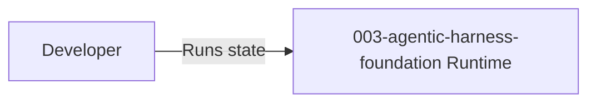

# Component Diagram

State: `003-agentic-harness-foundation`

```mermaid
flowchart LR
  developer["Developer"]
  runtime["003-agentic-harness-foundation Runtime"]

  developer -->|Runs state| runtime
```
