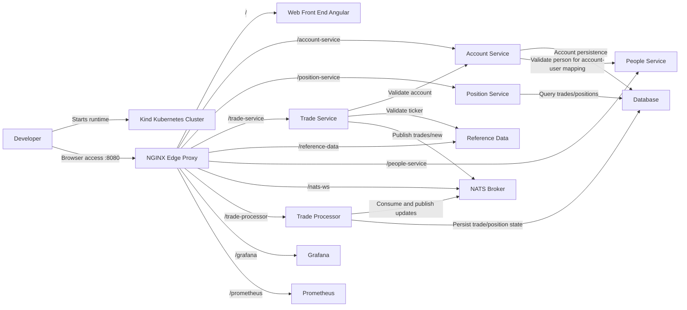

# Component Diagram

State: `010-kubernetes-runtime`

```mermaid
flowchart LR
  developer["Developer"]
  cluster["Kind Kubernetes Cluster"]
  edge["NGINX Edge Proxy"]
  web["Web Front End Angular"]
  account["Account Service"]
  position["Position Service"]
  tradeService["Trade Service"]
  referenceData["Reference Data"]
  people["People Service"]
  nats["NATS Broker"]
  tradeProcessor["Trade Processor"]
  database["Database"]
  grafana["Grafana"]
  prometheus["Prometheus"]

  developer -->|Starts runtime| cluster
  developer -->|Browser access :8080| edge
  edge -->|/| web
  edge -->|/account-service| account
  edge -->|/position-service| position
  edge -->|/trade-service| tradeService
  edge -->|/reference-data| referenceData
  edge -->|/people-service| people
  edge -->|/nats-ws| nats
  edge -->|/trade-processor| tradeProcessor
  edge -->|/grafana| grafana
  edge -->|/prometheus| prometheus
  tradeService -->|Validate account| account
  tradeService -->|Validate ticker| referenceData
  tradeService -->|Publish trades/new| nats
  tradeProcessor -->|Consume and publish updates| nats
  tradeProcessor -->|Persist trade/position state| database
  account -->|Account persistence| database
  position -->|Query trades/positions| database
  account -->|Validate person for account-user mapping| people
```
