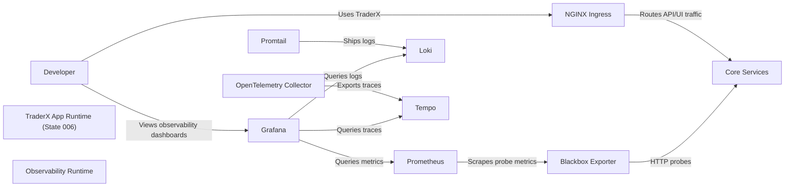

# Component Diagram

State: `007-observability-lgtm-compose`

```mermaid
flowchart LR
  developer["Developer"]
  app_runtime["TraderX App Runtime (State 006)"]
  obs_runtime["Observability Runtime"]
  ingress["NGINX Ingress"]
  core_services["Core Services"]
  prometheus["Prometheus"]
  blackbox["Blackbox Exporter"]
  loki["Loki"]
  promtail["Promtail"]
  tempo["Tempo"]
  otel["OpenTelemetry Collector"]
  grafana["Grafana"]

  developer -->|Uses TraderX| ingress
  ingress -->|Routes API/UI traffic| core_services
  blackbox -->|HTTP probes| core_services
  prometheus -->|Scrapes probe metrics| blackbox
  promtail -->|Ships logs| loki
  otel -->|Exports traces| tempo
  developer -->|Views observability dashboards| grafana
  grafana -->|Queries metrics| prometheus
  grafana -->|Queries logs| loki
  grafana -->|Queries traces| tempo
```
