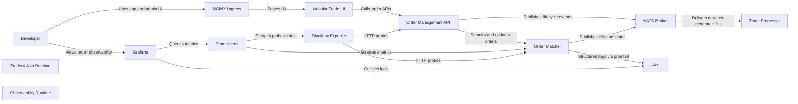

# Component Diagram

State: `009-order-management-matcher`

```mermaid
flowchart LR
  developer["Developer"]
  app_runtime["TraderX App Runtime"]
  obs_runtime["Observability Runtime"]
  ingress["NGINX Ingress"]
  trade_ui["Angular Trade UI"]
  order_api["Order Management API"]
  order_matcher["Order Matcher"]
  nats["NATS Broker"]
  trade_processor["Trade Processor"]
  prometheus["Prometheus"]
  blackbox["Blackbox Exporter"]
  loki["Loki"]
  grafana["Grafana"]

  developer -->|Uses app and admin UI| ingress
  ingress -->|Serves UI| trade_ui
  trade_ui -->|Calls order APIs| order_api
  order_api -->|Submits and updates orders| order_matcher
  order_api -->|Publishes lifecycle events| nats
  order_matcher -->|Publishes fills and status| nats
  nats -->|Delivers matcher-generated fills| trade_processor
  prometheus -->|Scrapes /metrics| order_matcher
  prometheus -->|Scrapes probe metrics| blackbox
  blackbox -->|HTTP probes| order_api
  blackbox -->|HTTP probes| order_matcher
  order_matcher -->|Structured logs via promtail| loki
  developer -->|Views order observability| grafana
  grafana -->|Queries metrics| prometheus
  grafana -->|Queries logs| loki
```
