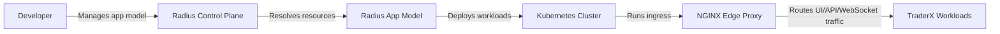

# Component Diagram

State: `005-radius-kubernetes-platform`

```mermaid
flowchart LR
  developer["Developer"]
  radius["Radius Control Plane"]
  appModel["Radius App Model"]
  cluster["Kubernetes Cluster"]
  edge["NGINX Edge Proxy"]
  workloads["TraderX Workloads"]

  developer -->|Manages app model| radius
  radius -->|Resolves resources| appModel
  appModel -->|Deploys workloads| cluster
  cluster -->|Runs ingress| edge
  edge -->|Routes UI/API/WebSocket traffic| workloads
```
