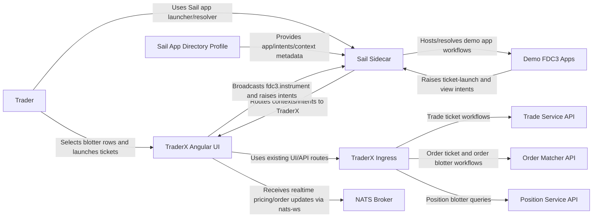

# Component Diagram

State: `014-fdc3-intent-interoperability`

```mermaid
flowchart LR
  trader["Trader"]
  traderxUi["TraderX Angular UI"]
  traderxIngress["TraderX Ingress"]
  sailSidecar["Sail Sidecar"]
  sailDirectory["Sail App Directory Profile"]
  demoApps["Demo FDC3 Apps"]
  orderApi["Order Matcher API"]
  tradeApi["Trade Service API"]
  positionApi["Position Service API"]
  nats["NATS Broker"]

  trader -->|Selects blotter rows and launches tickets| traderxUi
  trader -->|Uses Sail app launcher/resolver| sailSidecar
  sailDirectory -->|Provides app/intents/context metadata| sailSidecar
  sailSidecar -->|Routes contexts/intents to TraderX| traderxUi
  traderxUi -->|Broadcasts fdc3.instrument and raises intents| sailSidecar
  sailSidecar -->|Hosts/resolves demo app workflows| demoApps
  demoApps -->|Raises ticket-launch and view intents| sailSidecar
  traderxUi -->|Uses existing UI/API routes| traderxIngress
  traderxIngress -->|Trade ticket workflows| tradeApi
  traderxIngress -->|Order ticket and order blotter workflows| orderApi
  traderxIngress -->|Position blotter queries| positionApi
  traderxUi -->|Receives realtime pricing/order updates via nats-ws| nats
```
