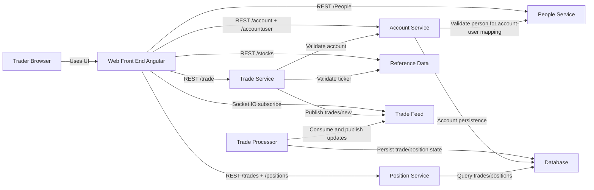

# Component Diagram

State: `001-baseline-uncontainerized-parity`

```mermaid
flowchart LR
  trader["Trader Browser"]
  web["Web Front End Angular"]
  account["Account Service"]
  position["Position Service"]
  tradeService["Trade Service"]
  referenceData["Reference Data"]
  people["People Service"]
  tradeFeed["Trade Feed"]
  tradeProcessor["Trade Processor"]
  database["Database"]

  trader -->|Uses UI| web
  web -->|REST /account + /accountuser| account
  web -->|REST /trades + /positions| position
  web -->|REST /trade| tradeService
  web -->|REST /stocks| referenceData
  web -->|REST /People| people
  web -->|Socket.IO subscribe| tradeFeed
  tradeService -->|Validate account| account
  tradeService -->|Validate ticker| referenceData
  tradeService -->|Publish trades/new| tradeFeed
  tradeProcessor -->|Consume and publish updates| tradeFeed
  tradeProcessor -->|Persist trade/position state| database
  account -->|Validate person for account-user mapping| people
  account -->|Account persistence| database
  position -->|Query trades/positions| database
```
