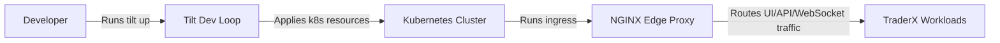

# Component Diagram

State: `012-platform-convergence-c3`

```mermaid
flowchart LR
  developer["Developer"]
  tilt["Tilt Dev Loop"]
  cluster["Kubernetes Cluster"]
  edge["NGINX Edge Proxy"]
  workloads["TraderX Workloads"]

  developer -->|Runs tilt up| tilt
  tilt -->|Applies k8s resources| cluster
  cluster -->|Runs ingress| edge
  edge -->|Routes UI/API/WebSocket traffic| workloads
```
