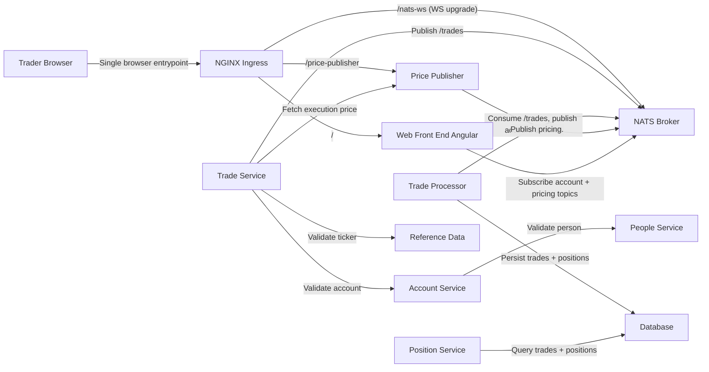

# Software Architecture

State: `010-pricing-awareness-market-data`
Title: `Architecture (State 010 Pricing Awareness and Market Data)`

## Architecture Summary

State 010 builds on NATS-based runtime from 007 and adds synthetic market pricing, trade execution price stamping, position cost basis aggregation, and frontend valuation.

## Entrypoints

- `ingress` -> `http://localhost:8080`
- `nats-ws` -> `ws://localhost:8080/nats-ws`
- `price-publisher` -> `http://localhost:18100/prices`

## Notes

- Markets are treated as always open in this simulation.
- yfinance bootstrap is optional startup-only and falls back to snapshot data.
- Advanced pricing/risk engines are intentionally out of scope for this state.

## Diagram

See [Component Diagram](./component-diagram.md).

## Detailed Architecture (Spec Extract)

# Architecture (State 010 Pricing Awareness and Market Data)

State 010 builds on NATS-based runtime from 007 and adds synthetic market pricing, trade execution price stamping, position cost basis aggregation, and frontend valuation.

- Inherits architectural baseline from: `007-messaging-nats-replacement`
- Generated from: `system/architecture.model.json`
- Canonical flows: `../001-baseline-uncontainerized-parity/system/end-to-end-flows.md`

## Entry Points

- `ingress`: `http://localhost:8080`
- `nats-ws`: `ws://localhost:8080/nats-ws`
- `price-publisher`: `http://localhost:18100/prices`

## Architecture Diagram

## Node Catalog

| Node | Kind | Label | Notes |
| --- | --- | --- | --- |
| `trader` | actor | Trader Browser | Uses Angular UI and receives realtime trade, position, and pricing updates. |
| `ingress` | gateway | NGINX Ingress | Routes REST and websocket traffic. |
| `web` | frontend | Web Front End Angular | Subscribes to account and pricing streams via nats.ws. |
| `nats` | messaging | NATS Broker | Pub/sub broker for backend and browser streaming. |
| `pricePublisher` | service | Price Publisher | Publishes `pricing.<TICKER>` and exposes REST quote endpoint. |
| `tradeService` | service | Trade Service | Validates account/ticker and stamps execution price before publishing orders. |
| `tradeProcessor` | service | Trade Processor | Processes trades, persists price/cost basis, emits account updates. |
| `account` | service | Account Service | Account and account-user operations. |
| `position` | service | Position Service | Trades/positions query endpoints. |
| `referenceData` | service | Reference Data | Ticker lookup/list. |
| `people` | service | People Service | Identity lookup and validation. |
| `database` | database | Database | Persistent account/trade/position state. |

## State Notes

- Markets are treated as always open in this simulation.
- yfinance bootstrap is optional startup-only and falls back to snapshot data.
- Advanced pricing/risk engines are intentionally out of scope for this state.

