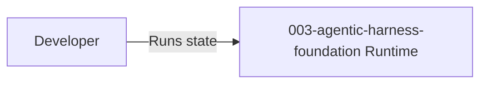

# Software Architecture

State: `003-agentic-harness-foundation`
Title: `Agentic Harness Foundation`

## Architecture Summary

Update this model with the authoritative architecture for this state.

## Entrypoints

## Notes

## Diagram

See [Component Diagram](./component-diagram.md).

## Detailed Architecture (Spec Extract)

# Agentic Harness Foundation

Update this model with the authoritative architecture for this state.

- Generated from: `system/architecture.model.json`
- Canonical flows: `system/end-to-end-flows.md`

## Architecture Diagram

## Node Catalog

| Node | Kind | Label | Notes |
| --- | --- | --- | --- |
| `developer` | actor | Developer | Local developer using this state. |
| `runtime` | boundary | 003-agentic-harness-foundation Runtime | Target runtime for this state. |

