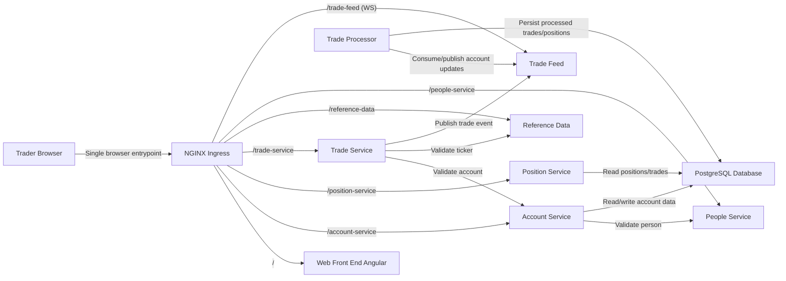

# Software Architecture

State: `009-postgres-database-replacement`
Title: `Architecture (State 009 PostgreSQL Database Replacement)`

## Architecture Summary

State 009 replaces H2 database runtime with PostgreSQL while preserving state 003 containerized ingress topology and baseline flows.

## Entrypoints

- `ingress` -> `http://localhost:8080`
- `postgres` -> `postgres://localhost:18083/traderx`

## Notes

- State 009 is an architecture-track branch from state 003.
- Only database engine/runtime is replaced; functional API and messaging contracts remain stable.
- H2 web console is removed from runtime expectations in this state.

## Diagram

See [Component Diagram](./component-diagram.md).

## Detailed Architecture (Spec Extract)

# Architecture (State 009 PostgreSQL Database Replacement)

State 009 replaces H2 database runtime with PostgreSQL while preserving state 003 containerized ingress topology and baseline flows.

- Inherits architectural baseline from: `003-containerized-compose-runtime`
- Generated from: `system/architecture.model.json`
- Canonical flows: `../001-baseline-uncontainerized-parity/system/end-to-end-flows.md`

## Entry Points

- `ingress`: `http://localhost:8080`
- `postgres`: `postgres://localhost:18083/traderx`

## Architecture Diagram

## Node Catalog

| Node | Kind | Label | Notes |
| --- | --- | --- | --- |
| `trader` | actor | Trader Browser | Uses Angular UI via ingress. |
| `ingress` | gateway | NGINX Ingress | Single browser entrypoint for UI + API + websocket. |
| `web` | frontend | Web Front End Angular | TraderX UI. |
| `referenceData` | service | Reference Data | Ticker lookup/list. |
| `tradeFeed` | messaging | Trade Feed | Socket.IO pub/sub layer (unchanged from state 003). |
| `people` | service | People Service | Identity lookup and validation. |
| `account` | service | Account Service | Account and account-user operations using PostgreSQL. |
| `position` | service | Position Service | Trades/positions query operations using PostgreSQL. |
| `tradeProcessor` | service | Trade Processor | Trade processing and persistence using PostgreSQL. |
| `tradeService` | service | Trade Service | Trade submission and validation. |
| `database` | database | PostgreSQL Database | Persistent account/trade/position state. |

## State Notes

- State 009 is an architecture-track branch from state 003.
- Only database engine/runtime is replaced; functional API and messaging contracts remain stable.
- H2 web console is removed from runtime expectations in this state.

