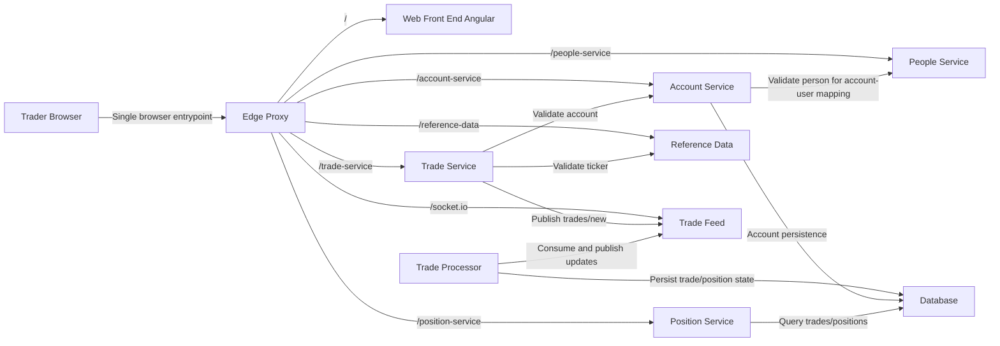

# Software Architecture

State: `002-edge-proxy-uncontainerized`
Title: `Architecture (State 002 Edge Proxy Uncontainerized)`

## Architecture Summary

State 002 keeps uncontainerized services and introduces an edge proxy as the single browser-facing entrypoint.

## Entrypoints

- `edge-proxy` -> `http://localhost:18080`
- `angular-upstream` -> `http://localhost:18093`

## Notes

- State 002 preserves baseline functional flows F1-F6.
- Primary delta is topology and origin model, not business behavior.

## Diagram

See [Component Diagram](./component-diagram.md).

## Detailed Architecture (Spec Extract)

# Architecture (State 002 Edge Proxy Uncontainerized)

State 002 keeps uncontainerized services and introduces an edge proxy as the single browser-facing entrypoint.

- Inherits architectural baseline from: `001-baseline-uncontainerized-parity`
- Generated from: `system/architecture.model.json`
- Canonical flows: `../001-baseline-uncontainerized-parity/system/end-to-end-flows.md`

## Entry Points

- `edge-proxy`: `http://localhost:18080`
- `angular-upstream`: `http://localhost:18093`

## Architecture Diagram

## Node Catalog

| Node | Kind | Label | Notes |
| --- | --- | --- | --- |
| `trader` | actor | Trader Browser | User enters only through edge proxy. |
| `edge` | gateway | Edge Proxy | Single browser-facing origin. |
| `web` | frontend | Web Front End Angular | Served behind edge proxy. |
| `account` | service | Account Service | Account and account-user CRUD. |
| `position` | service | Position Service | Trades and positions query endpoints. |
| `tradeService` | service | Trade Service | Trade submission and validation. |
| `referenceData` | service | Reference Data | Ticker lookup/list. |
| `people` | service | People Service | Directory lookup and validation. |
| `tradeFeed` | messaging | Trade Feed | Socket.IO publish/subscribe bus. |
| `tradeProcessor` | service | Trade Processor | Processes new trades and updates positions. |
| `database` | database | Database | Persistent account, trade, and position state. |

## State Notes

- State 002 preserves baseline functional flows F1-F6.
- Primary delta is topology and origin model, not business behavior.

