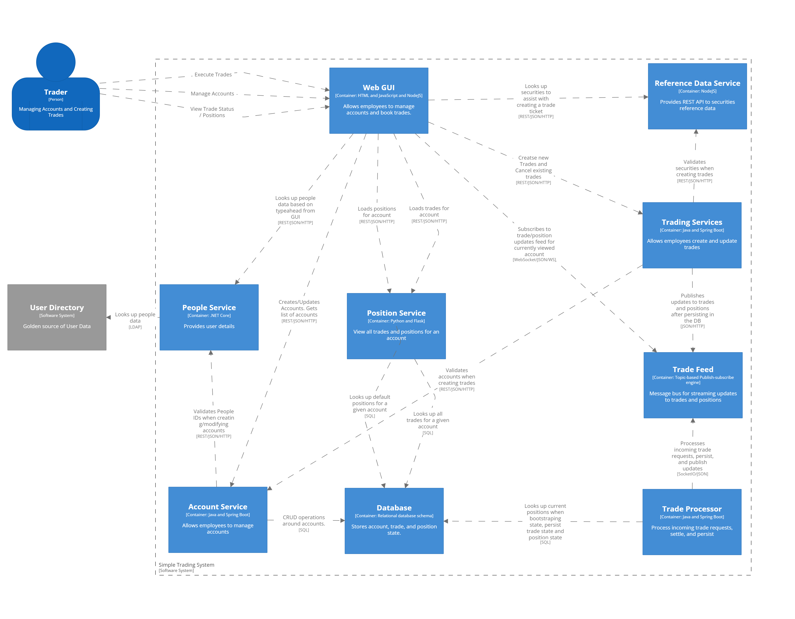

Below is a C4 diagram explaining the various componentry of the Sample Application.  The DSL for this diagram, as rendered, is [included](./c4/c4-diagram.dsl) in this repository.

You can navigate to the [individual codebases from this page](./code.md).

See Also: [Sequence Diagrams and Flows](./flows.md)
