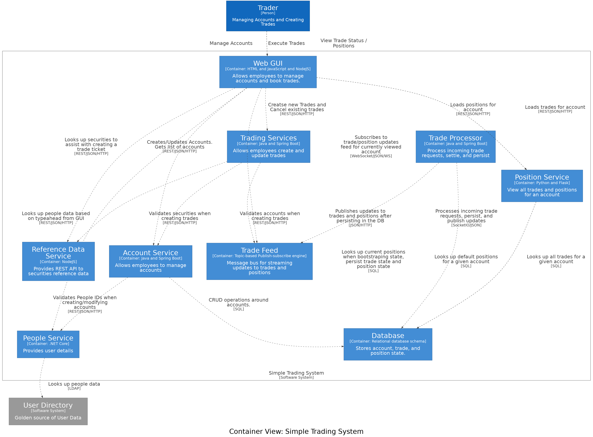
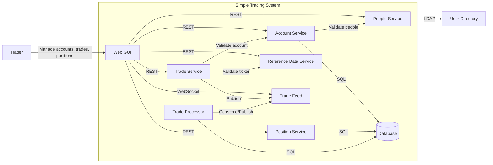

Below is a C4-inspired diagram explaining the various componentry of the Sample Application. The DSL for the original C4 diagram is [included](./c4/workspace.dsl) in this repository (render with [Structurizr Lite](https://structurizr.com/help/lite)).

You can navigate to the [individual codebases from this page](./code.md).

## C4 Container Diagrams

> **Note**: Diagram images will be auto-generated from `workspace.dsl` after every PR is merged via GitHub Actions.

These diagrams are auto-generated from `workspace.dsl` via GitHub Actions.

### Full System

### Progressive Views

| View | Description |
|------|-------------|
| [Single Service](./c4/structurizr-single-service.png) | Reference data only |
| [Multiple Services (no DB)](./c4/structurizr-multiple-services-no-db.png) | Web, Account, People, RefData |
| [Multiple Services (with DB)](./c4/structurizr-multiple-services-db-no-messaging.png) | Adds Position service and Database |
| [Multiple Services (no async)](./c4/structurizr-multiple-services-no-async.png) | Adds Trade Feed |
| [Full System](./c4/structurizr-full-system.png) | Complete system |

## Simplified Overview (Mermaid)

```mermaid
flowchart LR
  Trader[Trader] -->|Manage accounts, trades, positions| Web[Web GUI]

  subgraph TraderX["Simple Trading System"]
    Web
    Account[Account Service]
    Position[Position Service]
    TradeSvc[Trade Service]
    TradeProc[Trade Processor]
    RefData[Reference Data Service]
    People[People Service]
    Feed[Trade Feed]
    DB[(Database)]
  end

  UserDir[User Directory]

  Web -->|REST| Account
  Web -->|REST| Position
  Web -->|REST| TradeSvc
  Web -->|REST| RefData
  Web -->|REST| People
  Web -->|WebSocket| Feed

  Account -->|SQL| DB
  Position -->|SQL| DB
  TradeProc -->|SQL| DB

  TradeSvc -->|Publish| Feed
  TradeProc -->|Consume/Publish| Feed

  TradeSvc -->|Validate account| Account
  TradeSvc -->|Validate ticker| RefData
  Account -->|Validate people| People
  People -->|LDAP| UserDir
```

See Also: [Sequence Diagrams and Flows](./flows.md)
