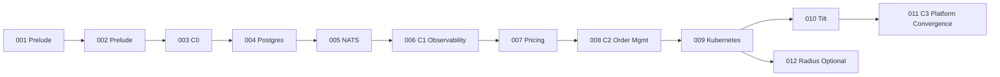

# Multi-State Generation Plan

This plan defines how TraderX evolves through numbered states with explicit convergence checkpoints.

## Objectives

- keep each transition reproducible from specs,
- keep generated branches compareable and publishable,
- isolate FR/NFR deltas per state,
- preserve a clear set of recommended jump-off points (`C0-C3`).

## Explicit State Inheritance Policy

- Every state inherits all functional and non-functional behavior from its `previous` lineage by default.
- A state may diverge from inherited behavior only when the feature pack declares an explicit conflict, replacement, or deprecation requirement.
- If no explicit conflict/replacement/deprecation is declared, generation, runtime scripts, smoke tests, and docs must keep inherited capabilities intact.
- Validation should verify inherited capabilities in downstream states to prevent accidental feature loss during runtime transitions.

## Containerization Boundary

- States `001-003` are pre-container states: published generated branches should not include Docker/Compose artifacts.
- Container build workflows begin at `004+`.
- Only convergence states (`C0+`) publish container images.

## Transition Mechanics

1. Update target state pack (`spec.md`, `plan.md`, `tasks.md`, `system/**`).
2. Generate parent state.
3. Apply ordered patch set (`specs/<state>/generation/patches/*.patch`) for derived changes.
4. Regenerate architecture docs.
5. Run state smoke tests + global gates.
6. Publish code snapshot branch.

## Generation Concurrency Invariant

- Default generation is sequential. The pipeline writes to shared roots under `generated/**`, so parallel runs targeting the same root are a race condition.
- `pipeline/generate-state.sh` enforces this with a top-level generation lock and fails fast on concurrent shared-root invocations.
- Parallel generation is allowed only when each run uses a distinct `TRADERX_GENERATED_ROOT` (for example separate workspaces or CI job sandboxes).
- This invariant applies to upstream and overlay pipelines that mirror upstream generation behavior.

## Current Convergence-First Model



## Publish Model

- Canonical authoring stays in this branch (`specs/**`, `.specify/**`, pipeline/docs).
- Generated code snapshots are published to `code/generated-state-*` branches.
- Publish ancestry follows `previous` only.
- Dotted-line parents are docs lineage only.

## Required Governance for Convergence States

- `catalog/state-catalog.json` must carry convergence metadata.
- `system/convergence-rationale.md` must exist and be updated when convergence state content/metadata changes.
- CI gates must pass before publish.
- Convergence states `C0+` must include image build/publish CI and GHCR run-bundle artifacts (see `/docs/spec-kit/generated-state-ci`).

## Reference Commands

```bash
bash pipeline/refresh-state-docs.sh
bash pipeline/verify-spec-coverage.sh
bash pipeline/publish-generated-state-branch.sh <state-id> --push
```
