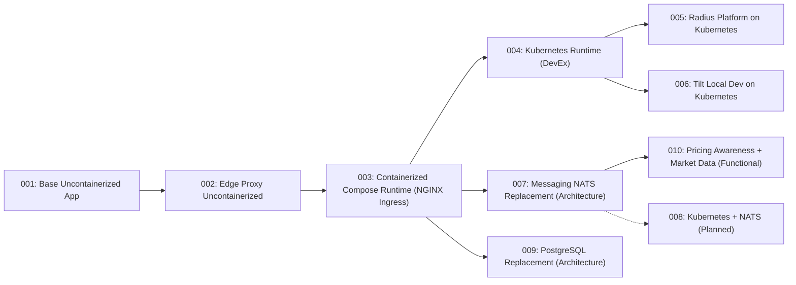
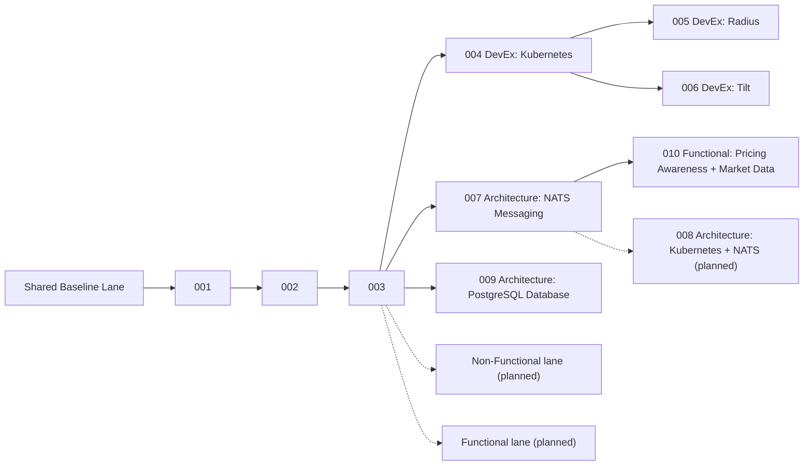

# Visual Learning Paths

This is the canonical state progression model for TraderX.

## Official Current Graph



## State To Artifact Mapping

| State | Spec Pack | Architecture | Flows / Runtime Topology | Generated Code Branch |
| --- | --- | --- | --- | --- |
| [`001-baseline-uncontainerized-parity`](/specs/baseline-uncontainerized-parity) | [`specs/001-baseline-uncontainerized-parity`](/specs/baseline-uncontainerized-parity) | [`system/architecture`](/specs/baseline-uncontainerized-parity/system/architecture) | [`system/end-to-end-flows`](/specs/baseline-uncontainerized-parity/system/end-to-end-flows) | `code/generated-state-001-baseline-uncontainerized-parity` |
| [`002-edge-proxy-uncontainerized`](/specs/edge-proxy-uncontainerized) | [`specs/002-edge-proxy-uncontainerized`](/specs/edge-proxy-uncontainerized) | [`system/architecture`](/specs/edge-proxy-uncontainerized/system/architecture) | [`system/runtime-topology`](/specs/edge-proxy-uncontainerized/system/runtime-topology) | `code/generated-state-002-edge-proxy-uncontainerized` |
| [`003-containerized-compose-runtime`](/specs/containerized-compose-runtime) | [`specs/003-containerized-compose-runtime`](/specs/containerized-compose-runtime) | [`system/architecture`](/specs/containerized-compose-runtime/system/architecture) | [`system/runtime-topology`](/specs/containerized-compose-runtime/system/runtime-topology) | `code/generated-state-003-containerized-compose-runtime` |
| [`004-kubernetes-runtime`](/specs/kubernetes-runtime) | [`specs/004-kubernetes-runtime`](/specs/kubernetes-runtime) | [`system/architecture`](/specs/kubernetes-runtime/system/architecture) | [`system/runtime-topology`](/specs/kubernetes-runtime/system/runtime-topology) | `code/generated-state-004-kubernetes-runtime` |
| [`005-radius-kubernetes-platform`](/specs/radius-kubernetes-platform) | [`specs/005-radius-kubernetes-platform`](/specs/radius-kubernetes-platform) | [`system/architecture`](/specs/radius-kubernetes-platform/system/architecture) | [`system/runtime-topology`](/specs/radius-kubernetes-platform/system/runtime-topology) | `code/generated-state-005-radius-kubernetes-platform` |
| [`006-tilt-kubernetes-dev-loop`](/specs/tilt-kubernetes-dev-loop) | [`specs/006-tilt-kubernetes-dev-loop`](/specs/tilt-kubernetes-dev-loop) | [`system/architecture`](/specs/tilt-kubernetes-dev-loop/system/architecture) | [`system/runtime-topology`](/specs/tilt-kubernetes-dev-loop/system/runtime-topology) | `code/generated-state-006-tilt-kubernetes-dev-loop` |
| [`007-messaging-nats-replacement`](/specs/messaging-nats-replacement) | [`specs/007-messaging-nats-replacement`](/specs/messaging-nats-replacement) | [`system/architecture`](/specs/messaging-nats-replacement/system/architecture) | [`system/runtime-topology`](/specs/messaging-nats-replacement/system/runtime-topology) | `code/generated-state-007-messaging-nats-replacement` |
| [`009-postgres-database-replacement`](/specs/postgres-database-replacement) | [`specs/009-postgres-database-replacement`](/specs/postgres-database-replacement) | [`system/architecture`](/specs/postgres-database-replacement/system/architecture) | [`system/runtime-topology`](/specs/postgres-database-replacement/system/runtime-topology) | `code/generated-state-009-postgres-database-replacement` |
| [`010-pricing-awareness-market-data`](/specs/pricing-awareness-market-data) | [`specs/010-pricing-awareness-market-data`](/specs/pricing-awareness-market-data) | [`system/architecture`](/specs/pricing-awareness-market-data/system/architecture) | [`system/runtime-topology`](/specs/pricing-awareness-market-data/system/runtime-topology) | `code/generated-state-010-pricing-awareness-market-data` |

## Swimlane View



Use `catalog/state-catalog.json` as the canonical state lineage record, and publish code snapshots with:

```bash
bash pipeline/publish-generated-state-branch.sh <state-id> --push
```
