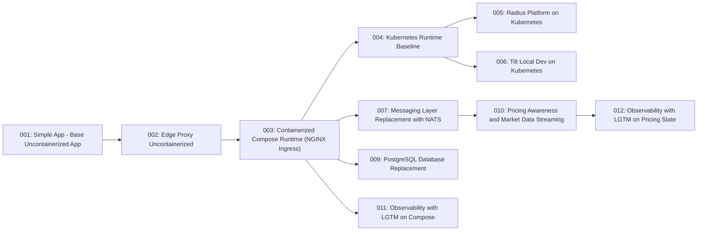
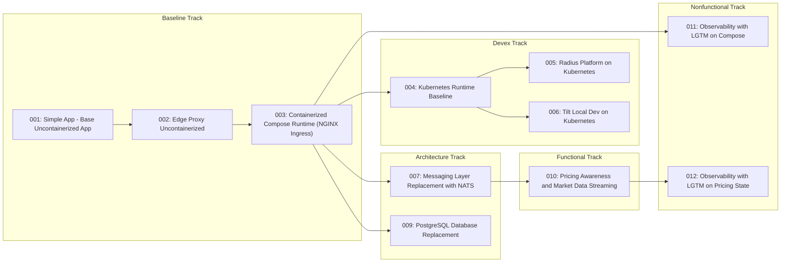

# Visual Learning Paths

This page is generated from `catalog/state-catalog.json`.

## Official Current Graph

## State To Artifact Mapping

| State | Spec Pack | Architecture | Flows / Runtime Topology | Learning Guide | Generated Code Branch |
| --- | --- | --- | --- | --- | --- |
| [`001-baseline-uncontainerized-parity`](/specs/baseline-uncontainerized-parity) | [link](/specs/baseline-uncontainerized-parity) | [link](/specs/baseline-uncontainerized-parity/system/architecture) | [link](/specs/baseline-uncontainerized-parity/system/end-to-end-flows) | [link](/docs/learning/state-001-baseline-uncontainerized-parity) | [code/generated-state-001-baseline-uncontainerized-parity](https://github.com/finos/traderX/tree/code/generated-state-001-baseline-uncontainerized-parity) |
| [`002-edge-proxy-uncontainerized`](/specs/edge-proxy-uncontainerized) | [link](/specs/edge-proxy-uncontainerized) | [link](/specs/edge-proxy-uncontainerized/system/architecture) | [link](/specs/edge-proxy-uncontainerized/system/runtime-topology) | [link](/docs/learning/state-002-edge-proxy-uncontainerized) | [code/generated-state-002-edge-proxy-uncontainerized](https://github.com/finos/traderX/tree/code/generated-state-002-edge-proxy-uncontainerized) |
| [`003-containerized-compose-runtime`](/specs/containerized-compose-runtime) | [link](/specs/containerized-compose-runtime) | [link](/specs/containerized-compose-runtime/system/architecture) | [link](/specs/containerized-compose-runtime/system/runtime-topology) | [link](/docs/learning/state-003-containerized-compose-runtime) | [code/generated-state-003-containerized-compose-runtime](https://github.com/finos/traderX/tree/code/generated-state-003-containerized-compose-runtime) |
| [`004-kubernetes-runtime`](/specs/kubernetes-runtime) | [link](/specs/kubernetes-runtime) | [link](/specs/kubernetes-runtime/system/architecture) | [link](/specs/kubernetes-runtime/system/runtime-topology) | [link](/docs/learning/state-004-kubernetes-runtime) | [code/generated-state-004-kubernetes-runtime](https://github.com/finos/traderX/tree/code/generated-state-004-kubernetes-runtime) |
| [`005-radius-kubernetes-platform`](/specs/radius-kubernetes-platform) | [link](/specs/radius-kubernetes-platform) | [link](/specs/radius-kubernetes-platform/system/architecture) | [link](/specs/radius-kubernetes-platform/system/runtime-topology) | [link](/docs/learning/state-005-radius-kubernetes-platform) | [code/generated-state-005-radius-kubernetes-platform](https://github.com/finos/traderX/tree/code/generated-state-005-radius-kubernetes-platform) |
| [`006-tilt-kubernetes-dev-loop`](/specs/tilt-kubernetes-dev-loop) | [link](/specs/tilt-kubernetes-dev-loop) | [link](/specs/tilt-kubernetes-dev-loop/system/architecture) | [link](/specs/tilt-kubernetes-dev-loop/system/runtime-topology) | [link](/docs/learning/state-006-tilt-kubernetes-dev-loop) | [code/generated-state-006-tilt-kubernetes-dev-loop](https://github.com/finos/traderX/tree/code/generated-state-006-tilt-kubernetes-dev-loop) |
| [`007-messaging-nats-replacement`](/specs/messaging-nats-replacement) | [link](/specs/messaging-nats-replacement) | [link](/specs/messaging-nats-replacement/system/architecture) | [link](/specs/messaging-nats-replacement/system/runtime-topology) | [link](/docs/learning/state-007-messaging-nats-replacement) | [code/generated-state-007-messaging-nats-replacement](https://github.com/finos/traderX/tree/code/generated-state-007-messaging-nats-replacement) |
| [`009-postgres-database-replacement`](/specs/postgres-database-replacement) | [link](/specs/postgres-database-replacement) | [link](/specs/postgres-database-replacement/system/architecture) | [link](/specs/postgres-database-replacement/system/runtime-topology) | [link](/docs/learning/state-009-postgres-database-replacement) | [code/generated-state-009-postgres-database-replacement](https://github.com/finos/traderX/tree/code/generated-state-009-postgres-database-replacement) |
| [`010-pricing-awareness-market-data`](/specs/pricing-awareness-market-data) | [link](/specs/pricing-awareness-market-data) | [link](/specs/pricing-awareness-market-data/system/architecture) | [link](/specs/pricing-awareness-market-data/system/runtime-topology) | [link](/docs/learning/state-010-pricing-awareness-market-data) | [code/generated-state-010-pricing-awareness-market-data](https://github.com/finos/traderX/tree/code/generated-state-010-pricing-awareness-market-data) |
| [`011-observability-lgtm-compose`](/specs/observability-lgtm-compose) | [link](/specs/observability-lgtm-compose) | [link](/specs/observability-lgtm-compose/system/architecture) | [link](/specs/observability-lgtm-compose/system/runtime-topology) | [link](/docs/learning/state-011-observability-lgtm-compose) | [code/generated-state-011-observability-lgtm-compose](https://github.com/finos/traderX/tree/code/generated-state-011-observability-lgtm-compose) |
| [`012-observability-on-pricing`](/specs/observability-on-pricing) | [link](/specs/observability-on-pricing) | [link](/specs/observability-on-pricing/system/architecture) | [link](/specs/observability-on-pricing/system/runtime-topology) | [link](/docs/learning/state-012-observability-on-pricing) | [code/generated-state-012-observability-on-pricing](https://github.com/finos/traderX/tree/code/generated-state-012-observability-on-pricing) |

## Swimlane View

Use `catalog/state-catalog.json` as the canonical state lineage record.
