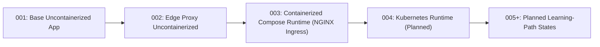
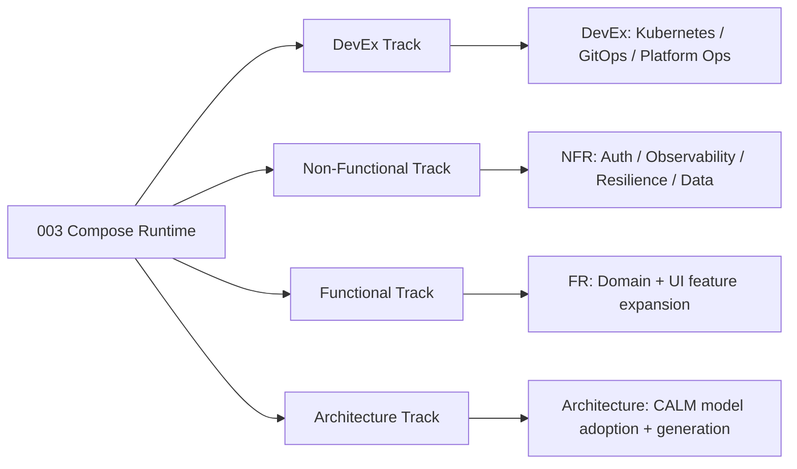

# Visual Learning Paths

This is the canonical state progression model for TraderX.

## Official Current Path



## State To Artifact Mapping

| State | Spec Pack | Generated Code Branch |
| --- | --- | --- |
| `001-baseline-uncontainerized-parity` | `specs/001-baseline-uncontainerized-parity` | `codex/generated-state-001-baseline-uncontainerized-parity` |
| `002-edge-proxy-uncontainerized` | `specs/002-edge-proxy-uncontainerized` | `codex/generated-state-002-edge-proxy-uncontainerized` |
| `003-containerized-compose-runtime` | `specs/003-containerized-compose-runtime` | `codex/generated-state-003-containerized-compose-runtime` |
| `004-kubernetes-runtime` | `specs/004-kubernetes-runtime` | `codex/generated-state-004-kubernetes-runtime` |

## Learning-Path Families (Planned Beyond `004`)



Use `catalog/state-catalog.json` as the canonical state lineage record, and publish code snapshots with:

```bash
bash pipeline/publish-generated-state-branch.sh <state-id> --push
```
