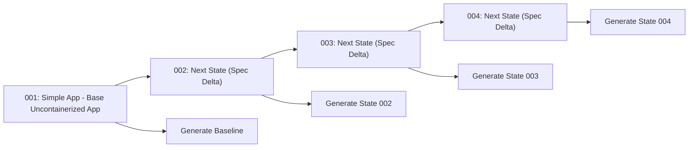
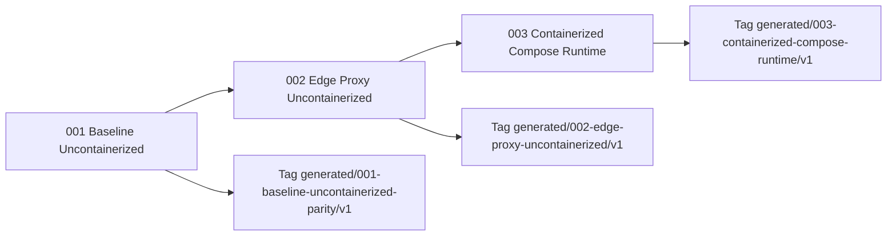

# Multi-State Generation Plan

This plan defines how TraderX will evolve from the current baseline into additional learning-path states using SpecKit change specs.

## Objectives

- make each state transition explicit and reproducible,
- isolate which components change per transition,
- generate runnable code for each state from spec deltas,
- show developers exactly what changed and why.

## Operating Model

1. Keep `001-baseline-uncontainerized-parity` as immutable baseline reference.
2. Create one new feature pack per state transition (for example `002-containerized-runtime`).
3. Capture only delta requirements in the new pack:
   - functional deltas for behavior changes,
   - non-functional deltas for platform/ops changes.
4. Compile manifests from the target state specs.
5. Generate only impacted components.
6. Run state-specific verification + shared conformance/parity gates.
7. Publish a state changelog documenting:
   - changed requirements,
   - changed components,
   - changed runtime contracts.

## Required Artifacts Per New State

- `spec.md` for changed user stories, FR, NFR.
- `plan.md` for technical realization.
- `tasks.md` for execution order and checks.
- `system/requirements-traceability.md` updated for new mappings.
- `components/*.md` for impacted components only.
- contract updates under `contracts/**` only where interfaces change.

## Developer Workflow For A New State

1. Read baseline + target state specs.
2. Run generation for target state.
3. Start target runtime.
4. Run state verifier and conformance pack.
5. Inspect generated diff summary.
6. Promote state only when all checks pass.

## Transition Visualization

## Programmed Next Three States

### Official Data of Record for Each State

For each state release, the canonical record must include:

1. numbered feature pack under `specs/NNN-*` (`spec.md`, `plan.md`, `tasks.md`);
2. updated traceability and affected contracts/components;
3. generated-code snapshot tag + validation evidence references in migration artifacts.

## Phase-10 Execution Backlog

- define canonical naming for state packs (`00N-state-name`),
- add state-delta template for FR/NFR/change-impact capture,
- add per-state component impact matrix output,
- add state-aware generation entrypoint,
- add state-aware verification scripts and docs runbooks.
