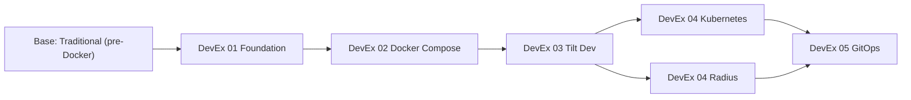
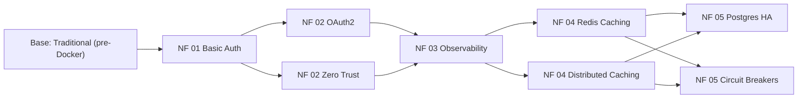
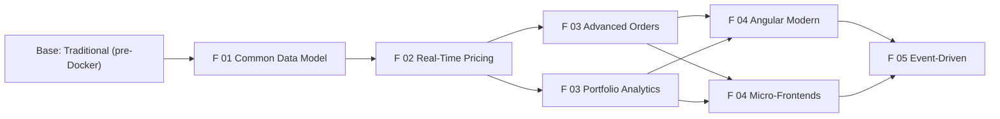
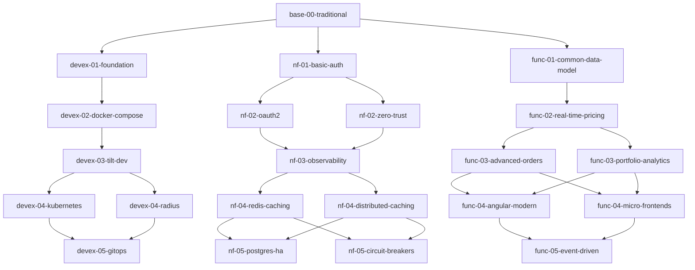

# Visual Learning Graphs

All paths start from `base-00-traditional` (pre-Docker).

## DevEx Track

```mermaid
flowchart LR
  B["Base: Traditional (pre-Docker)"] --> D1["DevEx 01 Foundation"]
  D1 --> D2["DevEx 02 Docker Compose"]
  D2 --> D3["DevEx 03 Tilt Dev"]
  D3 --> D4A["DevEx 04 Kubernetes"]
  D3 --> D4B["DevEx 04 Radius"]
  D4A --> D5["DevEx 05 GitOps"]
  D4B --> D5
```

## Non-Functional Track

```mermaid
flowchart LR
  B["Base: Traditional (pre-Docker)"] --> N1["NF 01 Basic Auth"]
  N1 --> N2A["NF 02 OAuth2"]
  N1 --> N2B["NF 02 Zero Trust"]
  N2A --> N3["NF 03 Observability"]
  N2B --> N3
  N3 --> N4A["NF 04 Redis Caching"]
  N3 --> N4B["NF 04 Distributed Caching"]
  N4A --> N5A["NF 05 Postgres HA"]
  N4A --> N5B["NF 05 Circuit Breakers"]
  N4B --> N5A
  N4B --> N5B
```

## Functional Track

```mermaid
flowchart LR
  B["Base: Traditional (pre-Docker)"] --> F1["F 01 Common Data Model"]
  F1 --> F2["F 02 Real-Time Pricing"]
  F2 --> F3A["F 03 Advanced Orders"]
  F2 --> F3B["F 03 Portfolio Analytics"]
  F3A --> F4A["F 04 Angular Modern"]
  F3A --> F4B["F 04 Micro-Frontends"]
  F3B --> F4A
  F3B --> F4B
  F4A --> F5["F 05 Event-Driven"]
  F4B --> F5
```

## Unified Knowledge Graph

```mermaid
graph TD
  Base["base-00-traditional"]

  Base --> D1["devex-01-foundation"]
  D1 --> D2["devex-02-docker-compose"]
  D2 --> D3["devex-03-tilt-dev"]
  D3 --> D4A["devex-04-kubernetes"]
  D3 --> D4B["devex-04-radius"]
  D4A --> D5["devex-05-gitops"]
  D4B --> D5

  Base --> N1["nf-01-basic-auth"]
  N1 --> N2A["nf-02-oauth2"]
  N1 --> N2B["nf-02-zero-trust"]
  N2A --> N3["nf-03-observability"]
  N2B --> N3
  N3 --> N4A["nf-04-redis-caching"]
  N3 --> N4B["nf-04-distributed-caching"]
  N4A --> N5A["nf-05-postgres-ha"]
  N4A --> N5B["nf-05-circuit-breakers"]
  N4B --> N5A
  N4B --> N5B

  Base --> F1["func-01-common-data-model"]
  F1 --> F2["func-02-real-time-pricing"]
  F2 --> F3A["func-03-advanced-orders"]
  F2 --> F3B["func-03-portfolio-analytics"]
  F3A --> F4A["func-04-angular-modern"]
  F3A --> F4B["func-04-micro-frontends"]
  F3B --> F4A
  F3B --> F4B
  F4A --> F5["func-05-event-driven"]
  F4B --> F5
```
