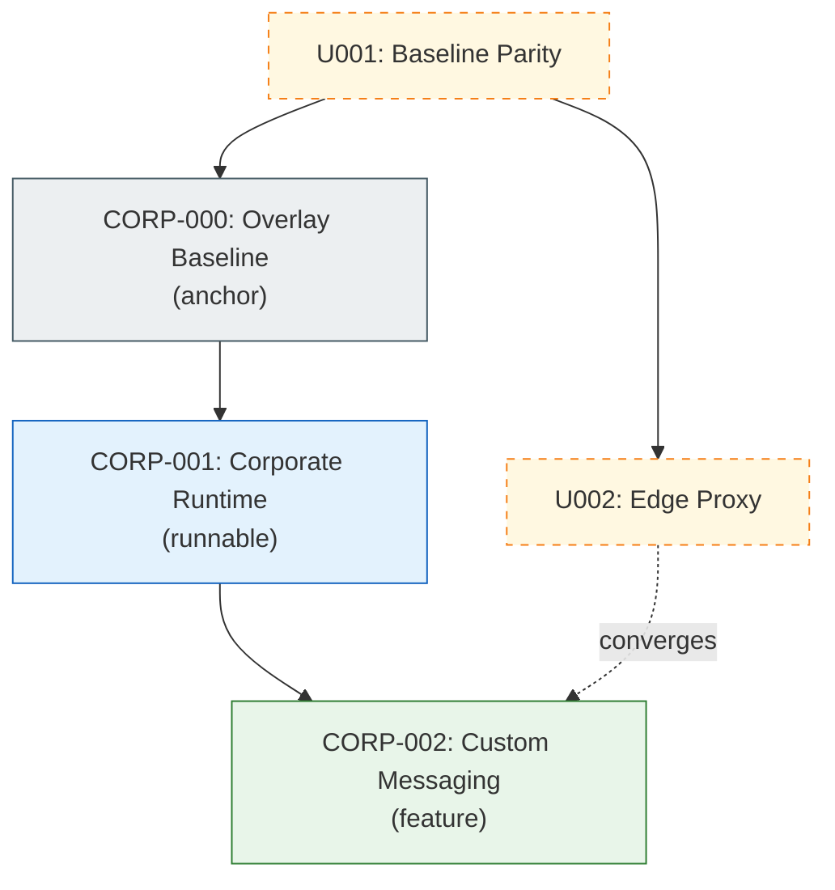

# Overlay Learning Graph Diagram Example

Copy this into your overlay repository `docs/learning/index.md` and replace IDs, labels, and links with your sanctioned states.

## State-to-Artifact Table Template

| State | Learning Guide | Spec Pack | Generated Branch | Diff vs Previous | Runnable |
|---|---|---|---|---|---|
| U001 | [U001 Guide](https://finos.github.io/traderX/docs/learning/001-baseline-uncontainerized-parity) | `specs/001-baseline-uncontainerized-parity` | `code/generated-state-001-baseline-uncontainerized-parity` | N/A | No |
| U002 | [U002 Guide](https://finos.github.io/traderX/docs/learning/002-edge-proxy-uncontainerized) | `specs/002-edge-proxy-uncontainerized` | `code/generated-state-002-edge-proxy-uncontainerized` | [Compare](https://github.com/finos/traderX/compare/code/generated-state-001-baseline-uncontainerized-parity...code/generated-state-002-edge-proxy-uncontainerized) | No |
| CORP-000 | [CORP-000 Guide](/docs/learning/corp-000-overlay-baseline) | `specs/corp-000-overlay-baseline` | `code/generated-state-corp-000-overlay-baseline` | [Compare](https://github.example.com/org/traderx-overlay/compare/code/generated-state-002-edge-proxy-uncontainerized...code/generated-state-corp-000-overlay-baseline) | No |
| CORP-001 | [CORP-001 Guide](/docs/learning/corp-001-corporate-runtime) | `specs/corp-001-corporate-runtime` | `code/generated-state-corp-001-corporate-runtime` | [Compare](https://github.example.com/org/traderx-overlay/compare/code/generated-state-corp-000-overlay-baseline...code/generated-state-corp-001-corporate-runtime) | Yes |
| CORP-002 | [CORP-002 Guide](/docs/learning/corp-002-custom-messaging) | `specs/corp-002-custom-messaging` | `code/generated-state-corp-002-custom-messaging` | [Compare](https://github.example.com/org/traderx-overlay/compare/code/generated-state-corp-001-corporate-runtime...code/generated-state-corp-002-custom-messaging) | Yes |
