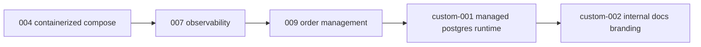

# Internal Sanctioned Learning Graph

Only the states listed in `overlay/catalog/sanctioned-learning-graph.example.yaml` are approved for internal learning and runtime use.

## Governance Notes

- This graph is intentionally narrower than public TraderX state lineage.
- Suppressed upstream states are omitted by policy.
- Internal-only states are explicitly marked with `custom-*` ids.
