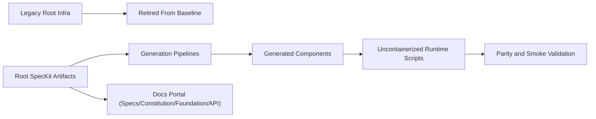
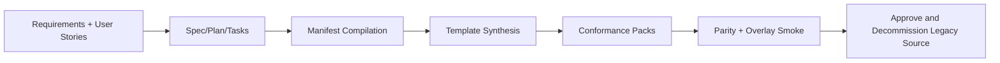

# TraderSpec Migration Blog

This log captures major milestones in the migration from source-first TraderX to a root-canonical GitHub SpecKit workflow.

## Snapshot

- Baseline generation and runtime are operational from root `specs/**` + `.specify/**`.
- Generated uncontainerized runtime scripts are canonical.
- Legacy root infra (compose/ingress/gitops/radius) has been retired from the active baseline.
- Phase C cleanup is closed; current focus is Phase 10 state release/tag execution.

## Timeline

### 2026-03-27

- Completed phases 1 through 8:
  - scaffold + bridge
  - base runtime sequencing
  - generated startup orchestration
  - first generated component
  - iterative component cutover
  - approved source retirement
  - SpecKit synthesis/conformance/compare implementation
  - migration evidence documentation

### 2026-03-28

- Completed major Phase 11 migration work:
  - bootstrapped root `.specify/`
  - created `specs/001-baseline-uncontainerized-parity`
  - migrated system/component artifacts into root feature pack
  - rewired generation/conformance/readiness pipelines to root specs

### 2026-03-29

- Completed repo canonicalization (Phase B):
  - removed obsolete infra and folders
  - made generated runtime scripts canonical
  - archived legacy workflows
  - validated runtime, conformance, parity, and docs
- Began and advanced Phase C:
  - moved operational folders to root (`pipeline/`, `scripts/`, `templates/`, `catalog/`)
  - moved `foundation/` and `tracks/` to root
  - rewired scripts and validations for new locations
  - simplified docs routing and navigation
- Advanced Phase C generated-artifact cleanup:
  - relocated ephemeral outputs to `generated/**` (`generated/code`, `generated/manifests`, `generated/api-docs`)
  - rewired generation/runtime scripts and Docusaurus API docs pipeline to the new generated paths
  - removed legacy tracked `api-docs/README.md` from source control
  - marked `prompts/**` and `tools/**` as explicit archive candidates in migration inventory/TODO
- Added generated-state publish model for Phase 10:
  - introduced canonical `catalog/state-catalog.json` for state lineage + branch/tag hints
  - added `pipeline/publish-generated-state-branch.sh` to emit code-only branches with state metadata
  - documented generated-state branch workflow and provenance files (`STATE.md`, `.traderx-state/state.json`)
  - published first baseline code-only branch snapshot:
    - `codex/generated-state-001-baseline-uncontainerized-parity` (source commit `6b97250`)
- Implemented state `002-edge-proxy-uncontainerized` generation path:
  - added `pipeline/generate-state.sh` with state-aware generation entrypoints and impact summary
  - added spec-driven edge routing input (`specs/002-edge-proxy-uncontainerized/system/edge-routing.json`)
  - added generated edge-proxy component (`templates/edge-proxy-specfirst`, `pipeline/generate-edge-proxy-specfirst.sh`)
  - added state runtime scripts (`start/stop/status-state-002-edge-proxy-generated.sh`) and smoke test script
  - updated state catalog to mark `002` generation mode as implemented
  - published generated code branch snapshot:
    - `codex/generated-state-002-edge-proxy-uncontainerized` (source commit `25c7e16`)
- Removed remaining tracked `TraderSpec/` legacy folder artifacts after root canonicalization.
- Implemented state `003-containerized-compose-runtime` generation and runtime scaffolding:
  - added compose/runtime spec artifacts under `specs/003-containerized-compose-runtime/system/**`
  - aligned container ingress to NGINX (close to prior `main` branch compose topology)
  - added state generation support (`pipeline/generate-state-003-compose-assets.sh`, `pipeline/generate-state.sh`)
  - added runtime scripts (`start/stop/status-state-003-containerized-generated.sh`, `test-state-003-containerized.sh`)
  - updated state catalog + generated-state publish flow for `003`
- Closed remaining Phase C checklist items:
  - removed stale `TraderSpec/codebase/*` solution references from `traderX.sln`
  - marked C.8/C.9/C.10 completed in migration TODO with archive decision captured
  - revalidated root SpecKit gates/readiness and docs production build
- Added clone-first runtime docs/harness into generated-state branches:
  - each generated branch now includes `RUN_FROM_CLONE.md`
  - `001` and `002` include runnable `scripts/*` + lightweight compatibility layout under `generated/code/{components,target-generated}`
  - `003` includes dedicated compose start/stop/status scripts directly in snapshot branch
- Republished generated-state branches with clone-ready docs/scripts from source commit `b50d3b8`:
  - `codex/generated-state-001-baseline-uncontainerized-parity` -> `af998f9`
  - `codex/generated-state-002-edge-proxy-uncontainerized` -> `6711ff4`
  - `codex/generated-state-003-containerized-compose-runtime` -> `aebc84a`
- Moved flow and architecture source-of-truth into state packs under `specs/**`:
  - migrated sequence-flow source to `specs/001-baseline-uncontainerized-parity/system/end-to-end-flows.md`
  - introduced generated architecture docs from state-local models:
    - `specs/*/system/architecture.model.json` -> `specs/*/system/architecture.md`
    - generation scripts: `pipeline/generate-state-architecture-doc.sh` and `pipeline/generate-all-architecture-docs.sh`
  - wired `pipeline/generate-state.sh` to regenerate architecture docs per state
  - removed legacy `docs/flows.md` and `docs/c4/*` artifacts
- Removed legacy learning-path scaffolding folders:
  - deleted `states/**` and `prompts/**` from active repository surface
  - retained learning-path progression in canonical spec/docs artifacts (`specs/**`, `docs/spec-kit/**`, `docs/learning-paths/**`)

## What Changed Technically

- Spec source of truth is now root-based:
  - `.specify/`
  - `specs/001-baseline-uncontainerized-parity/**`
- Operational roots are now canonical:
  - `pipeline/**`
  - `scripts/**`
  - `templates/**`
  - `catalog/**`
  - `foundation/**`
  - `tracks/**`
- Generated artifacts are treated as ephemeral and are not committed.

## Runtime Canonicalization Diagram

## Migration Cutover Flow

## Validation Evidence Pattern

The migration repeatedly validated with:

- root SpecKit gate checks
- readiness/expressiveness/coverage checks
- per-component conformance packs
- full parity runtime validation
- Docusaurus docs build with on-demand API docs generation

## Next

- Execute Phase 10 release tags on the refreshed generated-state branches.
- Start learning-path overlays and state transition demonstrations from the canonical baseline.
- Use the new state-transition planning model documented in:
  - `docs/spec-kit/state-transition-generation-plan.md`
  - `docs/spec-kit/why-speckit.md`

## Upcoming Phase-10 Sequence (Locked Next Path)

The next execution path is now explicitly staged:

1. publish a generated-code snapshot tag for `001-baseline-uncontainerized-parity`,
2. implement and release `002-edge-proxy-uncontainerized` from spec deltas,
3. implement and release `003-containerized-compose-runtime` from spec deltas.

Each release will be recorded with:

- source spec pack id,
- generated snapshot tag,
- validation evidence bundle (conformance + runtime smoke + docs build).
