# TraderSpec Migration TODO

This is the active program-of-record TODO for the SpecKit-first TraderX migration.

## Current Status

- Current phase: `Phase 10` (learning-path overlays and state releases).
- Next milestone: release generated snapshot tags for `001`, `002`, and `003`.
- Last updated: `2026-03-29`.

## Mission

Make root SpecKit artifacts (`.specify/` and `specs/`) the source of truth, with reproducible generation/runtime workflows and docs that guide contributors from requirements to running code.

## Phases

- `Phase 1` Scaffold + bridge: complete.
- `Phase 2` Base uncontainerized runtime: complete.
- `Phase 3` Generated startup orchestration: complete.
- `Phase 4` First pure-generated component: complete.
- `Phase 5` Component-by-component cutover: complete.
- `Phase 6` Legacy source deletion by approval: complete.
- `Phase 7` GitHub Spec Kit adoption and manifest synthesis: complete.
- `Phase 8` Migration documentation and visual evidence: complete.
- `Phase 9` Docs consolidation: complete.
- `Phase 10` Learning-path evolution: pending.
- `Phase 11` Root-level SpecKit canonical migration: complete.
- `Phase B` Repo canonicalization to SpecKit-first baseline: complete.
- `Phase C` Root flattening + docs simplification: complete.

## Program TODO

- [x] 1) Confirm scaffold/bridge state and baseline semantics.
- [x] 2) Define and validate official base uncontainerized startup sequence.
- [x] 3) Generate startup orchestration from spec inputs.
- [x] 4) Spec and generate first replacement component.
- [x] 5) Cut over all baseline components incrementally with regression checks.
- [x] 6) Remove approved legacy source components.
- [x] 7) Adopt GitHub Spec Kit requirements-first flow with conformance and comparison gates.
- [x] 8) Capture migration journey with diagrams and evidence.
- [x] 9) Consolidate TraderSpec docs and nav.
- [ ] 10) Apply learning-path overlays and demonstrate state transitions.
- [ ] 10.1 Define canonical state-pack naming and transition scope format.
- [ ] 10.2 Add SpecKit delta template for state changes (FR/NFR/contracts/components).
- [x] 10.3 Implement state-aware generation entrypoint and impact summary output.
- [ ] 10.4 Add state-specific verification gates and runbooks.
- [x] 10.5 Publish first post-baseline state generated fully from specs.
- [x] 10.6 Define generated-state branch/tag convention (spec-source vs code-snapshot).
- [x] 10.6a Publish baseline generated-state branch snapshot (`codex/generated-state-001-baseline-uncontainerized-parity`).
- [ ] 10.7 Publish generated-code snapshot tag for `001-baseline-uncontainerized-parity`.
- [x] 10.8 Finalize `002-edge-proxy-uncontainerized` spec pack (NFR-first state delta).
- [ ] 10.9 Generate/validate/release `002` state from specs and tag generated snapshot.
- [x] 10.9a Publish generated-state branch snapshot for `002` (`codex/generated-state-002-edge-proxy-uncontainerized`).
- [x] 10.10 Finalize `003-containerized-compose-runtime` spec pack.
- [ ] 10.11 Generate/validate/release `003` state from specs and tag generated snapshot.
- [x] 11) Complete root-level SpecKit canonical migration.
- [x] B) Canonicalize repository to SpecKit-first generated baseline.
- [x] C) Finish root flattening cleanup and docs simplification.

## Active Phase C Checklist

- [x] C.1 Remap Docusaurus routes to root-canonical mounts (`/specs`, `/specify`, `/api`, `/migration`).
- [x] C.2 Move `TraderSpec/pipeline/**` to `pipeline/**` and rewire references.
- [x] C.3 Move `TraderSpec/codebase/scripts/**` to `scripts/**` and rewire references.
- [x] C.4 Move `TraderSpec/templates/**` to `templates/**` and rewire references.
- [x] C.5 Move `TraderSpec/catalog/**` to `catalog/**` and rewire references.
- [x] C.6 Move migration docs to `migration-docs/*` and remove legacy plugin overlap.
- [x] C.7 Remove residual `TraderSpec/` folders that are no longer needed.
- [x] C.8 Re-run full validation set after final cleanup.
- [x] C.9 Finalize archive decisions for `prompts/**` and `tools/**` (decision updated: `prompts/**` removed as legacy; `tools/**` retained for active docs checks).
- [x] C.10 Complete generated-artifact relocation to `generated/**` and remove remaining legacy `api-docs/**`/`TraderSpec/codebase/**` runtime references.

## Validation Gates for Phase C Exit

Run all of these from repo root:

- `bash pipeline/speckit/validate-root-spec-kit-gates.sh`
- `bash pipeline/speckit/validate-speckit-readiness.sh`
- `bash pipeline/speckit/verify-spec-expressiveness.sh`
- `bash pipeline/verify-spec-coverage.sh`
- `bash pipeline/speckit/run-all-conformance-packs.sh`
- `bash pipeline/speckit/run-full-parity-validation.sh`
- `npm --prefix website run build`

## Phase 10 Preview

Phase 10 formalizes multi-state evolution as SpecKit deltas, so developers can move between states by changing requirements first and then regenerating only impacted components.

## Phase 10 State Sequence (Program of Record)

1. `001-baseline-uncontainerized-parity`
- Purpose: stable baseline reference and first generated-code snapshot.
- Tag target: `generated/001-baseline-uncontainerized-parity/v1`

2. `002-edge-proxy-uncontainerized`
- Purpose: introduce edge routing/proxy boundary to remove direct browser-to-many-service cross-origin calls.
- Delta shape: primarily non-functional (network topology, routing, CORS simplification), minimal functional changes.
- Tag target: `generated/002-edge-proxy-uncontainerized/v1`

3. `003-containerized-compose-runtime`
- Purpose: move runtime from local process orchestration to Docker/Docker Compose baseline.
- Delta shape: non-functional platform/runtime change with documented operational requirements.
- Tag target: `generated/003-containerized-compose-runtime/v1`

## Release Model

- `main` remains spec-source canonical (`.specify/**` + `specs/**` + generation pipeline).
- Generated runnable snapshots are published as tags on generated-code commits.
- Every generated-state tag must include:
  - source feature pack id,
  - generation command set used,
  - validation evidence references (conformance, smoke, docs build).

## Progress Graph

```mermaid
flowchart LR
  P1["Phase 1 Done"] --> P2["Phase 2 Done"]
  P2 --> P3["Phase 3 Done"]
  P3 --> P4["Phase 4 Done"]
  P4 --> P5["Phase 5 Done"]
  P5 --> P6["Phase 6 Done"]
  P6 --> P7["Phase 7 Done"]
  P7 --> P8["Phase 8 Done"]
  P8 --> P11["Phase 11 Done"]
  P11 --> P9["Phase 9 Done"]
  P9 --> PB["Phase B Done"]
  PB --> PC["Phase C In Progress"]
  PC --> P10["Phase 10 Next"]
```

