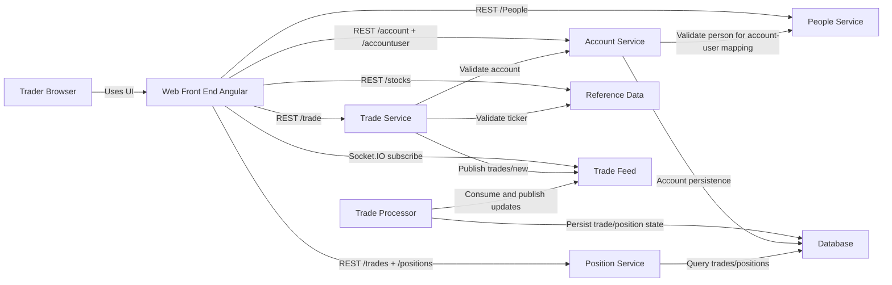

# Architecture (State 001 Baseline)

Baseline pre-containerized architecture with direct browser-to-service calls and Socket.IO trade/position subscriptions.

- Generated from: `system/architecture.model.json`
- Canonical flows: `system/end-to-end-flows.md`

## Entry Points

- `web-front-end-angular`: `http://localhost:18093`
- `trade-feed`: `http://localhost:18086`

## Architecture Diagram

## Node Catalog

| Node | Kind | Label | Notes |
| --- | --- | --- | --- |
| `trader` | actor | Trader Browser | Human user interacting with Angular UI. |
| `web` | frontend | Web Front End Angular | Browser-hosted UI. |
| `account` | service | Account Service | Account and account-user CRUD. |
| `position` | service | Position Service | Trades and positions query endpoints. |
| `tradeService` | service | Trade Service | Trade submission and validation. |
| `referenceData` | service | Reference Data | Ticker lookup/list. |
| `people` | service | People Service | Directory lookup and validation. |
| `tradeFeed` | messaging | Trade Feed | Socket.IO publish/subscribe bus. |
| `tradeProcessor` | service | Trade Processor | Processes new trades and updates positions. |
| `database` | database | Database | Persistent account, trade, and position state. |

## State Notes

- This state is intentionally pre-ingress and cross-origin.
- CORS behavior is part of baseline non-functional requirements.

