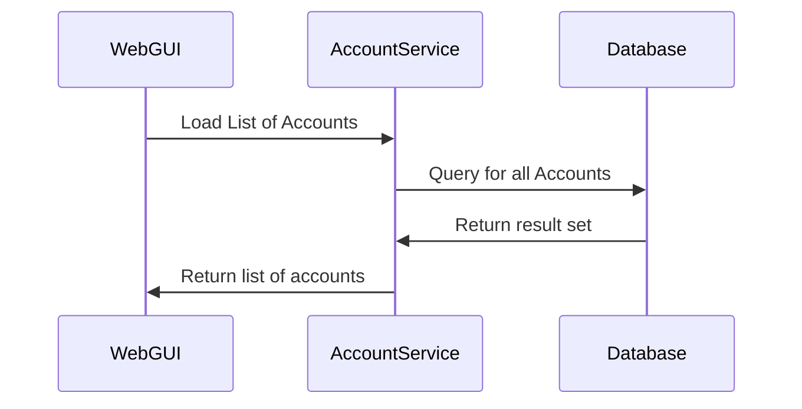
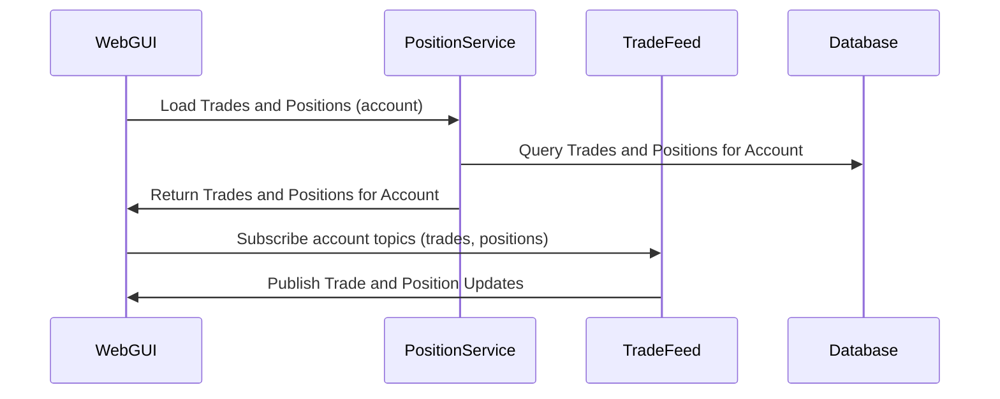
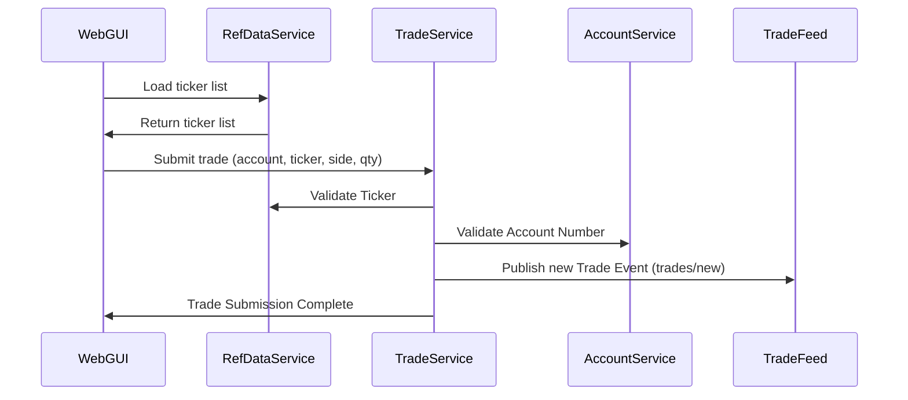
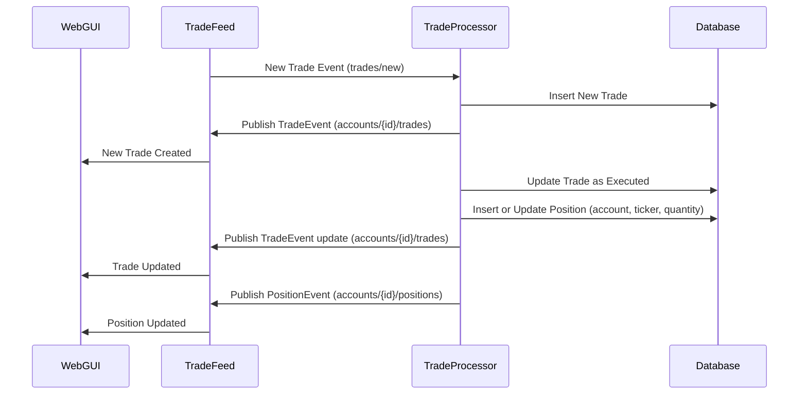
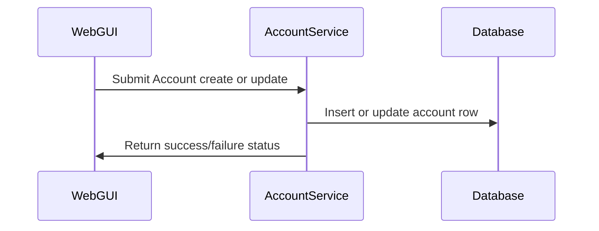
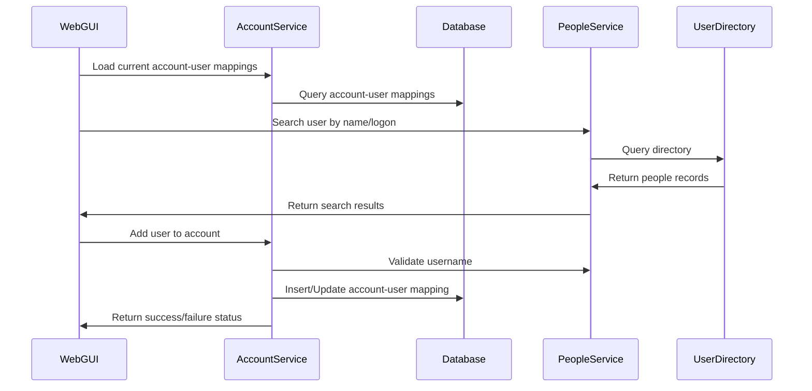

# End-to-End Flows (State 001 Baseline)

This file is the canonical flow source for `001-baseline-uncontainerized-parity`.

## F1: Load Accounts On Initial UI Load

On initial UI load, account-service returns all available accounts for selection.

## F2: Bootstrap Trade + Position Blotters

After account selection, the UI loads initial trades/positions and subscribes for incremental updates.

In `All Accounts` mode, trades are loaded cross-account and positions are merged by security; trade ticket creation is disabled.

## F3: Submit Trade Ticket

Trade-service validates ticker and account before publishing to trade-feed.

Trade ticket security entry uses ticker/company typeahead with browser autocomplete disabled.

## F4: Process Trade Events

Trade-processor consumes new trade events, updates persistence, and publishes updates.

## F5: Add/Update Account

Account-service handles account persistence for account administration flows.

## F6: Add/Update Account Users

Account user mappings require people-service validation before persistence.

Account-user display in UI resolves usernames to `fullName` via people-service lookup.

## Startup Dependency Flow (Operational)

Startup order is governed by runtime catalog and scripts:

`database -> reference-data -> trade-feed -> people-service -> account-service -> position-service -> trade-processor -> trade-service -> web-front-end-angular`
